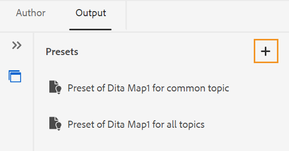
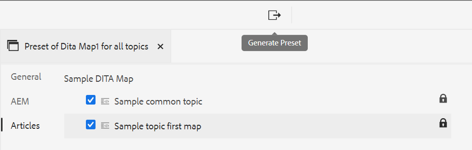
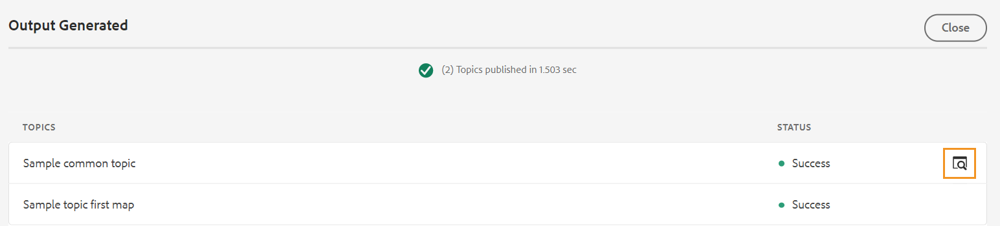
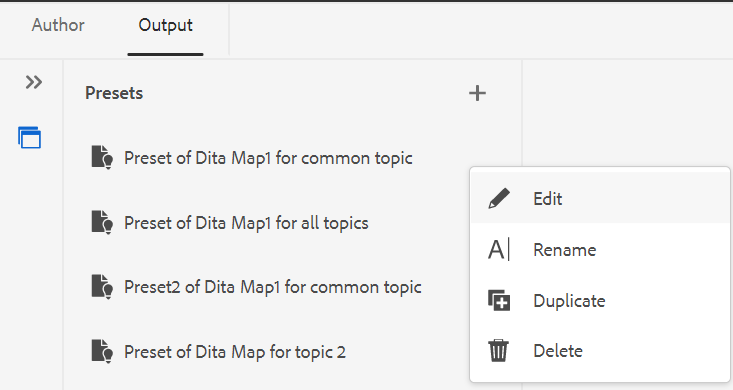

# 从Web编辑器创建输出预设 {#id218CL400JW3}

执行以下步骤可为DITA映射创建输出预设：

1. 在资产UI中，导航到要编辑的映射文件。

1. 要获取映射文件的独占锁定，请选择映射文件并单击 **签出**.

1. 选择 **编辑主题** 映射文件操作菜单中的选项。

   将打开映射文件以便在Web编辑器中编辑。

   >[!NOTE]
   >
   > 您可以使用高级映射编辑器在映射中添加或删除任何主题。 有关更多详细信息，请参阅 [使用高级映射编辑器](map-editor-advanced-map-editor.md#).

1. 在 **输出** 选项卡，选择+图标以创建DITA映射的输出预设。

   {width="350" align="left"}

1. 在添加预设对话框中输入预设的名称，然后单击 **添加**.

1. 输入以下配置详细信息。

   1. 在中选择所需的选项 **常规** 选项卡。 您可以选择创建附带条件或不附带条件的输出预设。 也可以使用DITVAL文件。 AEM Guides还允许您选择用于发布DITA映射特定版本的基线。
   1. 在“ ”中输入AEM站点详细信息 **AEM** 选项卡。 **站点** 显示AEM存储库中可用的AEM Sites列表。 **类别**， **区域模板**、和 **文章模板** 是用于组织输出外观的结构组件。 这些是在AEM站点模板中预定义的。

      >[!NOTE]
      >
      > 刷新每个下拉菜单以在下一个下拉菜单中获取进一步的分类。

   1. 从 **文章** 选项卡，选择要为其生成输出的主题。
1. 选择 **生成预设** 图标，以生成输出。

   {width="800" align="left"}

1. 您将看到输出生成过程的状态。 此 **主题** 列列出了为其生成输出的主题，而 **状态** 列显示每个主题的发布状态。

   要查看输出，请将鼠标指针悬停在主题上，然后单击“查看输出”。

   {width="800" align="left"}

>[!NOTE]
>
> 也可以从“选项”菜单中编辑、重命名、复制或删除现有的输出预设。

{width="550" align="left"}

**父主题：**[&#x200B;从Web编辑器中基于文章的发布](web-editor-article-publishing.md)
