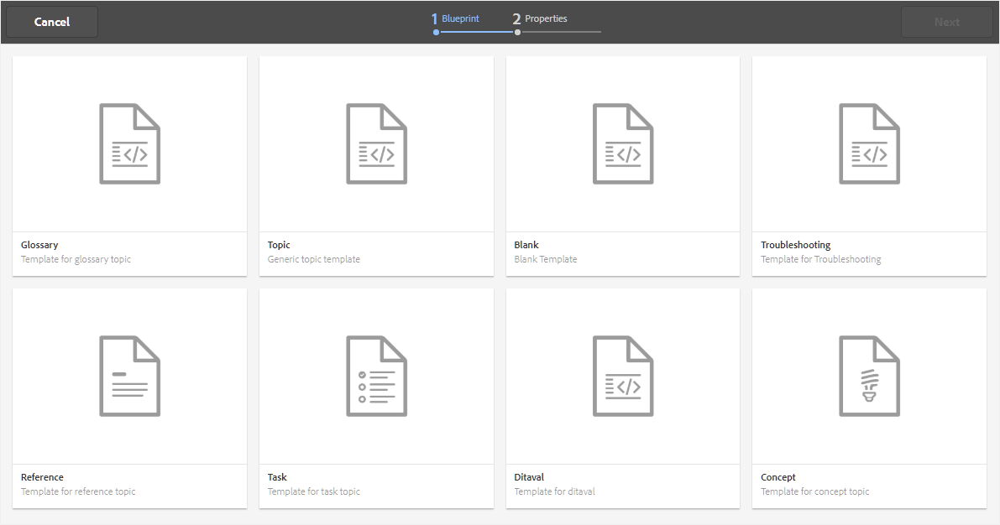
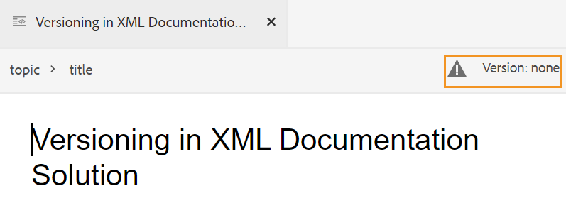

# 创建主题 {#id2056AL00O5Z}

AEM Guides允许您创建以下类型的DITA主题：主题、任务、概念、引用、术语表、DITAVAL等。 除了基于现成模板创建主题之外，您还可以定义自定义模板。 必须将这些模板添加到文件夹配置文件中，才能在模板选择Blueprint和Web编辑器中显示。

请注意，全局和文件夹配置文件配置仅适用于文件夹级别的管理用户。 有关设置全局和文件夹级别配置文件的详细信息，请参阅 *配置创作模板* 在安装和配置Adobe Experience Manager Guides中，了解您的设置。

执行以下步骤可创建主题：

1. 在Assets UI中，导航到要创建主题的位置。

1. 要创建新主题，请单击 **创建** \> **DITA主题**.

1. 在Blueprint页面上，选择要创建的DITA文档类型并单击 **下一个**.

   {width="800" align="left"}

   默认情况下，AEM Guides提供最常用的DITA主题模板。 您可以根据组织要求配置更多主题模板，请参阅 *配置创作模板* 在安装和配置Adobe Experience Manager Guides中，了解您的设置。

   >[!NOTE]
   >
   > 在Assets UI的列表视图中，DITA主题类型在“类型”列中显示为“主题”、“任务”、“概念”、“引用”、“Glossentry”或“DITAVAL”。 DITA映射显示为“映射”。

1. 在属性页面上，指定文档 **标题**.

1. \（可选\）指定文件 **名称**.

   如果管理员已根据UUID设置配置了自动文件名，则您将看不到用于指定文件名的选项。 基于UUID的文件名会自动指定给该文件。

   如果文件命名选项可用，则也会根据 **标题** 您的文档。 如果要手动指定文档名称，请确保 **名称** 不包含任何空格、撇号或大括号，且结尾为.xml或.dita。 默认情况下，AEM Guides会将所有特殊字符替换为连字符。 有关命名DITA文件的最佳实践，请参阅最佳实践指南中的文件名部分。

1. 单击&#x200B;**创建**。此时将显示“创建的主题”消息。

   您可以选择在Web编辑器中打开主题进行编辑，或者将主题文件保存在AEM存储库中。

   从Assets UI创建的每个新主题 **创建** \> **DITA主题** 或者，为Web编辑器分配唯一的主题ID。 此ID的值是文件名本身。 此外，新文档将保存为DAM中主题的最新工作副本。 在保存新创建主题的修订版本之前，您不会在“版本历史记录”中看到任何版本号。 如果打开主题进行编辑，则版本信息将显示在主题文件选项卡的右上角：

   {width="550" align="left"}

   新创建的主题的版本信息显示为 *无*. 保存新版本时，会为其分配一个版本号1.0。有关保存新版本的更多信息，请参见 [另存为新版本](web-editor-features.md#save-as-new-version-id209ME400GXA).

>[!NOTE]
>
> 如果管理员已将Web编辑器配置为在编辑之前签出文件，则在签出文件之前，您将无法编辑该文件。 同样，如果进行了配置，在关闭任何签出文件之前，将要求您签入该文件。

>[!IMPORTANT]
>
> 创建DITA主题后，继续保存对工作副本所做的更改，并在完成主题更新后创建新版本。

**父主题：**[&#x200B;创建和预览主题](create-preview-topics.md)
