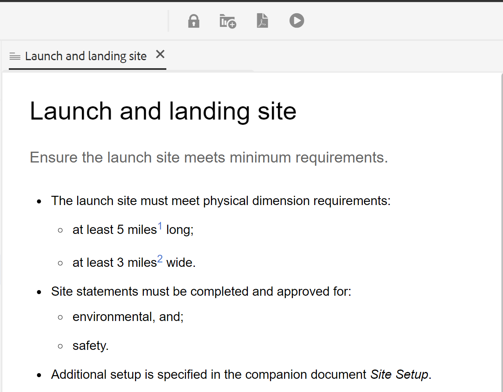

# 文档状态 {#id1821HC00URO}

为了管理文档的准备工作，AEM Guides提供了文档状态属性来指示文档的当前状态。 文档状态可帮助您快速确定文档是新文档、处于审阅中还是审阅已完成状态。

## 文档状态类型

文档可以具有在文档状态配置文件中定义的任何文档状态。 例如，文档可以具有以下任一文档状态：

- 草稿 — 指示使用新更改创建和保存文档。
- 正在审阅 — 指示已启动文档的审阅工作流。
- 已审核 — 表明文档已由目标用户审核。

这些状态是根据“文档状态”配置文件设置手动或自动设置的。 例如，如果文档状态配置文件配置为起始状态为草稿，并且为审阅文档定义审阅中状态。 然后，在创建文档时，文档状态将设置为 *草稿*. 如果启动审阅任务，则文档的状态将更改为“正在审阅”。

您也可以手动更改单个或多个文档的文档状态。 但是，如果选择更改多个文档的文档状态，则允许的状态由所选文档允许的共同状态确定。 例如，假设您已按相同顺序将文档状态定义为“草稿”、“正在审阅”、“已审阅”和“准备发布”。 在文档1.dita上，状态设置为 *草稿* 而在文档2.dita中，状态设置为“已审核”。 同时选择one.dita和two.dita时，允许的文档状态将为 *发布准备就绪*. 当two.dita *已审核* 状态，则两个的下一个可能状态是。dita *发布准备就绪*，在选择两个文档时显示。

>[!NOTE]
>
> 文档一次只能处于一种状态。

## 更改文档状态

要更改文档状态，请执行以下步骤：

1. 在Assets UI中，选择要更改其文档状态的一个或多个文档。
1. 在主工具栏中，单击 **属性**.
1. 从中选择新状态 **文档状态** 下拉菜单。 您只能选择在文档状态配置文件的“状态转换”部分中允许的那些文档状态。

   >[!NOTE]
   >
   >管理员可以查看所有文档状态，并将文档更改为任何可能的状态。

1. 单击“**保存并关闭**”。

## 查看文档状态

Assets UI的卡片视图显示当前状态以及相应DITA主题或DITA映射的创建日期和大小。

{width="800" align="left"}

## 在DDLC中使用文档状态

在DDLC中，文档状态在文档生命周期管理中起着重要的作用。 如果您的组织严格遵循DDLC，则根据文档状态来控制文档编辑的机制将是一项基本功能。 例如，您可以允许编辑文档 *草稿* 或 *正在审核* 状态。 但是，一旦文件经过审查并已准备好发布，就应该有办法防止进一步修改文件。

AEM Guides提供了文档审批工作流，可帮助您控制文档开发过程的生命周期。 文档准备发布或达到次末级状态后，您可以将其标记为已批准。 文档获得批准后，AEM Guides会创建文档的新版本并将其设置为只读。 然后，您可以移动文档以进行发布或创建基线以进行进一步处理。

要从标记为已批准的文档开始新版本，作者必须开始新版本。 启动新版本会将文档状态更改为 *草稿* 再来一次。 通过将文档状态更改为 *草稿*，文档将再次变为可编辑，您可以继续下一个版本。

要使用文档审批功能，请执行以下步骤：

>[!NOTE]
>
> 审批工作流功能必须由管理员启用。 有关更多详细信息，请参阅 *启用审批工作流* 安装和配置Adobe Experience Manager Guidesas a Cloud Service中的部分。

1. 在Web编辑器中，打开要标记为批准的文档。

1. 单击 **标记为已批准**&#x200B;图标。

1. 如果文档处于标记为已批准状态，则将显示以下对话框：

   {width="300" align="left"}

   如果文档无法标记为已批准，则会显示以下消息：

   {width="300" align="left"}

1. 如果您的文档已准备好标记为已批准，请从下拉列表中选择一个标签并单击 **批准**.

   >[!NOTE]
   >
   > 如果管理员尚未配置预定义的标签列表，则会显示一个用于输入标签的自由格式文本字段。

1. 成功将文档标记为已批准后，将 **预览** 以只读模式显示。

   {width="650" align="left"}

   >[!NOTE]
   >
   > 在预览模式下，将从工具栏中删除所有编辑选项。 此外，文档的“作者”和“来源”视图也已从顶部导航中删除。

文档一旦标记为已批准，就不再可用于编辑。 如果要将该文档用于下一个版本，则需要将其带回 *草稿* 省/州。 要将已批准文档的文档状态更改回 *草稿* 模式，请执行以下步骤：

1. 在批准的文档中，单击 **启动新版本** 图标 .

   出现“Start New Release（开始新版本）”消息。

1. 单击 **确认**.

   文档的状态将更改为“草稿”，并在Web编辑器中以编辑模式打开文档。

**父主题：**[&#x200B;使用Web编辑器](web-editor.md)
