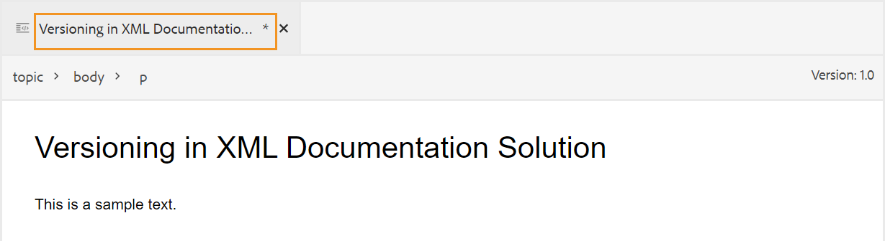

# 在Web编辑器中编辑主题 {#id2056B040VUI}

Web编辑器附带了一系列编辑功能，可让您轻松创建或修改主题文件。 概括地说，您可以执行以下步骤以在Web编辑器中编辑主题。

>[!IMPORTANT]
>
> 如果在使用Web编辑器时遇到应用程序错误，请刷新页面以继续工作。

1. 要在主题中进行更改，请单击所需元素的文本边界并开始进行编辑。

1. 要插入特定元素，请在要插入新元素的元素末尾单击，然后单击工具栏中的必需元素图标。 您也可以使用键盘快捷键 `Alt+Enter` 调用 **插入元素** 弹出窗口。

   将显示可用于主题中的元素列表。 AEM Guides根据元素在主题中的有效位置智能地放置元素。

   >[!NOTE]
   >
   > 您还可以通过配置 `ui_config.json` 文件位于 —  `/etc/designs/fmdita/clientlibs/xmleditor/`. 有关自定义功能的详细信息，请与系统管理员联系。

1. 编辑完文档后，单击 **保存**.

   >[!NOTE]
   >
   > 如果不希望将更改提交到AEM存储库，请单击 **关闭**，然后单击 **关闭但不保存** 在未保存的更改对话框中。

   **编辑文件时刷新浏览器**
在Web编辑器中编辑Experience Manager时，《浏览器指南》支持刷新浏览器。 此功能可帮助您继续编辑内容，以防您在工作时遇到应用程序错误。 如果在打开一个或多个具有未保存更改的文件进行编辑时点击浏览器刷新，系统会警告您未保存的更改可能会丢失。 您可以选择取消刷新操作并保存文件以保留更改。

   即使在刷新浏览器时，左侧和右侧面板的视图也会保留在Web编辑器中。 在刷新Experience Manager时，“浏览器指南”将恢复在Web编辑器中打开的文件上次保存的状态。 例如，在“存储库”面板中打开的文件将再次打开。 映射面板与先前打开的映射一起保留。

   活动主题或DITA映射将在内容编辑区域中重新打开。

   右侧面板也会重新打开，并显示与刷新之前相同的视图。

   **工作副本指示器**
AEM Guides提供了工作副本指示器，用于显示文件的当前\（工作副本\）是否与保存的版本同步。 如果您对当前副本进行了任何更改并且尚未保存文件，则会在主题的文件选项卡上显示一个\*标记以及标题。 此指示器用于提醒您保存所做的更改，并在保存文件时消失。

   {width="550" align="left"}

   AEM Guides还指示文件的最后保存的\(working\)副本是否与保存的版本同步。 如果在工作副本和上次保存的版本之间有一些未保存的更改，则会在主题文件选项卡右上角显示一个\*标记以及版本信息。 此指示器用于提醒您保存并从文件的当前\(working\)副本创建版本。

   {width="550" align="left"}

**父主题：**[&#x200B;使用Web编辑器](web-editor.md)
