# 了解Web编辑器功能 {#id176NC500V5Z}

本节介绍Web编辑器中可用的各种功能。 我们可以将Web编辑器分为以下部分或区域：

- [主工具栏](#id2051EA0G05Z)
- [辅助工具栏](#id2051EA0J0Y4)
- [左侧面板](#id2051EA0M0HS)
- [内容编辑区域](#id2051EB000UI)
- [右侧面板](#id2051EB003YK)

以下小节详细介绍了Web编辑器的各个部分。

## 主工具栏 {#id2051EA0G05Z}

主工具栏位于Web编辑器界面的顶部，它提供文件级功能以及Web编辑器中可用的各种创作模式。 顶部工具栏中可用的功能说明如下：

**全部保存** - 

保存在所有打开的主题中所做的更改。 如果在Web编辑器中打开了多个主题，请单击 **全部保存** 或使用 **Crtl**+**S** 快捷键只需单击一下即可保存所有文档。 您不必单独保存每个文档。

>[!NOTE]
>
> 保存操作不会创建主题的新版本。 要创建新版本，请选择“另存为新版本”。

**另存为新版本** - 

保存您在主题中所做的更改，并创建主题的新版本。 如果您处理的是新创建的主题，则版本信息显示为 **无**.

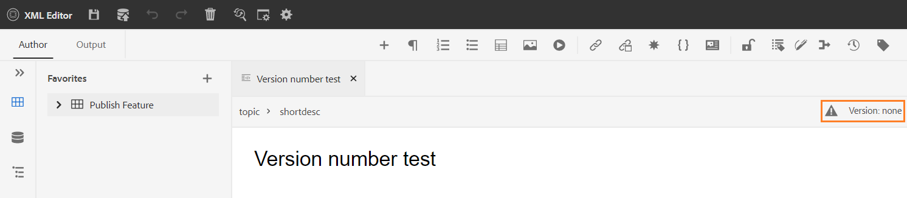{width="800" align="left"}

版本号会随为主题或映射文件创建的每个新版本而更改。

当您选择使用保存主题或映射时 **另存为新版本**，则会显示以下对话框：

{width="300" align="left"}

输入注释和版本标签以标识更改，然后单击 **保存** 以创建新的文件版本。

当您选择 *另存为新版本*，则主题的第一个版本将在DAM中创建，它也会成为您主题的当前活动版本。 之后，如果您还原到该主题的旧版本，则该版本将成为您当前的主题活动版本。

如果您的管理员预先配置了版本标签，则您将在下拉列表中看到这些标签。 您可以从可用标签列表中选择标签并保存文档。

{width="300" align="left"}

在保存主题时，可以添加注释，以指定在主题中所做的更改。 此注释显示在主题的“版本历史记录”中。

如果您的主题正在审核中，您的审核者将收到通知，告知有较新版本的主题可用。 他们可以轻松访问文档的最新修订版，并继续查看您主题的最新版本。

当您将指针悬停在主题的标题上时，会显示文件路径和版本号。

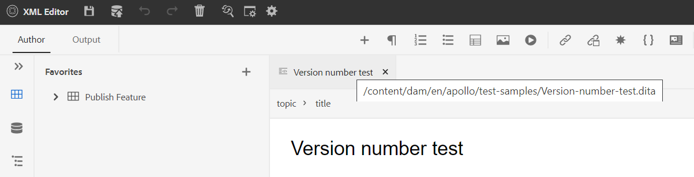{width="800" align="left"}

>[!NOTE]
>
> 在主题某个版本可用后，您还可以向主题添加标签。 然后，可以使用这些标签创建用于发布文档特定版本的基线。 有关在主题中使用标签的详细信息，请参阅 [使用标签](web-editor-use-label.md#).

**“撤消”和“重做”** -  / 

撤消或重做上一个操作。

**删除元素** - 

删除当前选定的元素或光标所在的元素。

**查找和替换** - 

查找和替换功能在“创作”和“源”视图模式下可用。 “查找和替换”文本栏显示在主题编辑区域的底部。 您可以使用快捷键 **CTRL**+**F** 以调用查找和替换栏。

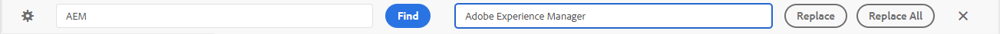{width="800" align="left"}

使用设置图标\(\)，您可以切换 **忽略大小写** 和 **仅全字** 搜索选项。 要执行不区分大小写的搜索，请打开\（或选择\） **忽略大小写** 选项。 否则，如果要执行区分大小写的搜索，请关闭\（或取消选择\） **忽略大小写** 选项。 您还可以选择搜索整个词。

搜索是即时的，这意味着当您在 **查找** 字段，则会立即在主题中搜索和选择术语。 同样，要替换主题中的文本，请在相应的字段中输入搜索词及其替换词，然后单击 **替换** 或 **全部替换** 按钮。

在“源”视图中，“查找和替换”对于搜索特定元素或属性非常有用。 例如，如果要替换 `@product` 属性，可以从“源”视图中轻松完成该操作。 “作者”视图不允许您根据属性或元素进行搜索。 但是，在使用时，您必须谨慎 **全部替换** 功能，因为它可能会覆盖XML代码。

**编辑器设置** - 

编辑器设置仅对管理用户可用。 通过使用首选项，管理员可以配置以下设置：

>[!NOTE]
>
> 如果要更新任何默认设置，则应重新打开文档以使更改生效。

- **常规**：常规设置允许您配置要用于Web编辑器的词典。 此选项卡包含三个部分： **拼写检查**， **条件**、和 **创作**.

  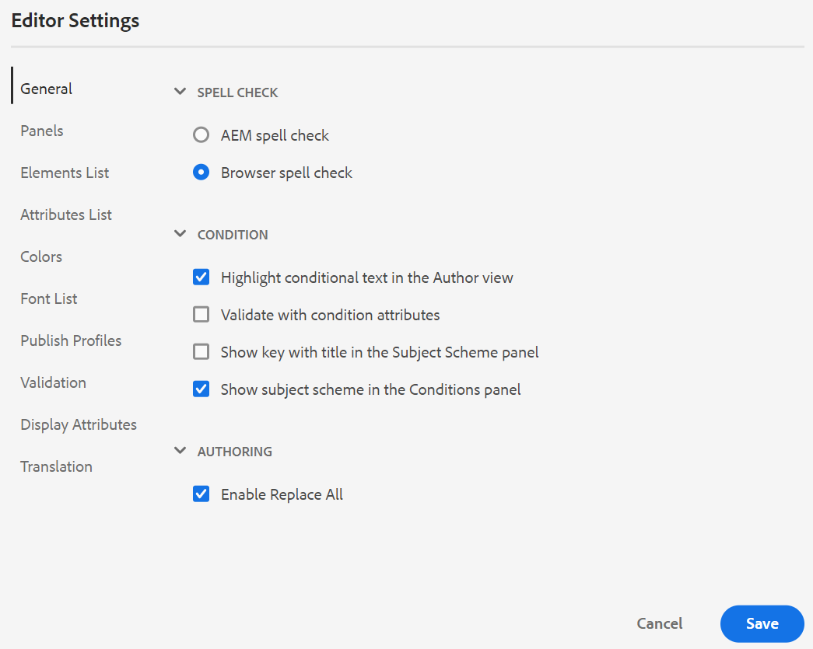{width="650" align="left"}

   - **拼写检查**：有两个选项 —  **AEM拼写检查** 和 **浏览器拼写检查**. 默认情况下，编辑器使用浏览器拼写检查功能，其中拼写检查使用浏览器的内置词典执行。 您可以切换到AEM拼写检查以使用AEM词典，也可以自定义该词典以添加自定义单词列表。 有关自定义AEM词典的更多信息，请参阅 *自定义AEM默认词典* 安装和配置Adobe Experience Manager Guidesas a Cloud Service中的部分。


   - **条件**

      - **在创作视图中高亮显示条件文本**：选择此项以在创作视图中高亮显示条件文本。 使用为条件定义的颜色突出显示条件内容。

      - **使用条件属性进行验证**：选择此项以允许验证为属性定义的值。 这样可防止您添加任何不正确的值。

      - **在“主题方案”面板中显示带有标题的键**：选择此项以在主题方案中显示键以及标题。 如果不选择此选项，则只显示标题。 例如，此处“os”、“audience”和“other”键也会与标题一起显示。

        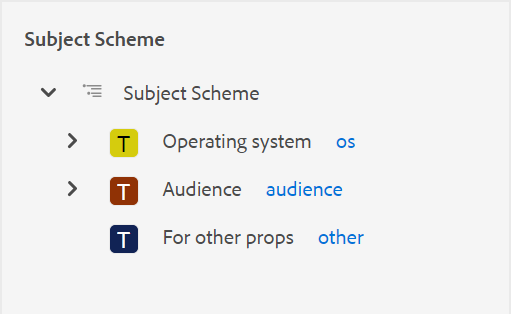{width="550" align="left"}

      - **在条件面板中显示主题方案**：选择此选项可在条件面板中查看主题方案。 如果取消选择此选项，则定义的条件将显示在条件面板中。

   - **创作**

      - **启用全部替换**：选择此选项可在“查找和替换”面板中看到全部替换图标。


   - **引用**
更改引文样式。 从要在项目中使用的下拉列表中选择引用样式。 有关更多详细信息，请参阅 [更改引文样式](./web-editor-apply-citations.md#change-citation-style).


**面板**：此设置控制编辑器左侧面板中显示的面板。 您可以切换开关以显示或隐藏所需的面板。

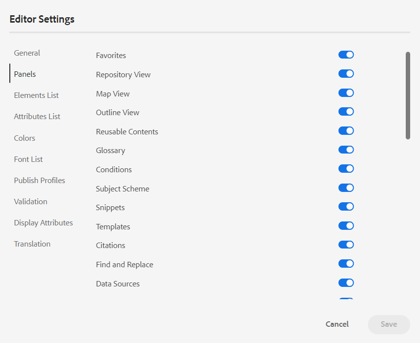{width="650" align="left"}

>[!NOTE]
>
> 如果自定义面板已配置，则它也会出现在面板列表中。 您可以切换开关以显示或隐藏自定义面板。 有关配置的更多详细信息，请参见 *在左侧面板中配置自定义面板* 安装和配置Adobe Experience Manager Guidesas a Cloud Service中的部分。

- **元素列表**：作为管理员，您可以控制作者可以使用插入的元素列表 [插入元素](#id204SG30105Z) 弹出窗口，还可以定义元素的显示名称。 元素列表设置允许您根据DITA规范指定元素名称以及要使用的标签而不是DITA定义的元素名称：

  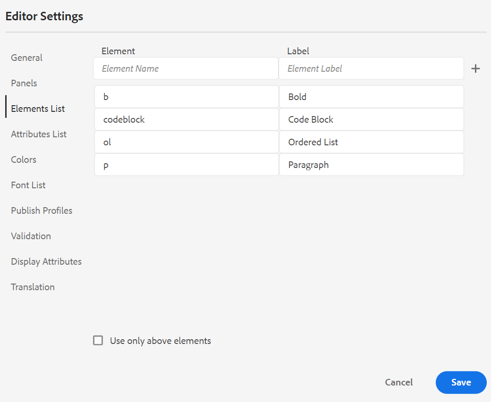{width="650" align="left"}

在上面的屏幕截图中， `b` 元素已被赋予粗体标签， `codeblock` 为代码块以及某些其他元素提供了标签。 如果您选择 **仅使用以上元素** 选项，则只有此列表中的有效元素\（在当前插入点\）将显示在“插入元素”弹出窗口中。

在以下屏幕快照中，当前上下文中只显示前一个屏幕快照中4个已配置元素中的3个：

{width="300" align="left"}

- **属性列表**：与元素列表类似，您可以控制要在元素的属性列表中显示的属性列表及其显示名称。 在以下屏幕截图中，只有3个属性已配置为在元素的属性列表中显示：

  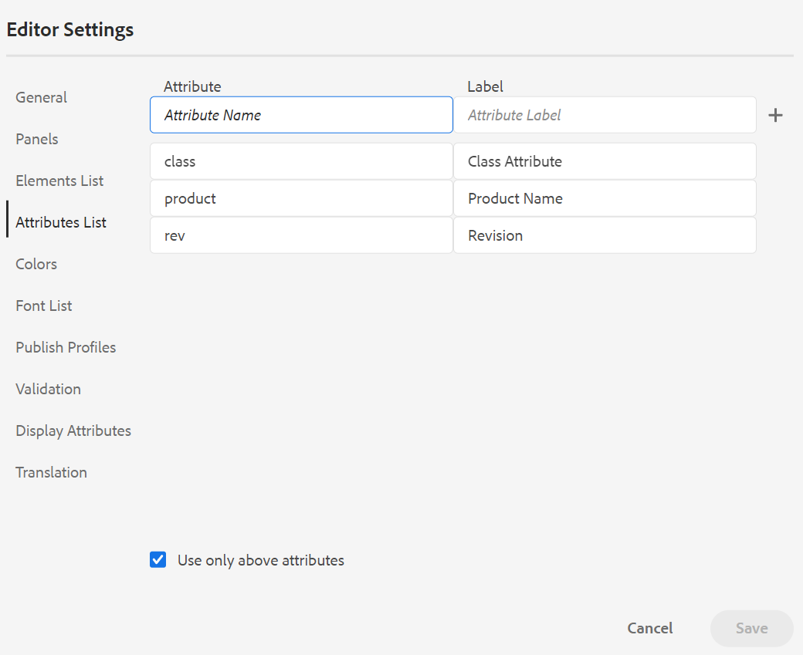{width="650" align="left"}

  使用此设置，当尝试将属性添加到元素时，您只会看到列表中配置的属性列表。

  {width="300" align="left"}

- **发布配置文件**：这包含可用于发布的发布配置文件 **知识库** 输出。 您可以为目标知识库创建新的用户档案。 例如，Salesforce或ServiceNow。

   - **创建Salesforce发布配置文件**

     **前提条件**

      - 为Salesforce创建连接的应用程序。 有关更多详细信息，请参阅 [为API集成启用OAuth设置](https://help.salesforce.com/s/articleView?id=sf.connected_app_create_api_integration.htm&amp;type=5).

      - 配置连接的应用程序时，请确保满足以下条件：

         - 指定回调。

           `URL: http://<server name>:<port>/bin/dxml/thirdparty/callback/salesforce`

         - 选择以下OAuth范围：
            - 完全访问（完全）
            - 选择通过API (api)管理用户数据

  配置应用程序后，Salesforce会提供 **使用者密钥** 和 **使用者密码**.

  这些资源可用于创建Salesforce发布配置文件。


   - 要创建Salesforce发布配置文件，请选择 **Salesforce** 来自的知识库 **服务器类型** 下拉菜单。 输入配置文件名称。 在 **站点URL**，输入用于发布输出的使用者网站，然后添加 **使用者密钥** 和 **使用者密码** 由Salesforce消费者网站提供。 然后， **验证** 和 **保存** 新创建的配置文件。
     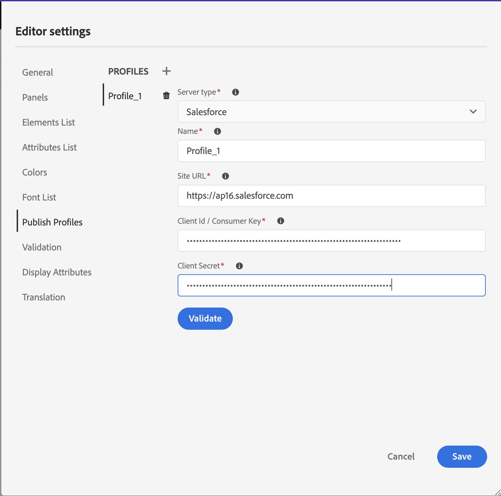{width="550" align="left"}

     >[!NOTE]
     >
     >要为《Experience Manager指南》中的Salesforce配置代理，请使用AEM中的Apache HTTP组件代理配置。 了解如何 [为AEM Link Checker配置代理](https://helpx.adobe.com/experience-manager/kb/How-to-configure-proxy-for-the-AEM-Link-Checker-AEM.html).


   - **创建ServiceNow发布配置文件**

     **前提条件**

     配置ServiceNow服务器以上传资产。
      - 连接到 **ServiceNow** 服务器。
      - 导航到 **系统属性** > **安全性**.
      - 取消选中以下选项：

        **必须设置此属性以激活用于上传的MIME类型检查（所有版本Eureka及更高版本）。 启用(true)或禁用(false)文件附件的mime类型验证。 上传期间，将检查通过glide.attachment.extensions配置的文件扩展名是否具有MIME类型。**

      - 单击&#x200B;**保存**。

     配置应用程序后，创建 **ServiceNow** 发布配置文件。
   - 要创建发布配置文件，请从中选择ServiceNow知识库 **服务器类型** 下拉菜单。 输入配置文件 **名称**. 在 **ServiceNow URL**，输入用于发布输出的消费者网站，然后添加 **用户名** 和 **密码** 由ServiceNow使用者站点提供。 然后， **验证** 和 **保存** 新创建的配置文件。

     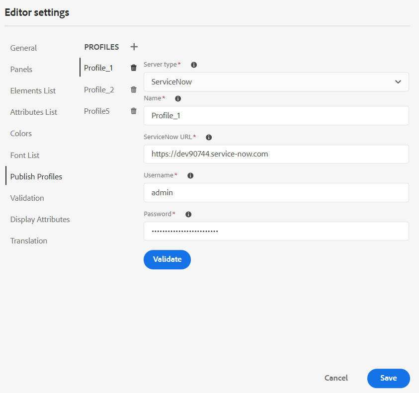{width="550" align="left"}

  验证后，可以在DITA Map的输出预设中选择发布配置文件，并使用它生成输出到  **Salesforce** 或 **ServiceNow** 您选择的服务器。

  了解关于 [知识库](../user-guide/generate-output-knowledge-base.md) 输出预设。


- **验证**：此选项卡包含用于在Web编辑器中配置模式验证的选项。 您可以启用以下功能：

   - **在保存文件之前运行验证检查**：选择此项可在执行任何保存操作之前使用选定的架构文件运行架构验证。 您可以通过单击+图标来添加Schematron文件。 将列出选定的架构文件。

     >[!NOTE]
     >选定的架构文件将在选定的文件夹配置文件中保留。

     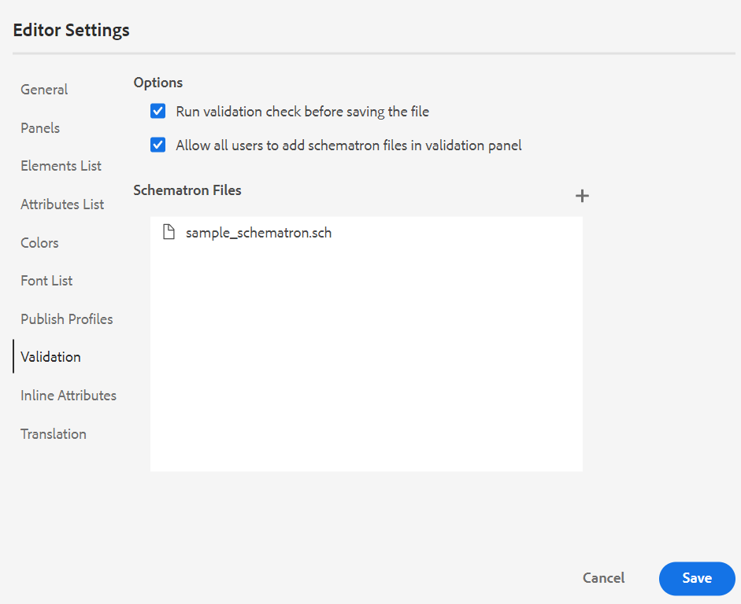{width="550" align="left"}
这会阻止用户保存任何违反选定架构文件中定义的规则的文件。 如果未选择此选项，则在保存更改之前不会验证文件。

   - **允许所有用户在验证面板中添加架构文件**：选择此项可允许用户在Web编辑器的验证面板中添加任何Schematron文件。 这允许用户添加Schematron文件，然后针对Schematron文件验证主题。 如果未选择此选项， **添加Schematron文件** 按钮不适用于 **验证面板** Web编辑器的。


- **显示属性**：与“属性列表”一样，您可以控制要在元素的属性列表中显示的属性列表。 默认情况下，四个 **显示属性**  — 受众、平台、产品和prop已配置为显示在元素的属性列表中。 您还可以使用添加显示属性 **添加** 图标。 您也可以使用删除任何显示属性 **删除** 图标。

  为元素定义的属性将显示在“布局”和“大纲”视图中。

  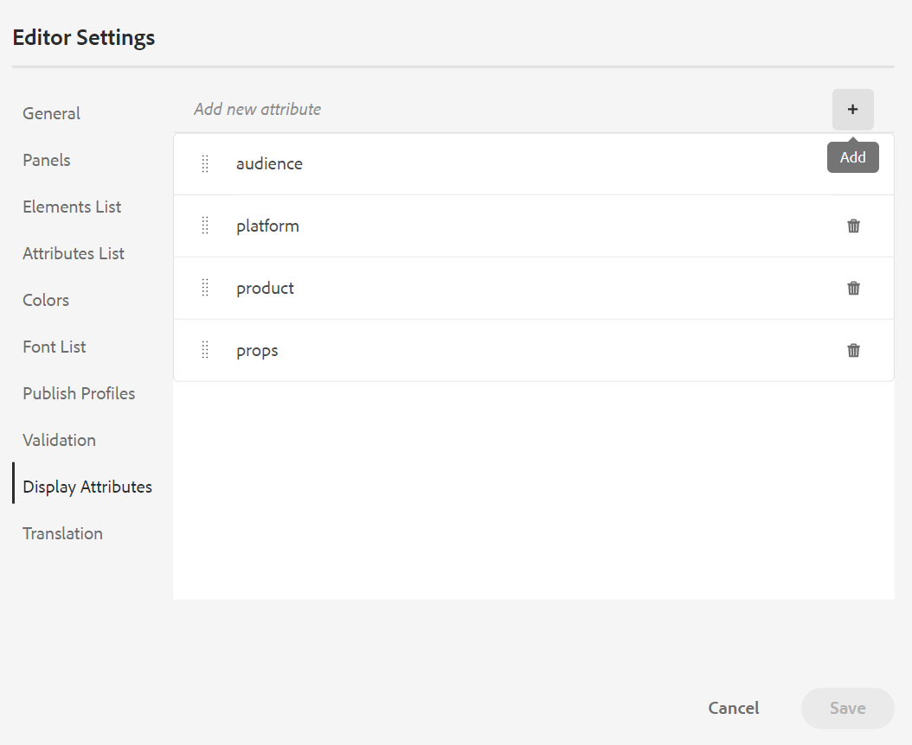{width="550" align="left"}

- **翻译**：此选项卡包含用于将源标签传播到目标版本的选项。

   - **将源版本标签传播到目标版本**：选择此选项可将源文件版本的标签传递到已翻译的文件。 默认情况下，该选项处于禁用状态。

  {width="550" align="left"}

- **元数据**：您可以控制主题的版本元数据及其值显示在 **版本历史记录** 对话框。  在元数据路径中，指定要从中选取元数据的节点的位置。 您还可以将元数据的自定义名称定义为标签。 默认属性为“标题”、“文档状态”和“标记”。

  可以从下的任何属性中选取元数据 `/jcr:content` 节点，以便您可以将属性的路径添加为元数据路径。


  如果元数据路径为空，则会显示错误。 如果将标签留空，则会选取最后一个元素作为标签。


  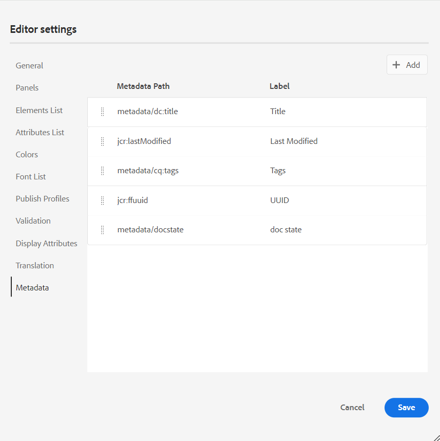{width="550" align="left"}

  *配置元数据&#x200B;**版本历史记录**对话框。*


  您还可以定义这些元数据标记的显示顺序。 要更改这些标记的默认顺序，请选择虚线将标记拖放到所需位置。
元数据标签以相同的顺序显示在 **版本历史记录** Web编辑器的。


**用户首选项** - 

“用户首选项”适用于所有作者。 使用这些首选项，作者可以配置以下设置：

{width="550" align="left"}

- **使用设备主题**：选中此复选框可允许AEM Guides根据设备的主题在浅色和深色主题之间自动切换。

- **文件查看方式**：选择在Web编辑器中查看文件的默认方式。 您可以按标题或文件名查看文件列表，这些文件名来自中的各个面板。 **作者** 视图。
  >[!NOTE]
  >
  > 默认情况下，文件在Web编辑器中按标题显示。

- **主题**：您可以为该编辑器选择浅色、最亮、最深或最深的主题。 对于最浅的主题，工具栏和面板使用更浅的灰色背景。 对于浅色主题，工具栏和面板使用浅灰色背景。 对于最深的主题，工具栏和面板使用更深的黑色背景色。 如果为深色主题，则工具栏和面板会使用黑色背景。 在所有主题中，内容编辑区域都以白色背景显示。

- **文件夹配置文件**：文件夹配置文件控制与条件属性、创作模板、输出预设和Web编辑器配置相关的各种配置。 默认情况下，将显示“全局配置文件”。 此外，如果您的管理员在系统中配置了文件夹配置文件，则这些文件夹配置文件也会显示在文件夹配置文件列表中。

  管理员可以在文件夹配置文件中定义的Web编辑器配置包括：自定义用户界面，包括工具栏图标、Web编辑器的布局、代码片段和根映射。 有关更多详细信息，请参阅 *配置全局或文件夹级别的配置文件* 在“安装和配置Adobe Experience Manager Guides”as a Cloud Service中。

  >[!NOTE]
  >
  > 当前文件夹配置文件的名称在主工具栏中显示为“用户首选项”图标的标签。

- **基本路径**：默认情况下，当您从Web编辑器访问AEM存储库时，您会看到来自/content/dam位置的资源。 您的工作文件夹很可能是/content/dam/文件夹中的几个文件夹。 每次单击几下即可访问工作文件夹。 您可以将基本路径设置为工作文件夹，然后存储库视图会预先显示来自该位置的内容。 这可以缩短访问工作文件夹的时间。 此外，在主题中插入任何引用或媒体文件时，文件浏览位置将以“基本路径”中设置的文件夹开始。

- **选择根映射**：选择一个DITA映射文件以解析键引用或术语表条目。 解析关键引用时，所选根映射的优先级最高。 有关更多详细信息，请参阅 [解析关键引用](map-editor-other-features.md#id176GD01H05Z).

>[!NOTE]
> 
> 如果您不想使用任何根映射，请确保 **选择根映射** 字段为空。

**“创作”、“源”和“预览”模式**

有关各种创作和文档查看模式的详细信息，请参阅 [Web编辑器视图](web-editor-views.md#).

## 辅助工具栏 {#id2051EA0J0Y4}

在Web编辑器中打开主题进行编辑时，将显示辅助工具栏。 辅助工具栏中可用的功能说明如下：

**插入元素** - 

在当前或下一个有效位置插入有效元素。 您也可以使用键盘快捷键 ***Alt***+***输入*** 以打开“插入元素”弹出菜单。 例如，您正在编辑一个段落，然后在 **插入元素** 弹出窗口，将显示可以插入段落中的元素列表。 选择要插入的元素。 您可以使用键盘滚动元素列表并按 ***输入*** 以插入所需的元素。 您还可以在搜索框中键入字符或字符串，并搜索以它开头的元素。


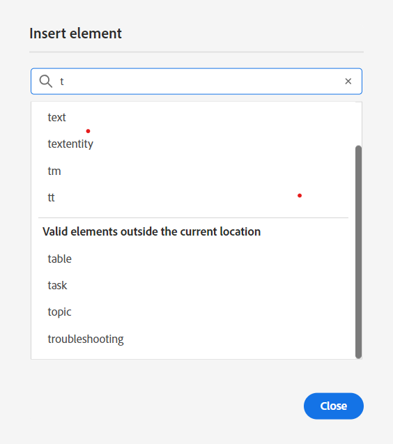{width="300" align="left"}

*输入“t”可搜索以“t”开头的所有有效元素。*

如果您在块元素内工作，例如 `note`，然后使用插入元素图标在 `note` 元素。 在以下屏幕快照中，注释元素已插入p \(paragraph\)元素中：

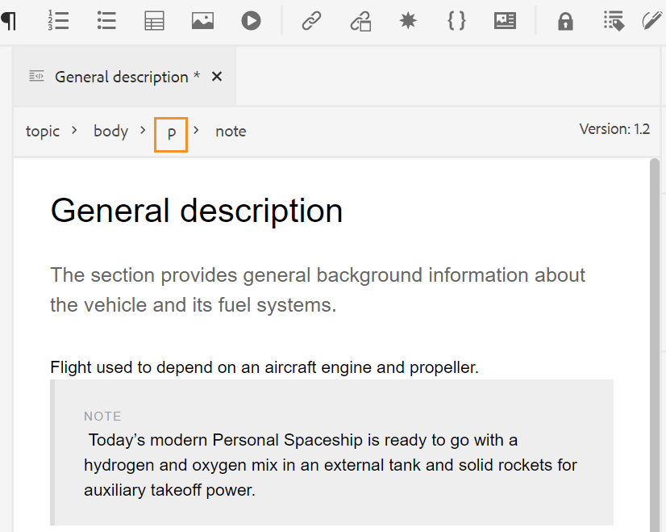{width="800" align="left"}

如果在注释元素中按Enter键，则会在注释元素本身中创建一个新段落。 要在注释外部插入新元素，请在元素痕迹导航中单击相应p元素\（在屏幕快照中高亮显示\），然后单击插入元素图标或按 ***Alt***+***输入*** 以打开“插入元素”弹出菜单。 然后，选择所需的元素并按Enter键将所选元素插入到注释元素之后。

当出现闪烁的块光标时，您还可以在两个元素之间添加元素。

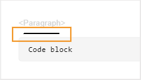{width="300" align="left"}

例如，如果您正在处理DITA主题，并且块光标在简短描述和主体之间闪烁，则可以添加 `prolog` 元素，然后添加版权、作者和其他详细信息。

输入新元素的另一种方法是使用上下文菜单。 在文档中的任意位置单击鼠标右键以调用上下文菜单。 从此菜单中选择 **插入元素** 以显示 **插入元素** 对话框，然后选择要插入的元素。

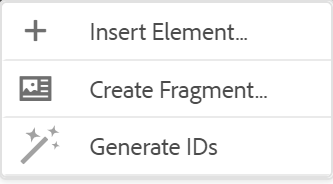{width="300" align="left"}

**插入段落** - 

在当前或下一个有效位置插入段落元素。

**插入/删除编号列表** - 

在当前或下一个有效位置创建编号列表。 如果您在编号列表中并单击此图标，则项目将转换为普通段落。

**插入/删除项目符号列表** - 

在当前或下一个有效位置创建项目符号列表。 如果您位于项目符号列表上并单击此图标，该项目将转换为普通段落。

>[!NOTE]
>
>您还可以选择 **拆分列表** 列表项的上下文菜单中的选项，用于拆分当前列表并开始在同一级别的新列表。

**插入表** - 

在当前或下一个有效位置插入表。 单击“插入表格”图标以打开“插入表格”对话框：

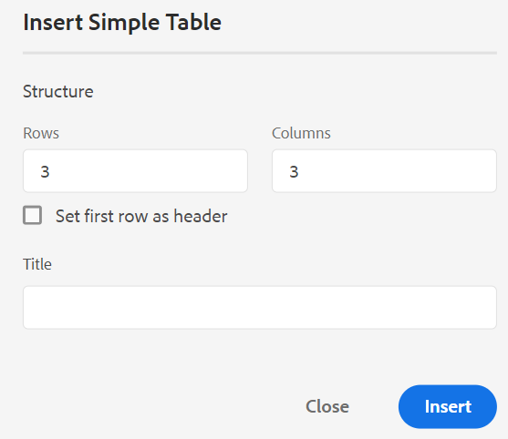{width="550" align="left"}

您可以指定表中所需的行数和列数。 如果要将第一行保留为表头，请选择“将第一行设置为表头”选项。 要向表格添加标题，请在标题字段中输入该标题。

插入表后，可以使用上下文菜单修改表。

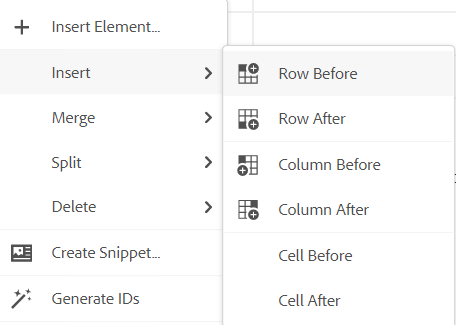{width="550" align="left"}

使用该表的上下文菜单，您可以：

- 插入单元格、行或列

- 在右侧和向下合并单元格

- 水平或垂直拆分单元格

- 删除单元格、行或列

- 从表中创建代码片段

- 生成Id


您还可以在表的多个单元格、整行或列上定义属性。 例如，要对齐表格单元格，请拖动并选择所需的单元格。 在右侧的“内容属性”面板中， **类型** 更改为 **多个条目**.

1. 在 **属性** 部分，单击 **+添加**.
1. 选择 `@valign` 属性来自 **属性** 下拉列表。
1. 从值下拉列表中，选择要应用于选定表单元格的所需文本对齐方式。
1. 单击 **添加。**

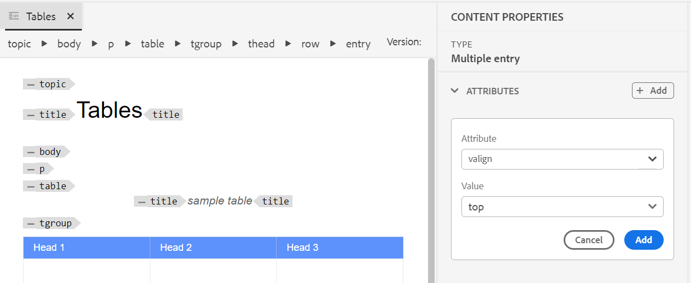{width="800" align="left"}

**插入图像** - 

在当前或下一个有效位置插入图像。 单击“插入图像”图标以打开“插入图像”对话框，然后搜索并选择您要插入的图像。

>[!NOTE]
>
> 您也可以通过将图像从本地系统拖放到文章上来添加图像。 在本例中，图像文件是使用 **上传资产** 工作流。  欲知更多详情，请参见 **上传资产** 中的工作流 [左侧面板](web-editor-features.md#id2051EA0M0HS) 部分。


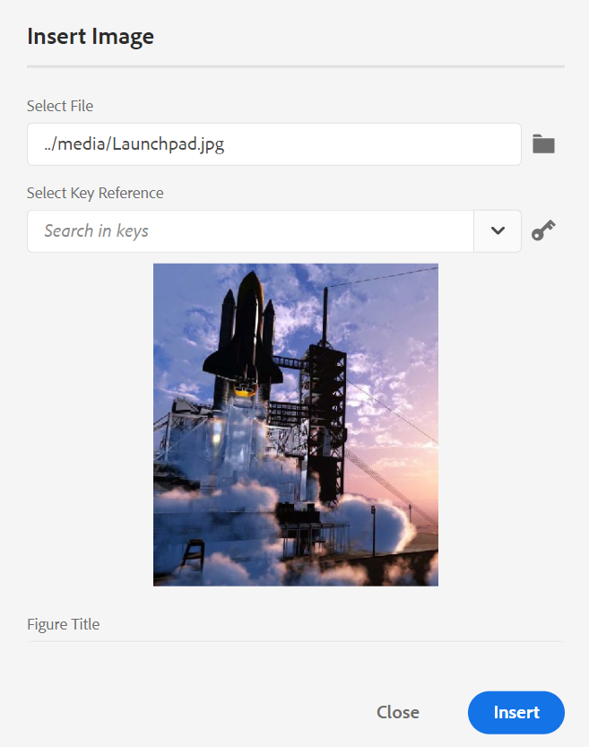{width="650" align="left"}

可以在“插入图像”对话框中为图像添加图像/图形标题和替换文本。

通过在顶部的“要搜索的类型”栏中输入文件名，可以搜索所需的图像文件，还可以按“路径\（要搜索的位置\）”、“收藏集”、“文件类型”和“标记”筛选搜索结果。 找到所需的图像文件后，选择该文件并单击“选择”将图像插入到文档中。 您可以插入各种格式的图像文件，如 `.png`， `.svg`， `.gif`， `.jpg`， `.eps`， `.ai`， `.psd`，等等。

插入图像后，您可以从“内容属性”面板中更改高度、宽度、版面和属性。 单击某个图像文件，然后在右边栏的“内容属性”面板中进行更改。

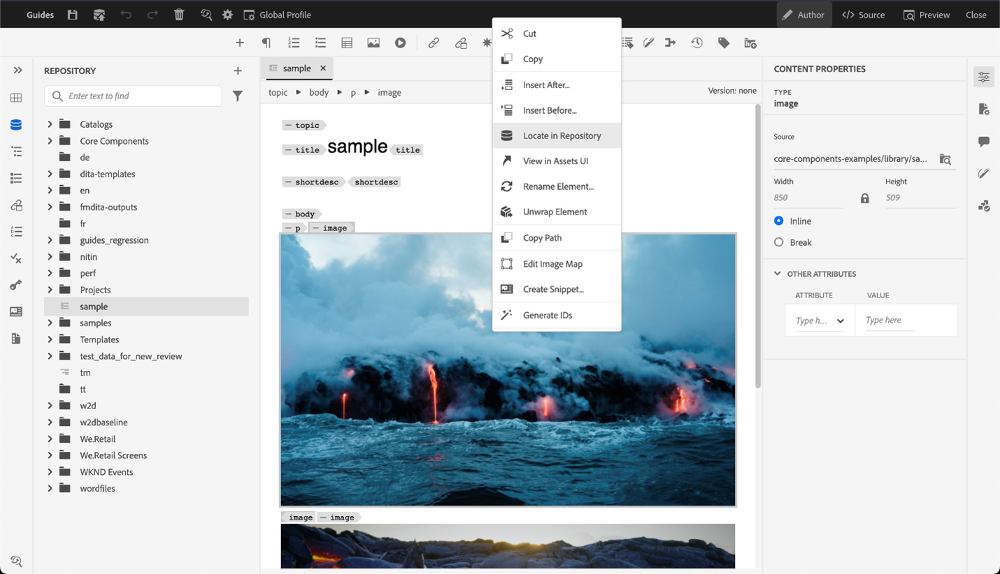{width="800" align="left"}

“源”字段显示所插入图像文件的UUID。 通过将鼠标指针悬停在“源”字段上，可以找到插入图像文件的完整路径。 该路径将显示在工具提示中。

您可以通过提供图像文件的“高度”或“宽度”值来调整图像的大小。 图像的纵横比会自动得到保持。 如果需要，还可以通过单击“保持宽高比”(Maintain Aspect Ratio)的锁定图标\(属于“保持宽高比”(Maintain Aspect Ratio)\)并提供“高度”(Height)和“宽度”(Width)值来选择不保持图像文件的宽高比。

也可以将图像的“放置”设置指定为“内联”或“破断”。 如果选择使用“断点”放置选项，则可以选择对齐图像的位置（“左”、“中”或“右”）。

您还可以通过选择中所需的属性，为图像文件添加其他属性 **属性** 字段。

>[!NOTE]
>
>您还可以在图像中定义可单击区域\（图像映射\）。 欲知更多详情，请参见 **插入/编辑图像映射** 中的功能描述 [左侧面板](web-editor-features.md#id2051EA0M0HS) 部分。

**图像或媒体文件的上下文菜单**

也可以使用上下文菜单对图像和媒体文件执行一些常见操作。 在图像上的任意位置单击鼠标右键以调用上下文菜单。

上下文菜单提供剪切、复制或粘贴图像或媒体的选项。 可在所选元素之前或之后插入元素。 您还可以选择重命名或取消元素包装。 您可以在存储库中找到选定的图像或媒体，或在资产UI中查看文件预览。

利用上下文菜单中的其他选项，可复制路径、编辑图像映射、创建代码片段或为所选元素生成ID。

**插入多媒体** - 

插入不同类型的多媒体文件。 单击“插入多媒体”图标，然后选择要插入的文件类型。 支持的多媒体格式包括：

- 音频文件
- 视频文件
- YouTube
- Vimeo

选择“音频或视频文件”选项时，将显示存储库视图，以浏览并选择所需的文件。 如果选择YouTube或Vimeo，则会显示“插入多媒体”对话框。 将视频文件的链接粘贴到Web链接字段中，然后单击“插入”以将视频添加到文档中的当前或下一个有效位置。

>[!NOTE]
>
> 添加YouTube视频链接时，您需要替换字符串 `watch?v=` 替换为 `embed` 在URL中。 例如，要添加YouTube视频链接，请执行以下操作： `https://www.youtube.com/**watch?v**=WlIKQOrmZcs`，您需要将其添加为： `https://www.youtube.com/**embed/**WlIKQOrmZcs`. 此更改可确保在AEM站点和PDF输出中嵌入视频。

也可以从“插入多媒体”对话框添加音频或视频文件。 选择“音频/视频文件”选项，然后单击浏览图标以启动存储库视图。 从存储库中选择音频或视频文件，然后单击选择，以在音频/视频文件字段中添加该文件的链接。 如果选择视频文件，则文件的预览也会显示在“预览”区域中。 您可以播放视频文件以查看其预览。

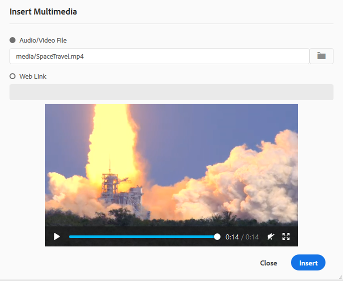{width="650" align="left"}

**插入交叉引用** - 

插入以下类型的引用：内容引用、内容键引用、键引用、文件引用、Web链接或电子邮件链接。

单击 **选择文件** 图标\（用于内容引用和文件引用\）或 **选择映射** 图标\（适用于内容键引用和键引用\）并选择要链接到的所需文件或内容。

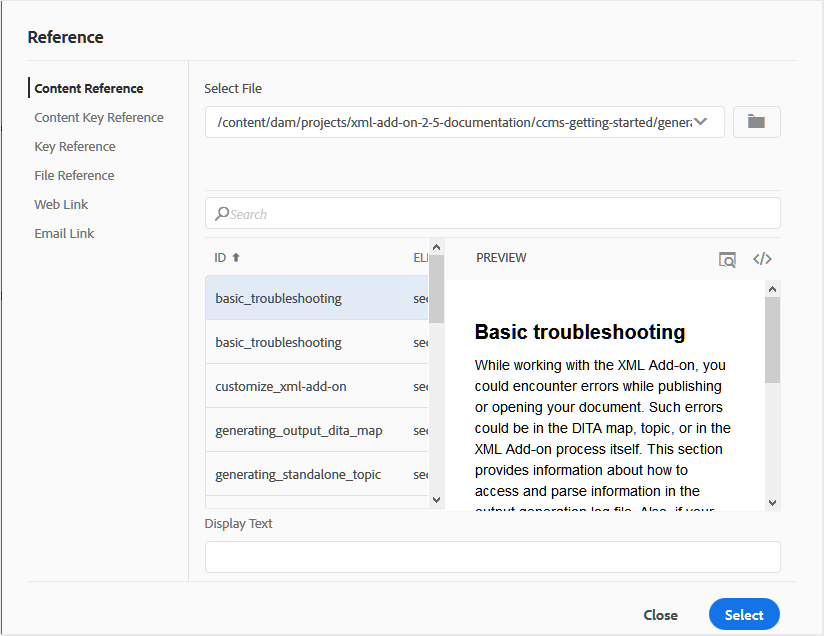{width="650" align="left"}

所选引用的链接即添加到文档中。 链接上的上下文菜单为您提供了以下选项：

- **插入元素**：显示可在给定上下文中插入的有效元素列表。
- **复制UUID**：复制插入引用的UUID。
- **复制路径**：复制插入引用的完整路径。
- **创建代码片段**：从插入的引用创建可重用的代码片段。
- **生成Id**：为插入的引用生成唯一ID。

您也可以使用要引用的文件的UUID进行搜索。 对于“内容”和“键引用”链接，输入要链接到的文件的UUID，将自动搜索该文件并在“预览”部分中显示该文件。 指定文件的UUID时，无需明确提及.xml文件的文件扩展名。 .xml扩展名会自动附加到UUID中。

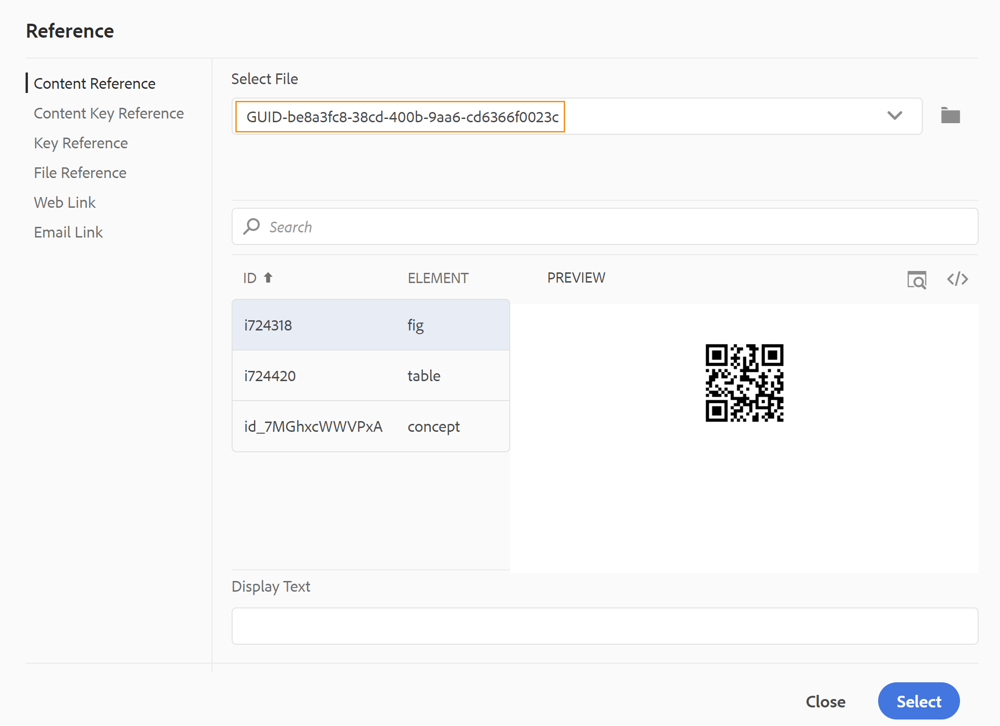{width="650" align="left"}

如果您的管理员已在以下位置启用UUID选项： *XMLEditorConfig*，则您将在中看到引用内容的UUID **链接** 属性。

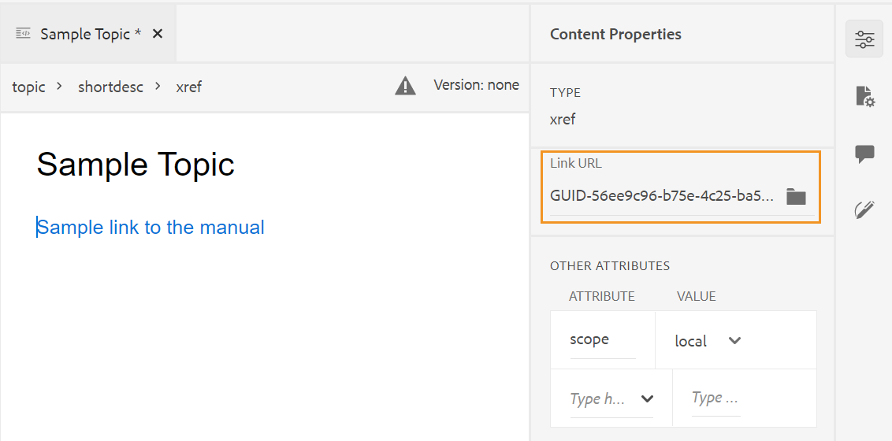{width="800" align="left"}

>[!NOTE]
>
> 如果 **启用UUID** 选项，则会显示引用内容的相对路径。

>[!IMPORTANT]
>
> 即使引用的内容的相对路径显示在 **链接** 属性，链接是在内部使用引用内容的UUID创建的。

>[!TIP]
>
> 有关引用内容的最佳实践，请参阅最佳实践指南中的引用部分。

**筛选搜索**

您可以在AEM存储库选定路径上的文件中搜索某些文本。 例如，“general”会在下面给定的屏幕快照中进行搜索。 您还可以使用增强型筛选器缩小搜索范围。 您可以查找选定路径中存在的所有DITA文件，如DITA主题和DITA映射。

您可以在所选路径中搜索非DITA文件，如图像文件、多媒体和文档。 您还可以在DITA元素的属性中搜索特定值。 您还可以查找由指定用户签出的文件。

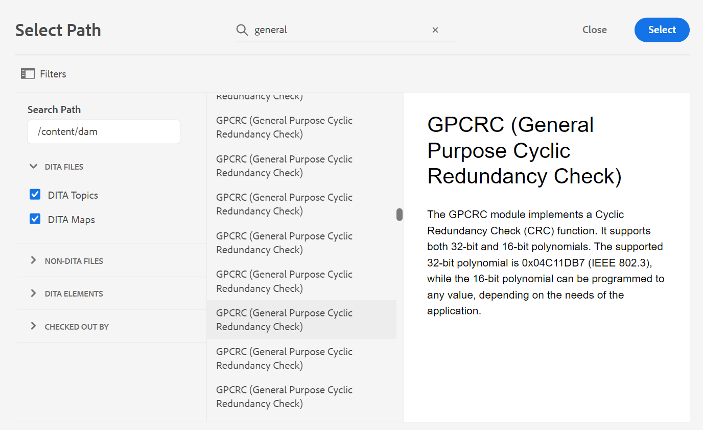{width="650" align="left"}

>[!NOTE]
>
> 系统管理员还可以配置文本过滤器，并显示或隐藏其他过滤器。 有关更多详细信息，请参阅安装和配置Adobe Experience Manager Guidesas a Cloud Service中的配置文本过滤器部分。

将显示包含搜索文本的已过滤文件的列表。 例如，在上面的屏幕截图中，列出了包含文本“general”的文件。 您还可以预览文件的内容。

**插入可重用内容** - 

重复使用项目中任何其他文档中存在的内容。 您可以通过直接链接到文件中的内容或使用键引用插入内容，请参见 [解析关键引用](map-editor-other-features.md#id176GD01H05Z). 在单击插入可重用内容图标时，您将看到重用内容对话框：

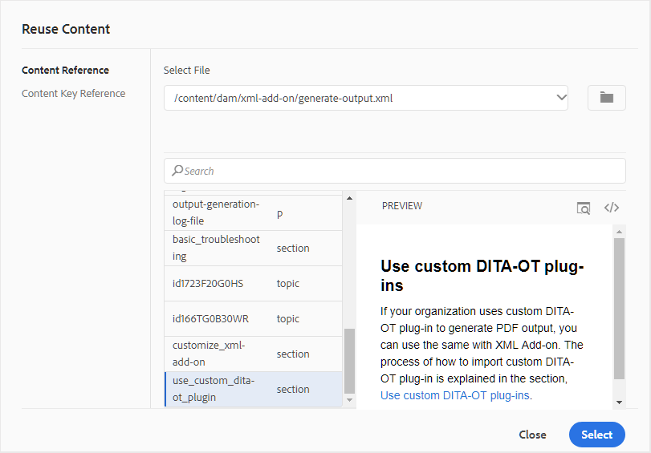{width="650" align="left"}

在“重用内容”对话框中，为文件引用选择DITA文件，或选择包含键引用的DITA映射文件。 选中后，该主题或关键引用将显示在对话框中。 您可以选择要插入的主题的ID/键，然后单击完成以在主题中插入内容。

对于插入“内容引用”，您还可以输入文件的UUID，并且该文件中的可重用内容将在“预览”部分中列出。

根据插入链接的设置，您可以在“属性”面板或“源代码”视图中查看插入内容的UUID或相对路径。 链接始终使用引用内容的UUID创建。 请参阅安装和配置Adobe Experience Manager指南as a Cloud Service中的配置基于UUID的链接。

>[!NOTE]
>
> 要在引用的内容之前或之后添加内容，请使用 *Alt*+*左侧* 箭头或Alt+*右* 使用箭头键将光标移动到所需位置。

您还可以将引用的内容嵌入主题中，方法是右键单击引用的内容，然后选择 **将引用替换为内容** 从上下文菜单中。

**插入特殊字符** -  

在主题中插入特殊字符。 单击“插入特殊字符”图标，打开“插入特殊字符”对话框。

>[!NOTE]
>
> AEM Guides提供了可移动和可调整大小的对话框。 可以在右下角调整具有两条交叉线的对话框的大小。 “特殊字符”对话框中的交叉线如下所示。

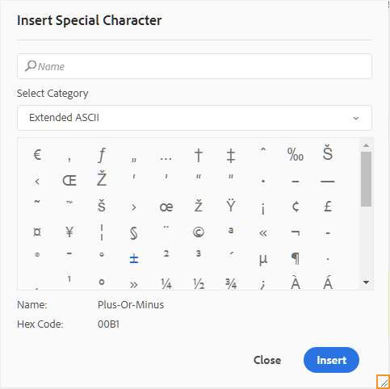{width="550" align="left"}

在“插入特殊字符”对话框中，可以使用特殊字符的名称搜索特殊字符。 所有特殊字符都存储在各种类别下。 使用选择类别下拉列表并选择类别。 将显示所选类别中可用的特殊字符。 您可以使用箭头键浏览特殊字符列表，或单击要插入的所需字符。 所选特殊字符的“名称”和“十六进制代码”显示在列表下方。 单击“插入”，在文档中插入选定的字符。

**插入关键字** - 

插入在DITA映射中定义的关键字。 单击“插入关键字”图标以打开“键引用”对话框。

{width="550" align="left"}

关键字按字母顺序列出，您还可以通过在“搜索”框中键入搜索字符串来搜索关键字。 搜索结果将返回包含ID或值中的字符串的关键字。 此对话框中列出了在DITA映射中定义的关键字。 选择要插入的关键字并单击 **插入**.

也可以通过右键单击该关键字并选择“属性”选项来更改插入关键字的属性。 将打开“关键字属性”对话框：

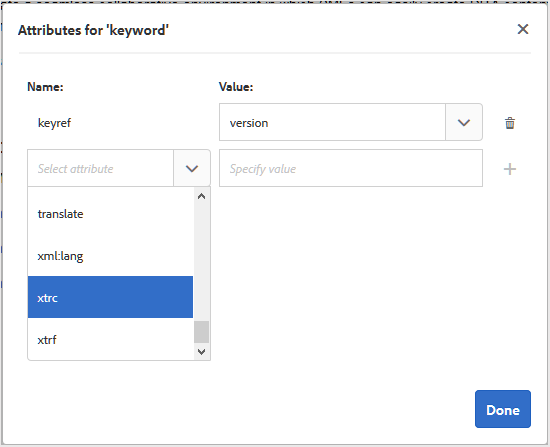{width="550" align="left"}

您可以更改关键字的属性或向关键字添加新属性。

**插入代码片段** - 

在当前或下一个有效位置插入代码片段。 要使此功能正常工作，您必须在系统中定义代码片段。 有关添加代码片段的更多信息，请参阅 **代码片段** 中的功能描述 [左侧面板](web-editor-features.md#id2051EA0M0HS) 部分。

单击插入代码片段图标时，将显示插入代码片段目录。 目录是上下文相关的，这表示只有在当前位置允许显示代码片段时，才会显示代码片段。

以下示例显示了两个预先配置的代码片段 — Warning和Error ，它们可以插入文档中的当前位置。

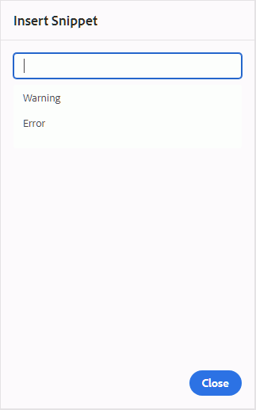{width="300" align="left"}

当从列表中选择一个代码片段时，它会插入到文档中的当前或下一个有效位置。 以下屏幕截图显示了文档中插入的错误片段：

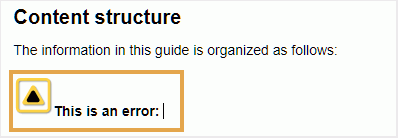{width="400" align="left"}

**插入/编辑图像映射** - 

在选定图像上插入图像映射。 具有链接到主题或网页的可单击区域的图像称为图像映射。

在当前主题中选择图像，然后单击插入/编辑图像映射图标以打开插入图像映射对话框。

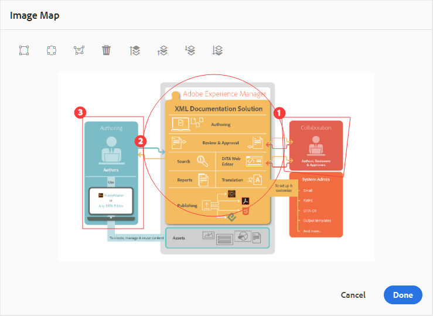{width="650" align="left"}

选择首选形状“矩形” ，圆形 ，或多边形  在图像上定义要用作链接的区域。 定义区域后，将出现“引用”对话框，您需要在其中指定指向内部或外部内容的链接：

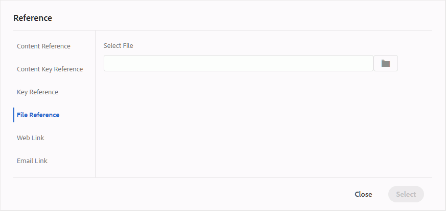{width="650" align="left"}

如果区域重叠，可以通过单击工具栏中相应的图标来将形状前移或后移。 您也可以通过选择某个区域并单击删除图标来删除该区域。 双击某个区域会打开“参照”对话框，您可以在其中更改目标链接。 在图像上标记所需的区域后，单击“完成”以保存更改。

**签出/签入** - / 

签出或签入当前文件。 签出文件为用户提供了对该文件的独占写入权限。 当文件被签入时，更改将保存在文件的当前版本中。

如果您在“映射视图”中并展开父映射，则只需单击一下即可签出映射中的所有文件。 只需展开父映射文件并选择父文件即可，这将导致选择映射中的所有文件。 然后，您可以选择 **签出**   以锁定地图中的所有文件。

>[!NOTE]
>
> 签入具有任何未保存更改的文件时，会提示您保存更改。 如果不保存更改，则它仅签入文件。

检入/检出的工具提示由 `ui_config.json` 文件。

有关详细信息，请查看 [配置签入和签出图标的标题](../install-guide/conf-checkin-checkout-title.md) ，请参见On-premise Installation and Configuration Guide。


**切换标记视图** - 

标记是指示元素边界的可视提示。 元素边界标记元素的开始和结束。 然后，您可以使用这些边界作为视觉提示来放置插入点或选取边界内的文本。 如果要在文档中的元素之前或之后插入另一个元素，可以将插入点放置在元素的打开或关闭边界之前或之后。

以下屏幕截图显示了打开了标记视图的文档：

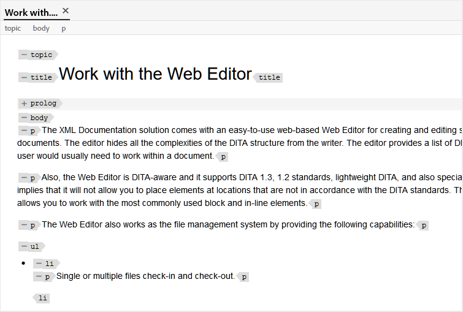{width="650" align="left"}

下列操作可以在标签视图开启的文档中执行：

- **选择元素**：单击元素的开始或结束标记以选择其内容。

- **展开或折叠标记**：单击标记中的+或 — 符号可展开或折叠标记。

- **使用上下文菜单**：上下文菜单提供用于剪切、复制或粘贴选定元素的选项。 您还可以在所选元素之前或之后插入元素。 其他选项允许您生成ID或打开选定元素的“属性”面板。

- **拖放元素**：选择元素的标记并将其轻松拖放到文档上。 如果放置位置是允许元素的有效位置，则元素将放置在放置的位置。


>[!NOTE]
>
> 如果用户从Web编辑器中启用标记视图，则即使跨会话，该视图也会保持启用状态。 这意味着您无需再次启用“标记视图”即可稍后访问它。新用户会话的“标记视图”的默认值由ui\_config.json文件中的tagsView属性决定。 欲知更多详情，请参见 *为标记视图配置默认值* 安装和配置Adobe Experience Manager Guidesas a Cloud Service部分中的。

**启用/禁用跟踪更改** 

通过启用“跟踪更改”模式，您可以跟踪对文档所做的所有更新。 启用跟踪更改后，文档将捕获所有插入和删除。 使用删除线突出显示所有已删除的内容，并以绿色文本突出显示所有插入。 此外，您还可以在主题页面的边缘获得更改条。 再次重申，对于已删除的内容，将显示红色栏，对于添加的内容，将显示绿色栏。 如果同一行中存在添加和删除操作，则绿色栏和红色栏都会显示。

以下屏幕截图突出显示删除和插入的内容以及更改条：

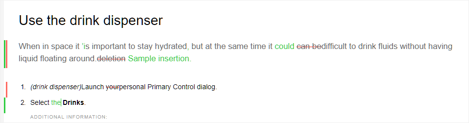{width="650" align="left"}

跟踪文档中的更改的典型用例可以是进行同行审阅。 您可以启用跟踪更改并共享文档以供审阅，审阅者随后进行更改并启用跟踪更改。 当您收到文档时，您应该具有查看建议更新的机制，以及一种接受或拒绝更改的便捷方式。

AEM Guides提供了跟踪更改功能，该功能包含在文档中进行的更新的相关信息。 “跟踪的更改”功能提供有关已进行哪些更新、谁进行了这些更新以及何时进行这些更新的信息。 使用“跟踪的更改”功能，您还可以轻松地接受或拒绝文档中的建议更新。

要访问该功能，请单击右侧面板中的跟踪更改图标。

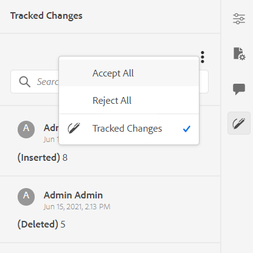{width="300" align="left"}

单击更改会选择文档中的更改内容。 您可以通过选择“接受更改”图标来接受更改，或通过选择“拒绝更改”来拒绝更改。

如果要通过单击接受或拒绝所有更改，请选择 **全部接受** 或 **全部拒绝**.

>[!NOTE]
>
> “预览”模式允许您查看文档，无论是否包含已更改内容的标记。 欲知更多详情，请参见 [预览](web-editor-views.md#preview-mode-id19AAGL00163) 模式。

**合并** - 

在多作者环境中工作时，很难跟踪其他作者在主题或地图中所做的更改。 “合并”功能不仅让您能够更好地控制变更的查看，而且还可以控制哪些变更保留在文档的最新版本中。

**合并主题文件**

要合并主题中的更改，请执行以下步骤：

1. 在Web编辑器中打开一个主题。

1. 单击 **合并**.

   此时将显示“合并”对话框。

   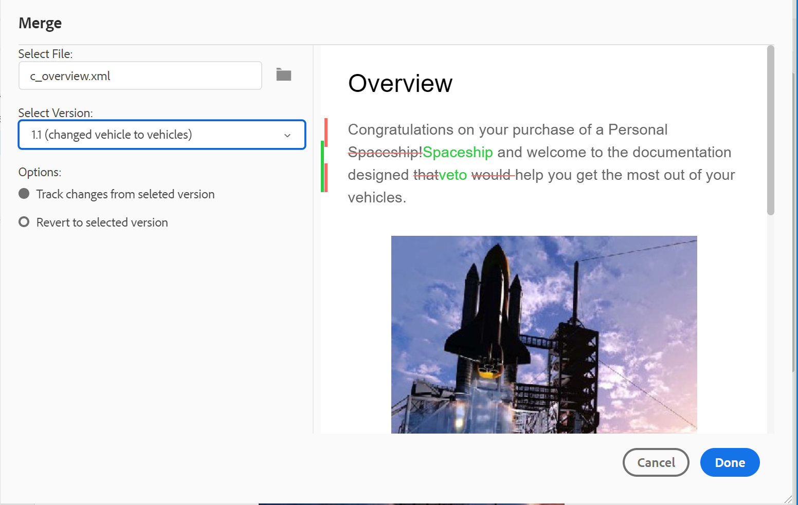{width="550" align="left"}

1. *\（可选\）* 您还可以浏览并从存储库中的其他位置选择新文件。

1. 选择要与文件的当前版本进行比较的文件版本。

1. 从“选项”中选择：

   - **跟踪选定版本中的更改**：此选项以跟踪更改的形式显示所有内容更新。 然后，您可以选择一次接受或拒绝文档中的更改，或者一次接受或拒绝全部更改。

   - **还原到所选版本**：此选项将文档的当前版本还原为所选版本。 此选项不会向您提供对接受或拒绝哪些内容的任何控制。

1. 单击&#x200B;**完成**。

1. 如果您选择了 **跟踪从所选版本更改的内容** 选项，则所选版本的所有更改都将显示在右侧面板的跟踪更改功能中。

   您可以从“跟踪的更改”面板中选择接受或拒绝所有注释，或者接受或拒绝单个注释。


**合并映射文件**

要合并映射文件中的更改，请执行以下步骤：

1. 在Web编辑器中打开映射。

1. 单击 **合并**.

   此时将显示“合并”对话框。

   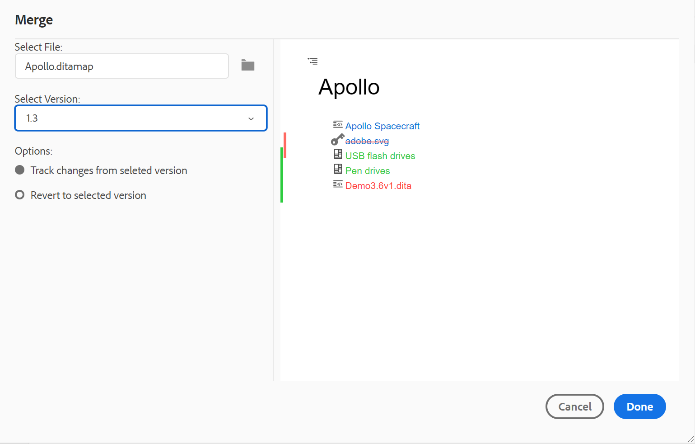{width="550" align="left"}

1. *\（可选\）* 您还可以浏览并从存储库中的其他位置选择新文件。

1. 选择要与文件的当前版本进行比较的文件版本。

1. 从“选项”中选择：

   - **跟踪选定版本中的更改**：此选项以跟踪更改的形式显示所有内容更新。 然后，您可以选择一次接受或拒绝文档中的更改，或者一次接受或拒绝全部更改。

   - **还原到所选版本**：此选项将文档的当前版本还原为所选版本。 此选项不会向您提供对接受或拒绝哪些内容的任何控制。

1. 单击&#x200B;**完成**。

   1. 如果您选择了 **跟踪从所选版本更改的内容** 选项，则所选版本的所有更改都会显示在跟踪的更改面板\（位于右侧）中。

      您可以从“跟踪的更改”面板中选择接受或拒绝所有更改，或者接受或拒绝映射文件中的单个更改。


**版本历史记录** - 


此 **版本历史记录** 利用Web编辑器中的功能，可检查DITA文件的可用版本、比较这些版本，并从编辑器本身还原到任何版本。

在版本历史记录中，您可以将当前版本（也可以是工作副本）的内容和元数据与同一文件的任何先前版本进行比较。 您还可以查看比较版本的标签和注释。

要访问版本历史记录并还原到主题的特定版本，请执行以下步骤：

1. 在Web编辑器中打开一个主题。

1. 单击 **版本历史记录**.

   此 **版本历史记录** 对话框。

   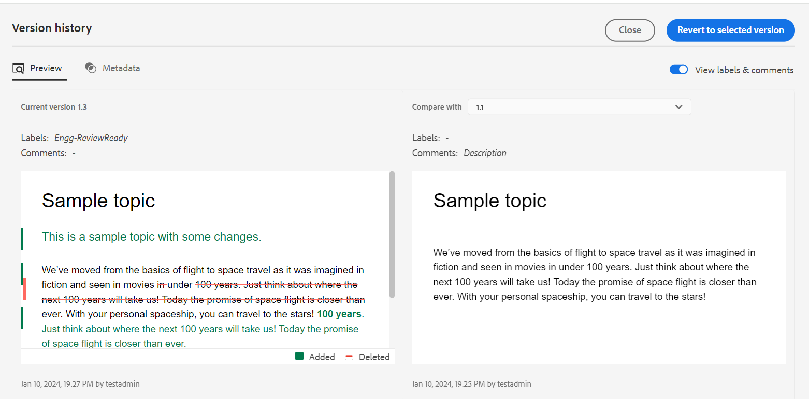{width="550" align="left"}
   *预览主题不同版本中的更改。*

1. 选择要在中比较或还原的主题版本 **比较** 下拉列表。

   >[!NOTE]
   >
   > 如果某个版本应用了标签，则这些标签也会与版本号一起显示\（在括号中）。


1. 启用 **查看标签和注释** 选项以查看应用于当前版本和比较版本的标签和注释。

1. 您还可以在以下位置查看以下信息 **版本历史记录** 对话框：

   **预览** 选项卡：新添加的内容为绿色字体，已删除的内容为红色字体。

   **元数据** 选项卡：新添加的元数据为绿色字体，已删除的元数据为红色字体。
   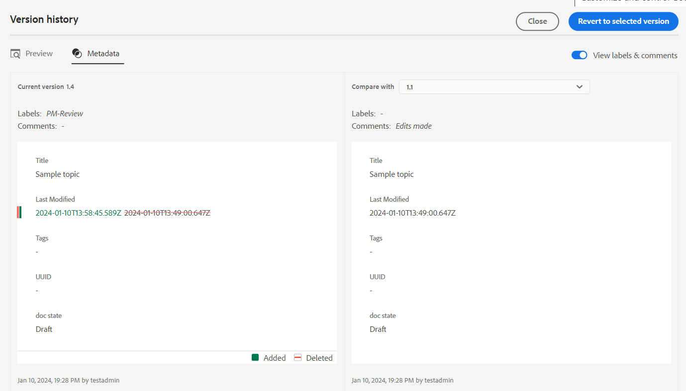{width="550" align="left"}
   *在版本历史记录中比较不同版本的元数据。*

   >[!NOTE]
   >
   > 系统管理员可以从编辑器设置的元数据选项卡中更改要显示的元数据。

   您还可以查看当前版本和比较版本的用户和时间详细信息。


1. 从下拉列表中选择一个版本后， **还原到所选版本选项** 可用。 预览窗口显示当前版本与所选版本的主题之间的差异。


1. 单击 **还原到所选版本** 将工作副本还原为所选的主题版本。

   将显示“还原版本”对话框。

   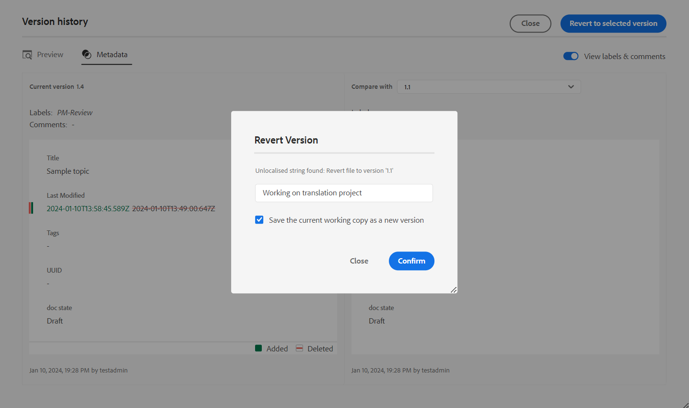{width="550" align="left"}

1. \(*可选*\)提供还原到早期版本的原因。 您也可以创建主题当前活动工作副本的新版本。

1. 单击 **确认。**

   文件的工作副本将还原为所选版本。 如果选择创建当前活动工作副本的新版本，则也会创建包含所有工作更改的新版本的文件。


在还原到早期版本时，将显示一个可视提示，指示您当前使用的版本不是最新版本。

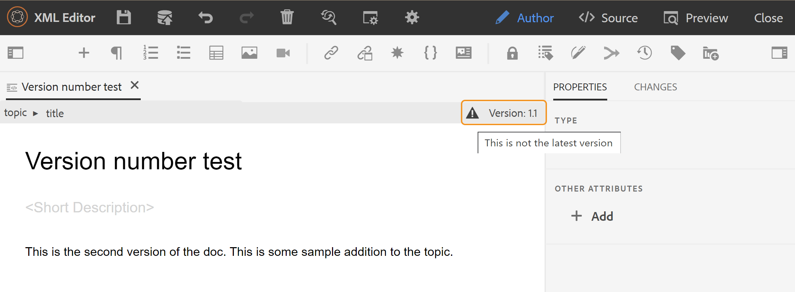{width="800" align="left"}

**版本标签管理** -  

标签可帮助您确定特定主题在DDLC \（文档开发生命周期\）中的阶段。 例如，在处理主题时，可以将标签设置为“已批准”。 发布主题并提供给客户后，您可以为该主题分配“已发布”标签。

AEM Guides允许您以自由格式文本格式指定标签或使用一组预定义标签。 自定义标签将允许系统中的任何作者根据其选择指定标签。 这提供了灵活性；但是，它会在系统中引入不一致的标签。 要解决此问题，管理员可以配置一组预定义标签。 有关配置预定义标签的详细信息，请参阅 *配置和自定义XML Web编辑器* 在“安装和配置Adobe Experience Manager Guides”as a Cloud Service中。

这些标签会以下拉列表形式显示给需要指定标签的作者。 这可确保在系统中仅使用预定义、一致的标签。

您可以通过多种方法向主题应用标签。 [版本历史记录](web-editor-use-label.md) 资产UI中的面板， [基线](/help/product-guide/user-guide/generate-output-use-baseline-for-publishing.md) UI和Web编辑器。 利用Web编辑器中的版本标签功能，作者可以快速轻松地为其主题分配标签。

要通过Web编辑器向主题添加标签，请执行以下步骤：

1. 在Web编辑器中打开一个主题。

1. 单击 **版本标签**.

   此时将显示版本标签管理对话框。

   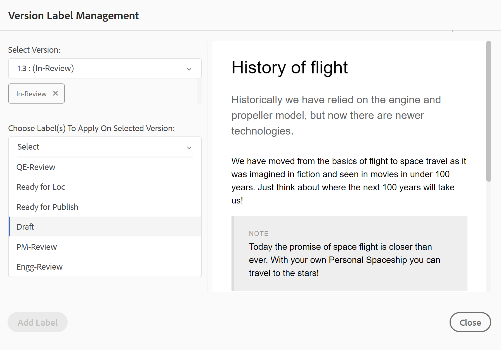{width="650" align="left"}

   “版本标签管理”对话框分为两部分 — 左侧面板包含可用于主题的版本列表以及标签下拉列表\（或用于输入标签的文本框），右侧面板包含主题预览。

1. 选择要应用标签的版本。

   从版本列表中选择其他版本的主题时，“预览”面板将显示当前版本与所选版本之间的更改

   >[!NOTE]
   >
   > 如果标签已应用于某个版本，则它将显示在下拉列表中的版本号旁边，以及“选择版本”列表的下方。 您可以通过单击\(**x**\)图标。

1. 如果您的管理员定义了标签列表，则会显示一个标签下拉列表，您可以从中选择要应用的标签。 您可以从下拉列表中选择多个标签。

   否则，您会看到一个文本框，您可以在其中输入要添加到主题中的标签。

   >[!NOTE]
   >
   > 不能对主题的多个版本应用相同的标签。 如果尝试关联现有标签，则可以选择将其从现有版本中删除，并将其应用到主题的所选版本。

1. 单击 **添加标签**.

1. 在应用标签确认消息中，选择 **移动标签** 选项将标签从现有版本移动到所选版本。 如果不选择此选项，并且有标签被分配给主题的不同版本，则它们不会移动到所选主题的版本。 在标签申请过程中会忽略此类标签。


**创建审阅任务** -  

可直接从Web编辑器创建当前主题的审阅任务或映射文件。 打开要为其创建审阅任务的文件，然后单击“创建审阅任务”以启动审阅创建流程。

>[!NOTE]
>
> 您还可以从审核面板\（位于右侧）创建审核任务。

请按照 [查看主题或映射](review.md#) 以了解更多详细信息。

## 左侧面板 {#id2051EA0M0HS}

左侧面板是永久面板。 您可以通过单击展开侧栏图标来展开或折叠它\(\)。 在展开视图中，它显示在折叠视图中作为工具提示显示的图标的名称。

>[!NOTE]
>
> 左侧面板可调整大小。 要调整面板的大小，将光标置于面板边界上，光标将变为双向箭头，单击并拖动以调整面板宽度。

通过左面板可访问以下功能：

**收藏夹** -  

如果您使用一组文件或文件夹，则可以将它们添加到收藏夹列表以快速访问它们。 收藏夹列表显示您已添加的文档列表以及其他用户公开可访问的收藏文档列表。
默认情况下，您可以按标题查看文件。 当您将鼠标悬停在文件上时，您可以作为工具提示查看文件标题和文件路径。
>[!NOTE]
>
> 作为管理员，您还可以选择在Web编辑器中按文件名查看文件列表。 选择 **文件名** 的选项 **文件查看方式** 中的部分 **用户首选项** .

要创建收藏夹列表或收藏夹，请单击“收藏夹”面板旁边的+图标以调出“新建收藏夹”媒体日志：

{width="300" align="left"}

输入要创建的收藏集的标题和描述。 如果您选择 **公共**，则其他用户可以看到此收藏夹。

要将文件添加到收藏夹，请使用以下任一方法：

- 在“存储库视图”中导航到所需的文件或文件夹，单击 *选项* 图标以打开上下文菜单，然后选择 **添加到收藏夹**. 在“添加到收藏夹”对话框中，您可以选择将文件/文件夹添加到现有收藏夹或创建新收藏夹。

  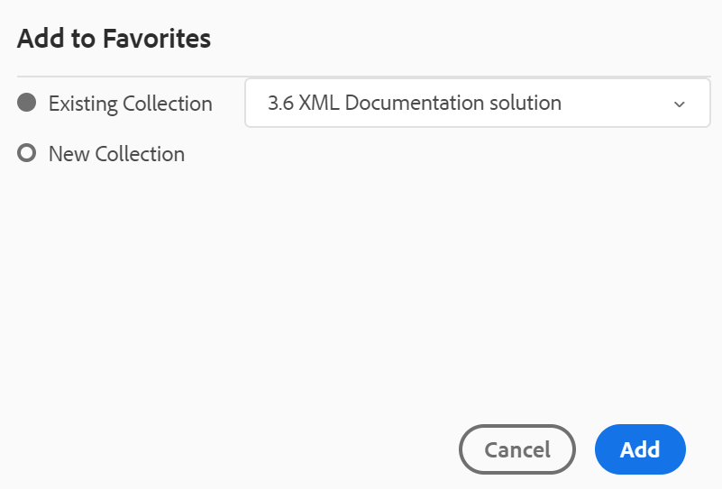{width="300" align="left"}

- 在编辑器中右键单击文件的选项卡以打开上下文菜单。 选择 **添加至** > **收藏夹** 将文件添加到收藏夹列表。

  {width="400" align="left"}

>[!NOTE]
>
> - 要从收藏夹列表中移除项目，请选择收藏夹收藏集中该项目旁边的选项图标，然后选择 **从收藏夹中移除**.
> - 要预览文件而不打开它，请选择文件，然后选择 **预览** 从“Options（选项）”菜单中。


**收藏夹集合的“选项”菜单**\
您还可以使用收藏夹集合的“选项”菜单执行许多操作：

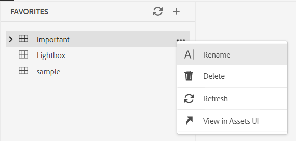{width="400" align="left"}
- **重命名**：重命名选定的收藏集。
- **删除**：删除选定的收藏集。
- **刷新**：从存储库中获取新的文件和文件夹列表。
- **在Assets UI中查看**：在Assets UI中显示文件或文件夹内容。

>[!NOTE]
>
> 您还可以使用顶部的“刷新”图标刷新列表。


**存储库视图** - 

当您单击“存储库视图”图标时，您将获得DAM中可用的文件和文件夹的列表。 默认情况下，您可以按标题查看文件。 当您将鼠标悬停在文件上时，您可以作为工具提示查看文件标题和文件名。

>[!NOTE]
>
> 作为管理员，您还可以选择在Web编辑器中按文件名查看文件列表。 选择 **文件名** 的选项 **文件查看方式** 中的部分 **用户首选项** .


一次加载75个文件。 每次单击 **加载更多**...加载了75个文件，在列出所有文件后按钮即停止显示。 批量加载非常高效，与加载文件夹中存在的所有文件相比，您可以更快地访问文件。

您可以轻松地导航到DAM中所需的文件，并在Web编辑器中打开它。 如果您具有编辑文件所需的访问权限，则可以这样做。

您还可以在Web编辑器中单击并播放音频或视频文件。 您可以更改视频的音量或视图。 在快捷菜单中，您还可以选择下载、更改播放速度或查看画中画。


选择一个映射，然后按Enter键或双击以在 **映射视图**. 欲知更多详情，请参见 **映射视图** 中的功能描述 [左侧面板](web-editor-features.md#id2051EA0M0HS) 部分。 选择一个主题，然后按Enter键或双击以在 [内容编辑区域](#id2051EB000UI). 能够直接从Web编辑器导航和打开文件可节省时间并提高生产效率。

**筛选搜索**

Web编辑器为搜索文本提供了增强的筛选器。 单击过滤器搜索\(\)图标以打开过滤器面板。 您可以在AEM存储库选定路径上的文件中搜索文本。 例如，在下面给定的屏幕快照中搜索“general purpose”。

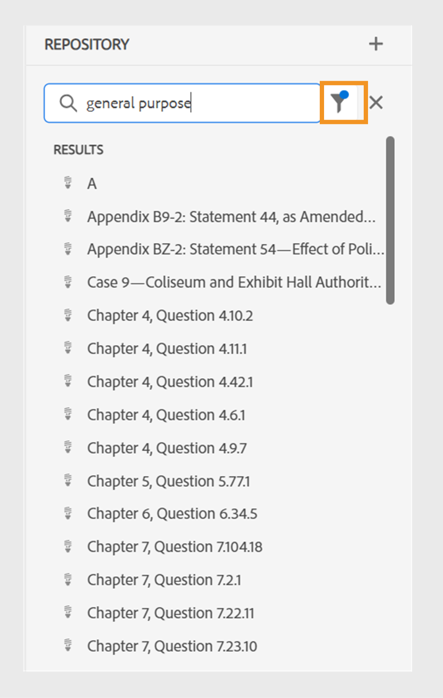{width="400" align="left"}

您还可以使用以下选项来筛选文件，并缩小AEM存储库中的搜索范围：

- **DITA文件**：您可以查找所有 **DITA主题** 和 **DITA映射** 在选定路径中存在。
- **非DITA文件**：您可以搜索 **图像文件**， **多媒体**、和 **文档** 在选定路径中。
- **DITA元素**：还可以在指定DITA元素的属性中搜索特定值。
- **签出者**：您可以查找由指定用户签出的文件。
- **上次修改时间**：您可以查找在选定日期之后但在选定日期之前上次修改的文件。 您还可以查找过去2小时、上周、上个月或去年上次修改的文件。
- **标记**：您可以查找应用了特定标记的文件。 您可以键入标记或从下拉列表中选择标记。

**注意：** 系统管理员还可以配置文本过滤器，并显示或隐藏其他过滤器。 有关更多详细信息，请参阅 *配置文本过滤器* 安装和配置Adobe Experience Manager Guidesas a Cloud Service中的部分。

将显示包含搜索文本的已过滤文件的列表。 例如，在上面的屏幕截图中，列出了包含文本“general purpose”的文件。 您可以从筛选列表中选择多个文件，以将它们拖放到打开进行编辑的映射中。

**“选项”菜单**

除了从左侧面板打开文件外，您还可以使用“存储库视图”中的“选项”菜单执行许多操作。 根据您选择的是文件夹、主题文件还是介质文件，您会看到不同的选项。

**文件夹选项**

您可以使用可用于的“选项”菜单执行以下操作 *文件夹* 在“存储库视图”中：

{width="550" align="left"}


- **创建**：创建新的DITA主题、DITA映射或文件夹。 欲知更多详情，请参见  **从存储库视图创建主题** 中的过程 [左侧面板](web-editor-features.md#id2051EA0M0HS) 部分。


- **上传资产**：将文件从本地系统上传到AEM存储库中的选定文件夹。 您还可以将文件从本地系统拖放到当前工作主题上。 如果要将本地系统中的图像插入主题，这非常有用。

  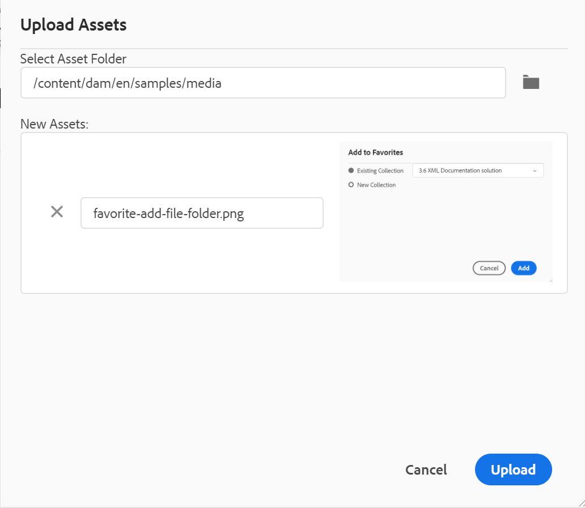{width="550" align="left"}

  您可以选择要上载文件的文件夹，并且还会显示图像预览。 如果要重命名文件，可以在“文件名”文本框中执行此操作。 单击上传以完成文件上传过程。 如果您在某个主题上拖放了图像文件，则该图像文件会添加到文章中，并且也会上传。

  如果您的管理员已在以下位置启用UUID选项： *XMLEditorConfig*，则您将在中看到上传图像的UUID **来源** 属性。

  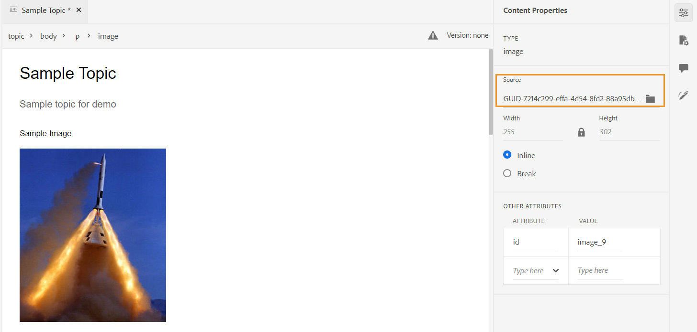{width="800" align="left"}

- **在文件夹中查找文件**：将焦点转移到存储库搜索，您可以在其中输入搜索词。 搜索在存储库中的选定文件夹下执行。 也可以应用过滤器返回DITA文件和/或图像文件。

  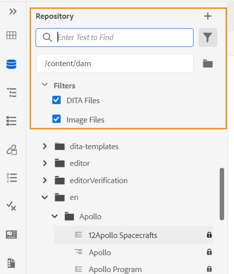{width="400" align="left"}

  您也可以使用文件的UUID进行搜索。 在这种情况下，搜索结果显示DITA/XML文件的标题，如果文件是图像文件，则显示文件的UUID。 在下面的搜索示例中，搜索图像文件的UUID，搜索结果显示原始图像文件的UUID和引用该图像的文件的主题标题。

  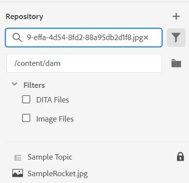{width="300" align="left"}

- **全部折叠**：折叠存储库中所有打开的文件夹并仅显示根级文件夹。

  >[!NOTE]
  >
  > 使用 **\>** 图标，以展开文件夹。

- **添加到收藏夹**：将选定的文件夹添加到收藏夹。 您可以选择将其添加到现有收藏夹收藏集或新收藏夹收藏集。

- **刷新**：从存储库中获取新的文件和文件夹列表。
- **在Assets UI中查看**：在Assets UI中显示文件夹内容。

**文件选项**

根据您选择的是介质文件还是DITA文件，“选项”菜单中会显示不同的选项。 一些可用于介质和DITA文件的常用选项包括：

- 重复
- 签出/签入
- 预览
- 移到
- 重命名
- 删除
- 复制
- 全部折叠
- 添加到收藏夹
- 属性
- 在Assets UI中查看

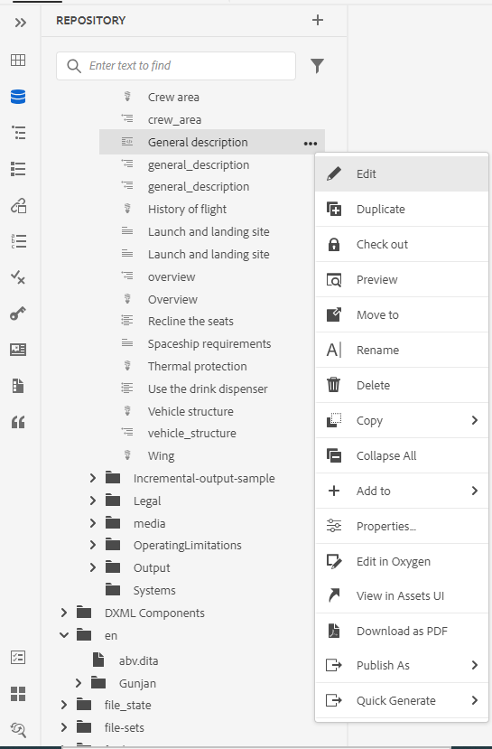{width="550" align="left"}

“选项”菜单中的各种选项说明如下：

- **编辑**：打开文件以进行编辑。 如果是.ditamap/.bookmap文件，它将在 [高级映射编辑器](map-editor-advanced-map-editor.md#) 进行编辑。

- **复制**：使用此选项创建所选文件的副本或副本。 您还可以选择在重复资产提示符下重命名重复的文件。 默认情况下，创建文件时使用的后缀\（如filename\_1.extension\）。 文件的标题与源文件相同，新文件从版本1.0开始。复制所有引用、标记和元数据，但基线不会复制到重复文件中。
- **签出**：获取选定文件的锁定以进行编辑。 对于锁定的文件，此选项将更改为 **签入**.

  >[!NOTE]
  >
  > - 如果文件被用户锁定或签出，将鼠标指针悬停在锁定图标上会显示已锁定文件的用户\(name\)。
  > - 签入具有任何未保存更改的文件时，会提示您保存更改。 如果不保存更改，则它仅签入文件。

- **预览**：获取文件（.dita、.xml、音频、视频或图像）的快速预览而不打开它。 您可以调整预览窗格的大小。 如果内容包含任意 `<xref>` 或 `<conref>`中，您可以选择它以在新选项卡中将其打开。 文件的标题将显示在窗口中。 如果不存在标题，则会显示文件名。 要关闭 **预览** 选择关闭图标，或单击窗格之外的任意位置。

  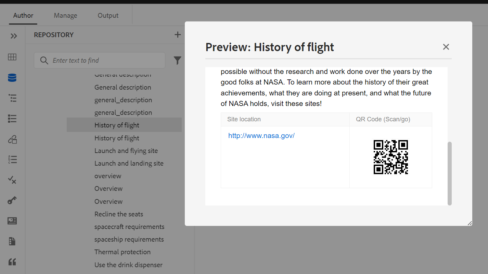{width="800" align="left"}

- **重命名**：使用此选项重命名选定的文件。 在新文件中输入新文件的名称 **重命名资源** 对话框。
   - 您可以重命名任何类型的文件。
   - 无法更改文件的扩展名。
   - 两个文件的名称不能相同。 因此，不能将文件重命名为已存在的名称。 显示错误。

- **移动到**：使用此选项可将所选文件移动到其他文件夹。
   - 您可以键入目标文件夹的名称，也可以选择 **选择路径** 以选择目标文件夹。
   - 您可以将任何类型的文件移动到“内容”文件夹中的任何目标。
   - 两个文件的名称不能相同。 因此，您不能将文件移动到具有相同名称的文件已存在的文件夹中。

  如果您尝试将文件移动到某个文件夹，而该文件夹中存在具有相同名称但标题不同的文件，则会显示“重命名和移动文件”对话框，并且您需要在移动文件之前重命名该文件。 目标文件夹中移动的文件具有新文件名。

  {width="550" align="left"}

  >[!NOTE]
  > 您还可以将文件拖放到另一个目标文件夹中。

  **排除方案**

  在以下情况下，AEM Guides不允许重命名或移动文件：

   - 如果文件是审阅或翻译工作流的一部分，则无法移动或重命名该文件。

   - 如果任何其他用户签出该文件，则无法重命名或移动该文件，您将看不到该文件的“重命名”或“移至”选项。

  >[!NOTE]
  > 如果管理员已授予您对文件夹的权限，则 **重命名** 或 **移动到** 将显示选项。

  <details>
    <summary> Cloud Service </summary>

  重命名或移动任何文件不会中断对该文件的所有现有引用，因为每个文件都有一个唯一的UUID。
  </details>


- **删除**：使用此选项可删除选定的文件。 删除文件之前会显示确认提示。

   - 删除文件之前会显示确认提示。
   - 如果文件未从任何其他文件引用，则会将其删除，并显示一条成功消息。
   - 如果文件已签出，则无法删除该文件，并会显示一条错误消息。

     >[!NOTE]
     >
     > 如果管理员阻止删除已签出的文件，则只会显示错误消息。 有关更多详细信息，请参阅 *阻止删除已签出的文件* 安装和配置Adobe Experience Manager Guidesas a Cloud Service中的部分。

   - 如果文件添加到收藏夹集合，则 **强制删除** 对话框随即显示，您可以强制删除它。
   - 如果该文件是从任何其他文件引用的，则 **强制删除** 对话框内将显示确认消息，您可以强制删除文件：

     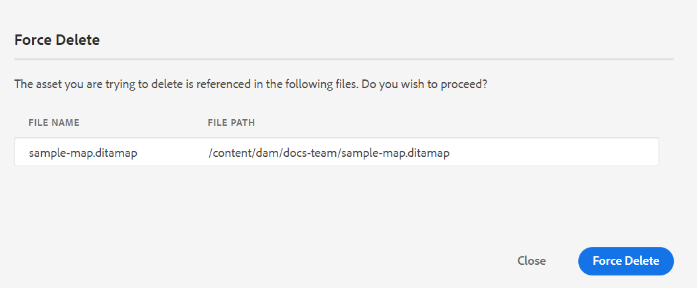{width="550" align="left"}

     >[!NOTE]
     >
     > 如果管理员已授予文件删除权限，则 **强制删除** 已启用。 否则， **强制删除** 将禁用，并显示一条消息，指出您无权删除引用的文件。 有关更多详细信息，请参阅 *防止删除引用的文件* 安装和配置Adobe Experience Manager Guidesas a Cloud Service中的部分。

   - 如果删除了引用的主题并且打开了包含要编辑的引用的文件，则将显示被引用文件的断开链接。

  >[!NOTE]
  >
  > 也可以使用键盘的Delete键以类似方式删除所选文件。

- **复制**：您可以从以下选项中进行选择：

   - **复制UUID**：将所选文件的UUID复制到剪贴板。

   - **复制路径**：将所选文件的完整路径复制到剪贴板。

- **全部折叠**：折叠存储库中的所有文件。 只显示存储库中的顶级文件夹。
- **添加至**：您可以从以下选项中进行选择：
   - **收藏夹**：将选定的文件添加到收藏夹。 您可以选择将其添加到现有收藏夹收藏集或新收藏夹收藏集。

   - **可重用内容**：将选定的文件添加到左侧面板中的可重用内容列表中。

- **属性**：使用此选项可打开所选文件的属性页。 也可以从资产UI访问此属性页面，方法是选择文件并单击工具栏中的属性图标。

- **打开地图仪表板**：如果所选文件是DITA映射，则此选项将打开映射仪表板。

- **在Oxygen中编辑**：选择此选项可编辑氧气连接器插件中的选定文件。 将打开文件以进行编辑。

  >[!NOTE]
  >
  >请联系您的客户成功团队以在环境中启用此功能。 这并非开箱即用支持的一部分。 有关更多详细信息，请查看 [配置选项以在氧气中进行编辑](../cs-install-guide/conf-edit-in-oxygen.md) 安装和配置指南中的部分。


- **在Assets UI中查看**：用于在Assets UI中显示.dita/.xml文件的预览。 对于.ditamap/.bookmap文件，映射中的所有主题文件都以单个统一的逐页视图显示。

- **下载为PDF**：使用选项生成并下载PDF输出。

- **发布方式**：使用选项将主题或主题中的元素发布到内容片段。

- **快速生成**：为选定文件生成输出。 只能为作为输出预设一部分的文件生成输出。 有关更多详细信息，请参阅 [从Web编辑器中基于文章的发布](web-editor-article-publishing.md#id218CK0U019I).


**从存储库视图创建主题**

您可以从“存储库”面板旁边的+图标或从“存储库视图”中文件夹的上下文菜单选择创建新主题、映射或文件夹。

***创建主题***

当您选择 *创建新主题* 从菜单中，您将看到以下对话框：

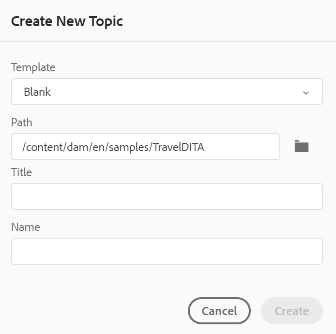{width="300" align="left"}

在 **创建新主题** 对话框，请提供以下详细信息：

- 主题所基于的模板。 例如，对于现成的设置，您可以从“空白”、“概念”、“DITAVAL”、“引用”、“任务”、“主题”和“疑难解答”模板中进行选择。

  如果您的文件夹配置了文件夹配置文件，则您将只看到在文件夹配置文件中配置的主题模板。

- 要保存主题文件的路径。 默认情况下，存储库中当前选定文件夹的路径将显示在路径字段中。
- 主题的标题。

- *\（可选\）* 主题的文件名。 根据主题“标题”自动建议文件名。

  如果管理员启用了基于UUID设置的自动文件名，则您将不会看到如下面的屏幕快照所示的“名称”字段：

  {width="300" align="left"}


当您单击 **创建**，则会在指定路径中创建主题。 此外，该主题会在Web编辑器中打开以进行编辑。

***创建DITA映射***

当您选择 *创建新的DITA映射*，您将获得以下对话框：

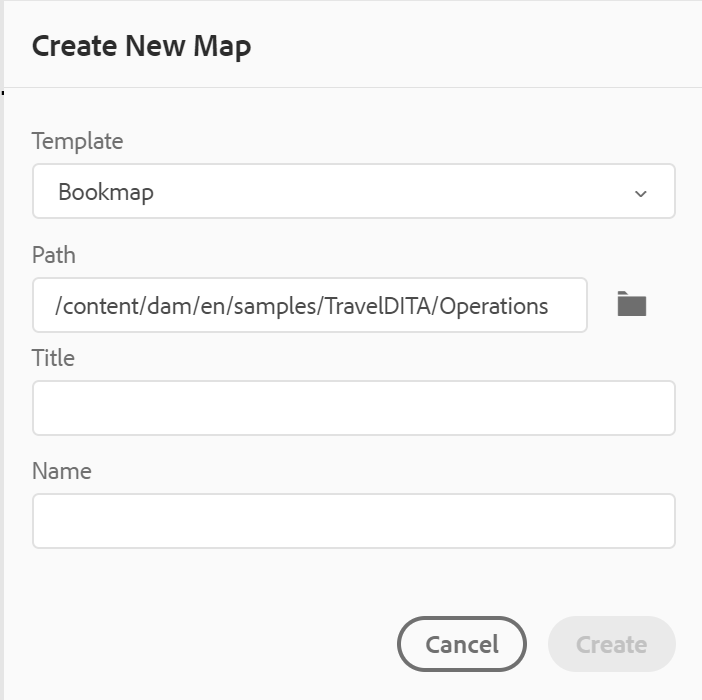{width="300" align="left"}

在 **创建新映射** 对话框，请提供以下详细信息：

- 映射所基于的模板。 例如，对于现成的设置，您可以从Bookmap或DITA映射模板中进行选择。

- 保存映射文件的路径。 默认情况下，存储库中当前选定文件夹的路径将显示在路径字段中。
- A **标题** 为了地图。

- *\（可选\）* 映射的文件名。 根据地图标题自动建议文件名。

  如果管理员启用了基于UUID设置的自动文件名，则您将不会看到名称字段。


当您单击 **创建**，即会在路径字段中指定的文件夹中创建和添加映射。 此外，将在映射视图中打开该映射。 可以在映射编辑器中打开映射文件并向其中添加主题。 有关向映射文件添加主题的详细信息，请参阅 [创建映射](map-editor-create-map.md#).

***创建文件夹***

当您选择 *创建新文件夹*，您将获得 **创建新文件夹** 对话框：

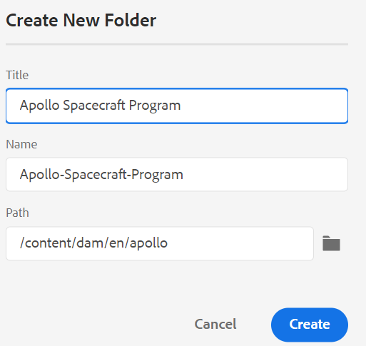{width="300" align="left"}

输入 **标题** （会自动转换为文件夹名称）。 路径是保存映射文件的位置。 默认情况下，存储库中当前选定文件夹的路径将显示在路径字段中。 当您单击 **创建**，即会在执行“创建文件夹”选项的文件夹中创建和添加文件夹。

**映射视图** -  

单击“映射视图”图标后，您将获得映射文件中主题的列表。 如果尚未打开任何映射文件，则“映射视图”显示为空白。 双击任何映射文件将在此视图中打开映射文件。 您可以双击映射中的任意文件以在Web编辑器中打开它。

默认情况下，您可以按标题查看文件。 当您将鼠标悬停在文件上时，您可以作为工具提示查看文件标题和文件路径。
>[!NOTE]
>
>作为管理员，您还可以选择查看当前在映射视图中打开的父映射的文件名。 选择 **文件名** 的选项 **文件查看方式** 中的部分 **用户首选项** .


在地图视图中打开地图时，当前地图的标题将显示在主工具栏的中央。 如果标题太长，则会显示省略号，您还可以将鼠标悬停在标题上来查看工具提示中的完整标题。

为主题或映射引用定义键属性时，可在左侧面板中查看标题、相应图标和键。 键显示为 `keys=<key-name>`.

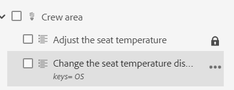{width="300" align="left"}

如果您对映射文件具有编辑权限，则也可以编辑这些文件。 有关通过DITA映射打开和编辑主题的详细信息，请参见 [通过DITA映射编辑主题](map-editor-advanced-map-editor.md#id17ACJ0F0FHS).


您可以使用映射文件的“选项”菜单执行以下操作：

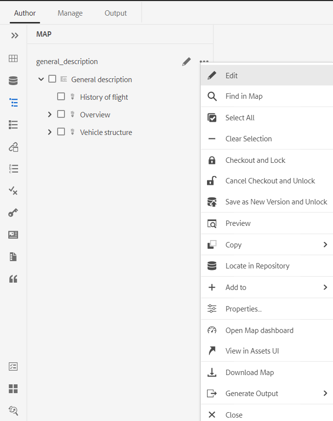{width="550" align="left"}

- **编辑**：打开映射文件以在高级映射编辑器中编辑。

- **全选**：选择映射中的所有文件。

- **清除选择**：在映射中取消选择选定的文件。

- **签出并锁定**：签出并锁定地图中的选定文件。

- **取消签出和解锁**：解锁映射文件并使其可用于编辑。 它不会将更改还原到早期版本。

- **另存为新版本并解锁**：创建较新版本并释放对映射中所选文件的锁定。

- **预览**：打开映射文件的预览。 在此视图中，映射中的所有主题文件都以单个统一的逐页视图显示。

- **复制**：您可以从以下选项中进行选择：
   - **复制UUID**：将映射文件的UUID复制到剪贴板。
   - **复制路径**：将映射文件的完整路径复制到剪贴板。

- **在存储库中找到**：显示映射文件在存储库\（或DAM\）中的位置。

- **添加至**：您可以从以下选项中进行选择：
   - **收藏夹**：将映射文件添加到收藏夹。 您可以选择将其添加到现有收藏夹收藏集或新收藏夹收藏集。

   - **可重用内容**：将映射文件添加到左侧面板中的可重用内容列表。

- **属性**：使用此项可打开映射文件的属性页面。 也可以从资产UI访问此属性页面，方法是选择文件并单击工具栏中的属性图标。

- **打开地图仪表板**：打开地图功能板。

- **在Assets UI中查看**：用于在Assets UI中显示映射文件的预览。 在此视图中，映射中的所有主题文件都以单个统一的逐页视图显示。
- **下载地图**：选择此选项可打开 **下载地图** 对话框。
在 **下载地图** 对话框中，您可以选择以下选项：
   - **使用基线**：选择此选项可获取为DITA映射创建的基线列表。 如果要根据特定基线下载映射文件及其内容，请从下拉列表中选择基线。 有关使用基线的更多详细信息，请查看 [使用基线](./generate-output-use-baseline-for-publishing.md).
   - **拼合文件层次结构**：选择此选项可将所有引用的主题和媒体文件保存在单个文件夹中。

  您也可以在不选择任何选项的情况下下载映射文件。 在这种情况下，将下载引用的主题和媒体文件的最新保留版本。


  在您单击 **下载** 按钮时，映射导出包请求已排队。 此 **成功** 如果成功创建包，将显示对话框。  您可以单击 **下载** 按钮来自 **成功** 对话框。

  如果地图可以下载，您将收到地图下载就绪通知。 如果下载失败，您将收到映射下载失败的通知。

  您可以从AEM通知收件箱访问下载链接。 在收件箱中选择生成的映射通知，以.zip格式下载映射。

  >[!NOTE]
  >
  >  默认情况下，下载的地图会在AEM通知收件箱中保留五天。

- **生成输出**：为选定的映射文件生成输出。 只能为作为输出预设一部分的文件生成输出。 有关更多详细信息，请参阅 [从Web编辑器中基于文章的发布](web-editor-article-publishing.md#id218CK0U019I).
- **关闭**：关闭映射文件。


以下屏幕截图显示了DITA映射视图中文件的“选项”菜单：

{width="550" align="left"}

您可以使用“选项”菜单执行以下操作：

- **编辑**：打开文件以进行编辑。 如果是.ditamap/.bookmap文件，它将在 [高级映射编辑器](map-editor-advanced-map-editor.md#) 进行编辑。

- **签出**：签出选定的文件。 对于已签出的文件，此选项将更改为 **签入**.


  >[!NOTE]
  >
  > - 如果文件被用户锁定或签出，将鼠标指针悬停在锁定图标上会显示已锁定文件的用户\(name\)。
  > - 签入文件时，会提示您保存更改。 如果不保存更改，则它仅签入文件。

- **预览**：获取文件（.dita、.xml、音频、视频或图像）的快速预览而不打开它。 您可以调整预览窗格的大小。 如果内容包含任意 `<xref>` 或 `<conref>`中，您可以选择它以在新选项卡中将其打开。  文件的标题将显示在窗口中。 如果不存在标题，则会显示文件名。 要关闭 **预览** 选择关闭图标，或单击窗格之外的任意位置。
- **复制**：您可以从以下选项中进行选择：
   - **复制UUID**：将所选文件的UUID复制到剪贴板。
   - **复制路径**：将所选文件的完整路径复制到剪贴板。


- **在存储库中找到**：显示所选文件在存储库\（或DAM\）中的位置。
- **全部展开**：展开映射文件中的所有主题。

- **全部折叠**：折叠属于当前映射文件的所有主题。

- **添加至**：您可以从以下选项中进行选择：
   - **收藏夹**：将选定的文件添加到收藏夹。 您可以选择将其添加到现有收藏夹收藏集或新收藏夹收藏集。

   - **可重用内容**：将选定的文件添加到左侧面板中的可重用内容列表中。

- **属性**：使用此选项可打开所选文件的属性页。 也可以从资产UI访问此属性页面，方法是选择文件并单击工具栏中的属性图标。

- **在Assets UI中查看**：用于在Assets UI中显示.dita/.xml文件的预览。 对于.ditamap/.bookmap文件，映射中的所有主题文件都以单个统一的逐页视图显示。

- **快速生成**：为选定文件生成输出。 只能为作为输出预设一部分的文件生成输出。 有关更多详细信息，请参阅 [从Web编辑器中基于文章的发布](web-editor-article-publishing.md#id218CK0U019I).

>[!NOTE]
>
> 您还可以从以下位置打开和编辑DITA映射中选定主题的属性 **更多选项** “地图视图”底部的菜单。

**大纲视图** -  

单击“大纲视图”图标时，将获得文档中所用元素的分层视图。

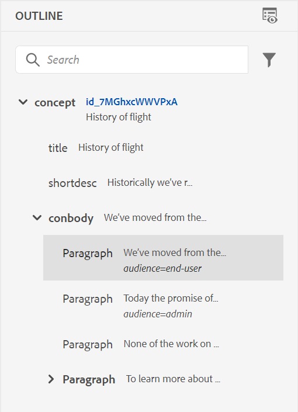{width="300" align="left"}

“大纲视图”提供以下功能：

- 文档中使用的所有元素的树视图。

- 如果元素具有ID、属性和文本，则您既可以查看元素，也可以查看它们。

- 在创作视图和源视图中访问大纲视图。

- 使用筛选器下拉列表显示所有元素或仅显示损坏的引用：

- 单击“大纲”视图中的某个元素将选择“创作”或“源”视图中的元素内容。“大纲”视图与“创作”和“源”视图保持同步。 如果在任何视图中进行了任何更改，则可在“大纲”视图中看到这些更改。 例如，如果在“创作”视图中添加段落或更新元素，则它将显示在“大纲”视图中。

  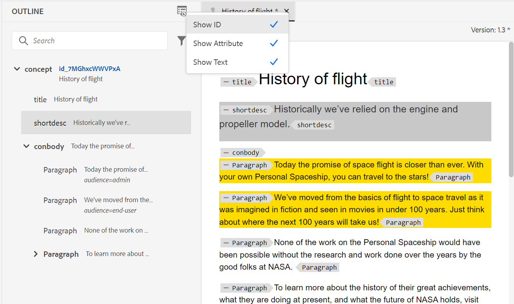{width="650" align="left"}

- 拖放元素。 您可以通过将另一个元素拖放到元素上来轻松替换元素。 如果将元素拖放到另一个元素上，并且在该元素周围看到一个方框，则表示元素将被替换。 它会替换元素被放置到的元素。

  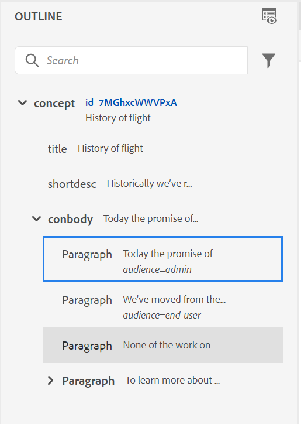{width="300" align="left"}

  如果拖放元素，则虚线矩形表示元素可以放置在当前位置。 如果拖放无效，则会显示一条错误消息，指示不允许执行该操作。

  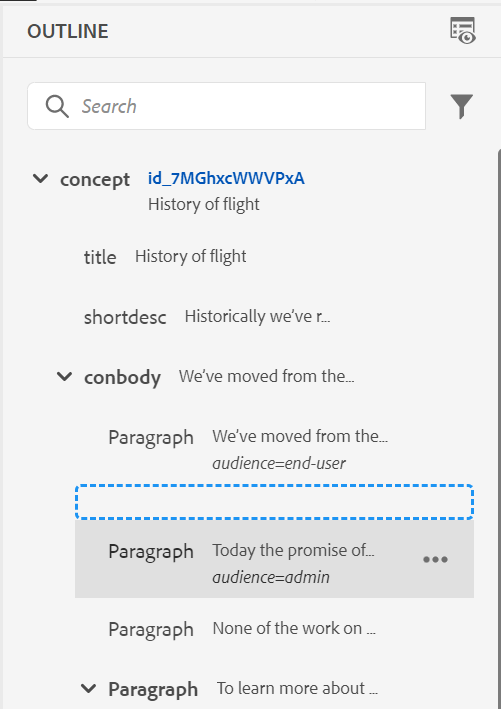{width="300" align="left"}

- 此 **选项** 中的菜单 *大纲视图* 允许您执行常规操作，例如“剪切”、“复制”、“删除”、“生成ID”、“在当前元素之前或之后插入元素”、“重命名或替换元素”、“封装元素”、“取消封装元素”以及在所选元素之外创建代码片段。

>[!NOTE]
>
>有关生成ID、在当前元素之前或之后插入元素以及取消元素包装的更多详细信息，请参阅 [Web编辑器中的其他功能](web-editor-other-features.md#).

**“大纲视图”面板的视图选项**

使用查看选项下拉列表，您可以选择查看以下内容（如果元素包含这些内容）：

- **显示ID**：显示元素的ID。
- **显示属性**：显示属性及其值。
- **显示文本**：显示文本。 如果文本长度超过20个字符，则会显示省略号。

如果块元素具有其自身的文本，则该文本将与该块元素一起显示。 如果它没有自己的文本，则第一个子元素的文本将与该块元素一起显示。

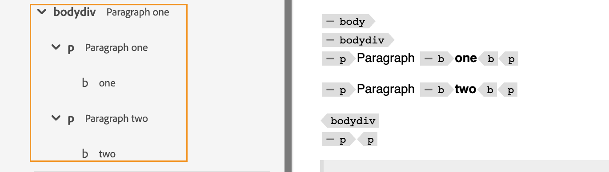{width="550" align="left"}

如果管理员为属性创建了配置文件，则您将获得这些属性及其配置的值。 您还可以在 **显示属性** 选项卡。 为元素定义的属性将显示在“布局”和“大纲”视图中。


欲知更多详情，请参见 *显示属性* 内部 *编辑器设置* 中的功能描述 [左侧面板](web-editor-features.md#id2051EA0M0HS) 部分。

**搜索功能**
使用搜索功能，您可以按元素的名称、ID、文本或属性值搜索元素。

搜索不区分大小写，并完全匹配字符串。 搜索结果根据元素在文档中的位置排序。

如果字符串显示在“大纲视图”面板中，则可以在元素中搜索该字符串。 例如，如果字符串“Adobe”出现在元素的文本中，并且显示在“大纲视图”面板中（如您选择的） **显示文本** （从查看选项下拉列表中），然后过滤包含的元素。 但是，如果文本未显示在“大纲视图”面板中（因为您尚未选择） **显示文本** （从查看选项下拉列表中），则不会过滤包含的元素。 同样，如果您已选择ID或属性，则您将在ID或属性中找到字符串。


**可重用内容** -  

DITA的主要功能之一是能够重用内容。 可重用内容面板可以存储DITA文件，通常可以从其中插入可重用内容。 添加后，DITA文件会保留在跨会话的可重用内容面板中。 这意味着您无需再次添加DITA文件即可稍后访问它们。

您只需将面板中的可重用内容拖放到当前主题上即可轻松快速地插入该主题。 您还可以在将内容插入文档之前获得该内容的预览。

默认情况下，您可以按标题查看文件。 当您将鼠标悬停在文件上时，您可以作为工具提示查看文件标题和文件路径。
>[!NOTE]
>
> 作为管理员，您还可以选择在Web编辑器中按文件名查看文件列表。 选择 **文件名** 的选项 **文件查看方式** 中的部分 **用户首选项** .

要将DITA文件添加到可重用内容面板，请使用以下任一方法：

- 单击可重用内容旁边的+图标以打开浏览文件对话框。 选择要添加的文件，然后单击 **添加** 以完成该过程。

  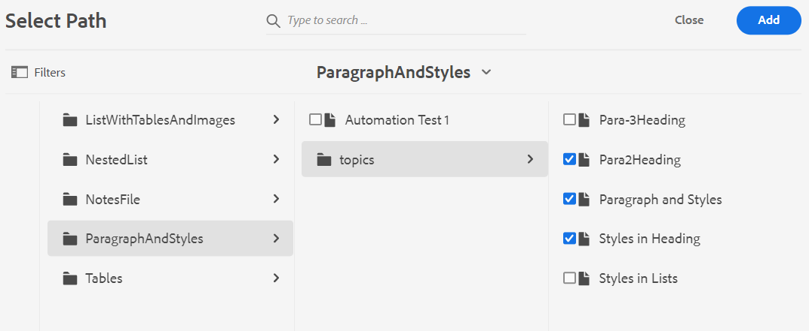{width="650" align="left"}

- 在“存储库视图”中，单击所需文件的“选项”图标，然后选择 **添加到可重用内容** 从上下文菜单中。

- 在编辑器中右键单击文件的选项卡以打开上下文菜单，然后选择 **添加到可重用内容**.


添加文件后，您可以在可重用内容面板中查看文件中的所有可重用内容元素。 可重用内容及其ID和元素名称一起显示。

将文件添加到“可重用内容”列表时，将显示文件的标题而非文件的UUID。 要检查文件的UUID，请将鼠标悬停在文件的标题上，文件的UUID将显示在工具提示中。

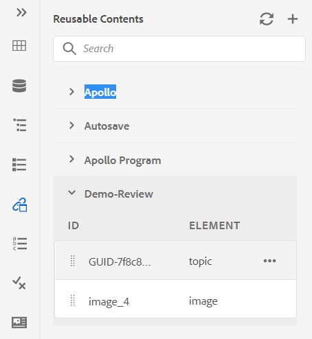{width="300" align="left"}

>[!NOTE]
>
> 您可以将多个文件添加到可重用内容列表。 然后，您可以从“可重用内容”面板将所需内容插入到文档中。

**刷新**：重新检查所有可重用内容，并显示可重用内容的新列表。

要从“可重用内容”面板插入内容，请使用以下任意方法：

- 将鼠标指针悬停在要插入的元素上，单击“选项”图标，然后选择 **插入可重用内容**.

  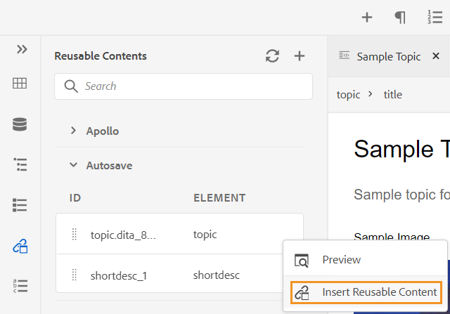{width="400" align="left"}

  >[!NOTE]
  >
  > 选择一个文件，然后选择 **预览** 从 **选项** 菜单来预览文件，而不打开它。 也可以预览主题中显示的引用。 参照ID会显示在窗口中。
  >
  > 此 **预览** 选项也适用于 **选项** 元素的菜单，可在插入元素之前快速预览该元素。

- 从面板中将可重用内容项拖放到文档中的所需位置。


**术语表** -  

AEM Guides允许您轻松创建和使用术语表类型的文档。 您可以创建术语表主题文件，然后将其包含在通用术语表映射中。 将此映射添加为根映射后，术语表条目将显示在“术语表”面板中。

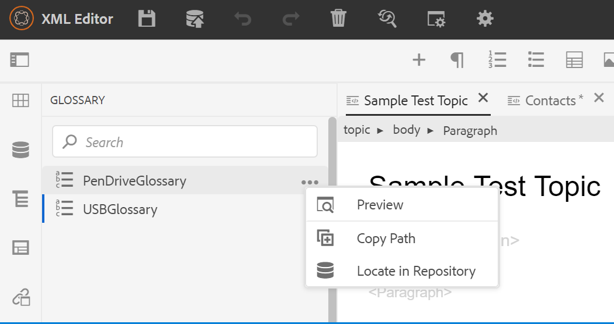{width="650" align="left"}

要从术语表中插入术语，只需将该条目从面板拖放到主题中的所需位置即可。 通过词汇表术语的“选项”菜单，您可以快速了解 **预览** 输入项的， **复制路径** 条目词文件，或在存储库中查找条目词文件。

执行以下步骤以搜索文本词并将其替换为术语表缩写：

1. 打开要在其中搜索和转换文本或术语的DITA主题或映射。
1. 选择术语表面板以查看根映射中存在的术语表。 您可以拖放这些术语以将其添加到打开的主题。
1. 选择 **热点** 工具\( \)以搜索特定文本术语并将它们转换为链接的术语表缩写。 此外，您也可以使用它来搜索词汇表缩写并将它们转换为文本术语，反之亦然。

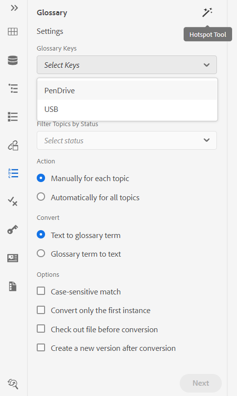{width="300" align="left"}

您可以配置“热点”工具的以下设置：

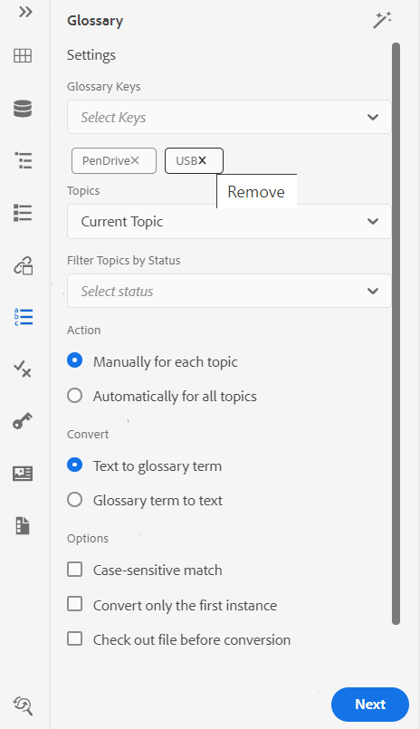{width="300" align="left"}

- **词汇表键**：从要用于选定主题中搜索的DITA映射中选择术语表键。 选定的键将显示如下。 您可以通过单击 **移除** 图标。

- **主题**：选择 **当前主题** 已在Web编辑器中打开，所有 **打开的主题** 在当前映射中，或 **当前映射** 正在映射编辑器中编辑以搜索术语。
- **按状态过滤主题**：您可以选择将搜索限制在具有所选文档状态的主题。 主题可以处于“草稿”、“编辑”、“正在审阅”、“已批准”、“已审阅”、“已完成”状态或组织配置的任何一种状态。
- **操作**：您可以选择搜索术语表键 **为每个主题手动** 或 **自动用于所有主题**. 如果您选择 **为每个主题手动**，它会提示您先确认，然后再转换每个主题中的每个术语。 如果您选择 **自动用于所有主题**，它自动转换所有主题中的所有术语。
- **转换**：您可以将搜索的 **文本到术语表** 或 **术语到文本。**
- **选项**：您可以从以下选项中进行选择：
   - **区分大小写的匹配**：搜索术语以查找具有相同大小写的匹配项。 例如，“USB”与“usb”不匹配。
   - **仅转换第一个实例**：如果一个主题中存在搜索词的多个实例，则仅转换第一个实例。
   - **转换前签出文件**：在转换术语之前，将签出搜索的文件。
   - **转换后创建新版本**：完成术语转换后会创建主题的新版本。
- **下一个** 如果您选择， **为每个主题手动** 选项。 单击 **下一个** 根据所选设置转换每个主题的术语。 它会提示您转换每个主题中的术语并移到下一个文件。 您可以选择转换术语或跳过它并移到下一个术语。

  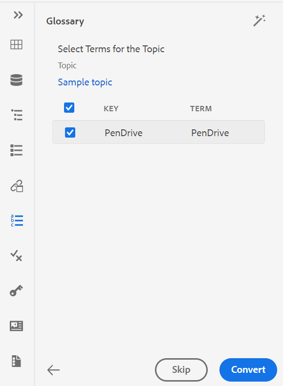{width="300" align="left"}

- **转换** 如果您选择， **自动用于所有主题** 选项。 选择 **转换** 将文档中的所有术语转换为链接的术语缩写。

列表 **已更新主题** 转换后的条款和 **有错误的主题** 将显示。 将鼠标悬停在\( \)图标（位于带有错误的主题旁边）以查看错误的详细信息。

{width="300" align="left"}

>[!NOTE]
>
> 刷新主题以查看转换后的术语。

**条件** -  

“条件”面板显示管理员在全局或文件夹级别配置文件中定义的条件属性。 只需将所需条件拖放到内容中，即可将条件添加到内容中。 为便于识别，使用为条件定义的颜色突出显示条件内容。

您还可以通过在元素上拖放多个条件来对元素应用多个条件。 对一个元素应用多个条件时，“属性”面板显示应用的条件（以逗号分隔）。

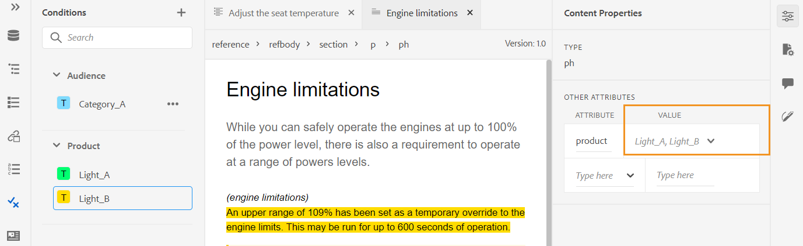{width="800" align="left"}

但是，在代码视图中，使用空格分隔符分隔条件。 在代码视图中添加或编辑条件时，请确保使用空格分隔多个条件。

>[!IMPORTANT]
>
> 以下屏幕截图显示具有管理权限的用户。 作为具有管理权限的用户，您可以添加、编辑和删除条件。 否则，作为普通作者，您将只能选择应用条件。

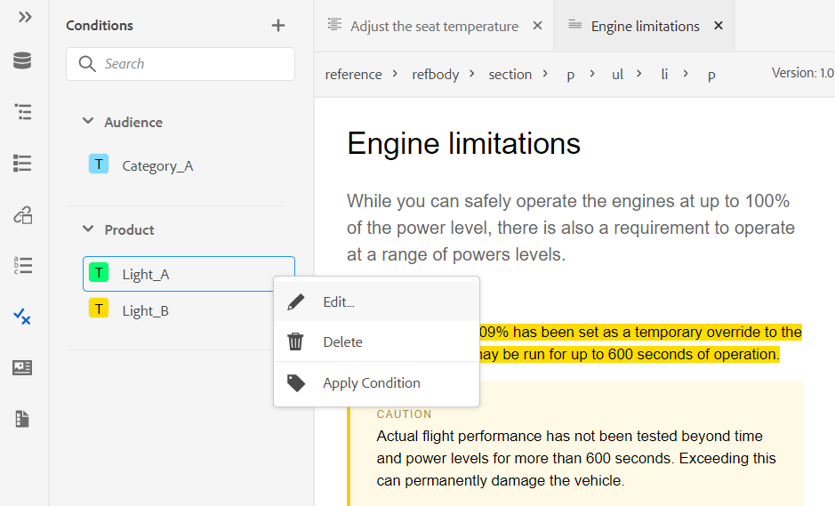{width="800" align="left"}

要添加或定义条件，请单击“条件”面板旁边的+图标以显示“定义条件”对话框：

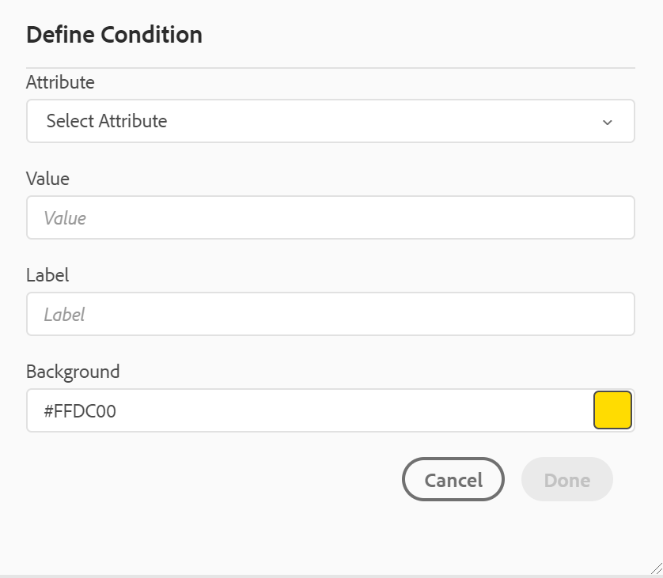{width="400" align="left"}

从“属性”列表中，选择要定义的条件属性，输入条件的值，然后指定在“条件”面板中显示的标签。 您还可以定义条件的颜色。 此颜色将设置为应用条件的内容的背景颜色

要编辑条件，请选择 **编辑** 从“Options（选项）”菜单中。 此时将显示“编辑条件”对话框：

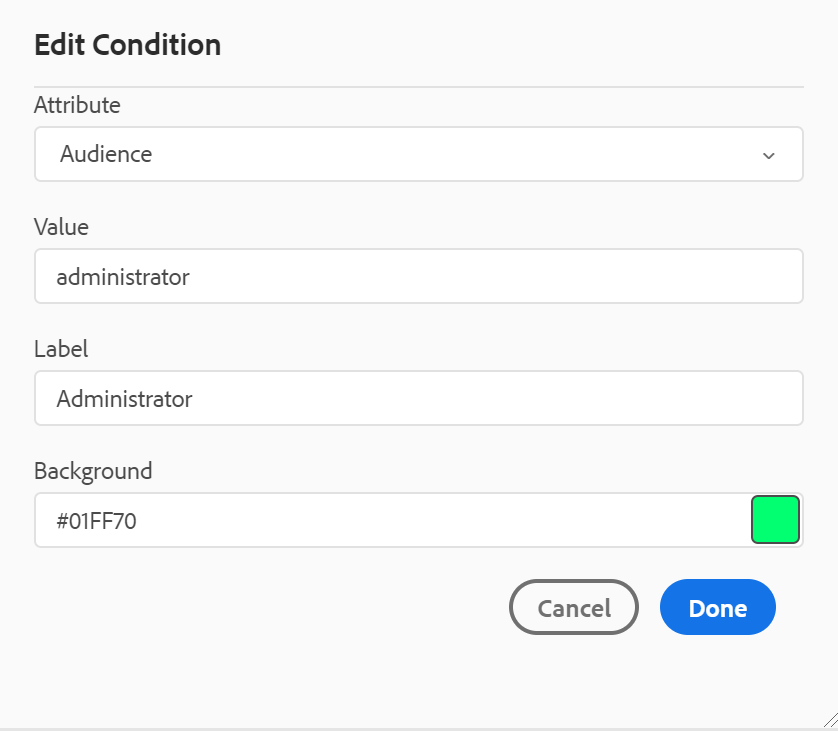{width="400" align="left"}

以定义新条件时配置的方式指定详细信息。

**主题方案** -  

主题方案映射是一种特殊形式的DITA映射，用于定义分类主题和控制值。 根据要求，您可以创建一个主题方案映射，并在根映射文件中引用它。 AEM Guides允许您定义主题方案中主题定义的嵌套级别层次结构。

您可以轻松地创建主题方案，然后在主题方案图中使用主题方案。 将此映射添加为根映射后，主题方案将显示在“主题方案”面板中。 “主题方案”面板以嵌套或分层方式显示可用的主题方案。

AEM Guides还支持嵌套级别主题方案映射，您可以在根主题方案映射下定义多个主题方案。

以下示例显示如何使用AEM Guides中的主题方案。

1. 在您选择的工具中创建主题方案文件。 以下XML代码创建用于绑定 `platform` 属性。

   ```XML
   <?xml version="1.0" encoding="UTF-8"?>
   <!DOCTYPE subjectScheme PUBLIC "-//OASIS//DTD DITA Subject Scheme Map//EN" "subjectScheme.dtd">
   <subjectScheme id="GUID-4f942f63-9a20-4355-999f-eab7c6273270">
       <title>rw</title>
       <!-- Define new OS values that are merged with those in the unixOS scheme -->
       <subjectdef keys="os">
           <subjectdef keys="linux">    </subjectdef>
           <subjectdef keys="mswin">    </subjectdef>
           <subjectdef keys="zos">    </subjectdef>
       </subjectdef>
       <!-- Define application values -->
       <subjectdef keys="app" navtitle="Applications">
           <subjectdef keys="apacheserv">    </subjectdef>
           <subjectdef keys="mysql">    </subjectdef>
       </subjectdef>
       <!-- Define an enumeration of the platform attribute, equal to       each value in the OS subject. This makes the following values       valid for the platform attribute: linux, mswin, zos -->
       <enumerationdef>
           <attributedef name="platform">    </attributedef>
           <subjectdef keyref="os">    </subjectdef>
       </enumerationdef>
       <!-- Define an enumeration of the otherprops attribute, equal to       each value in the application subjects.       This makes the following values valid for the otherprops attribute:       apacheserv, mysql -->
       <enumerationdef>
           <attributedef name="otherprops">    </attributedef>
           <subjectdef keyref="app">    </subjectdef>
       </enumerationdef>
   </subjectScheme>
   ```

   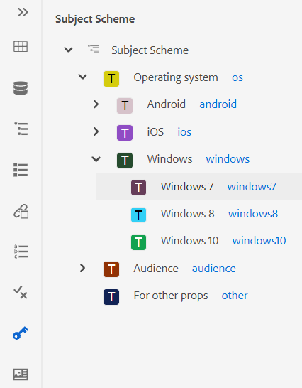{width="300" align="left"}

1. 保存扩展名为a.ditamap的文件，并将其上传到DAM中的任何文件夹。

   >[!NOTE]
   >
   > 可以在父DITA映射中添加对主题方案文件的引用。

   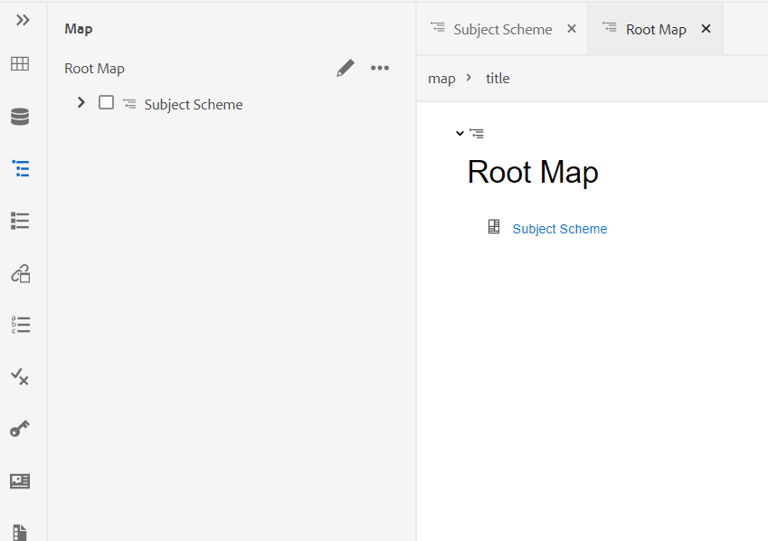{width="550" align="left"}

1. 将父映射设置为中的根映射 **用户首选项**. 将此映射添加为根映射后，主题方案将显示在“主题方案”面板中。

   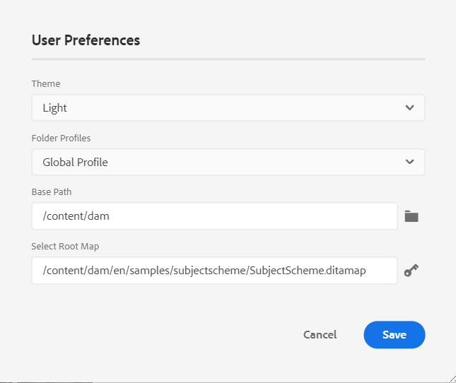{width="400" align="left"}

1. 在Web编辑器中，打开要使用主题方案定义的文件。
1. 只需将所需的主题方案拖放到内容上，即可将主题方案应用于您的内容。 然后，内容会以定义的颜色突出显示。

   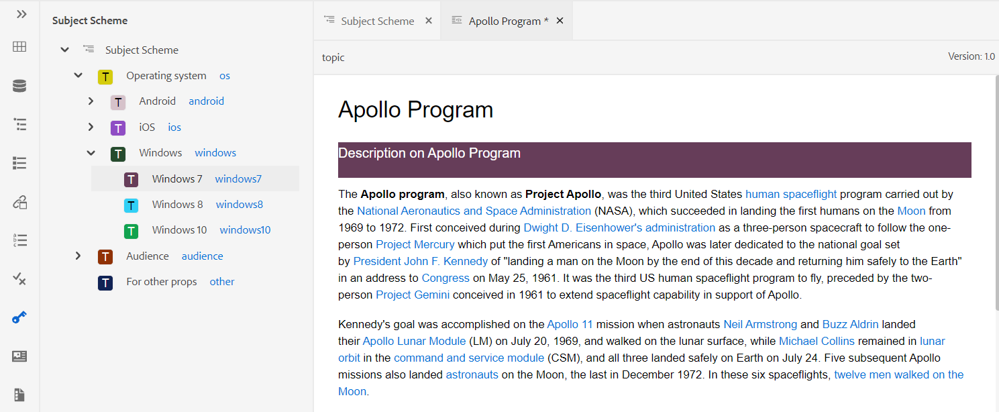{width="650" align="left"}

**处理主题定义和枚举的分层定义**

除了处理同一映射中存在的枚举和主题定义外，AEM Guides还提供了在两个单独的映射中定义枚举和主题定义的功能。 您可以在映射中定义一个或多个主题定义，在另一个映射中定义枚举定义，然后添加映射引用。 例如，以下XML代码在两个单独的映射中创建主题定义和枚举定义。

主题定义定义请参见 `subject_scheme_map_1.ditamap`


```XML
  <?xml version="1.0" encoding="UTF-8"?> 
    <!DOCTYPE subjectScheme PUBLIC "-//OASIS//DTD DITA Subject Scheme Map//EN" "../dtd/libs/fmdita/dita_resources/DITA-1.3/dtd/subjectScheme/dtd/subjectScheme.dtd"> 
    <subjectScheme id="subject-scheme.ditamap_f0bfda58-377b-446f-bf49-e31bc87792b3"> 

    <title>subject_scheme_map_1</title> 
    
    <subjectdef keys="os" navtitle="Operating system">
        <subjectdef keys="linux" navtitle="Linux">
        <subjectdef keys="redhat" navtitle="RedHat Linux">
        </subjectdef>
        <subjectdef keys="suse" navtitle="SuSE Linux">
        </subjectdef>
        </subjectdef>
        <subjectdef keys="windows" navtitle="Windows">
        </subjectdef>
        <subjectdef keys="zos" navtitle="z/OS">
        </subjectdef>
        </subjectdef>
        <subjectdef keys="deliveryTargetValues">
        <subjectdef keys="print">
        </subjectdef>
        <subjectdef keys="online">
        </subjectdef>
    </subjectdef>
    <subjectdef keys="mobile" navtitle="Mobile">
        <subjectdef keys="android" navtitle="Android">
        </subjectdef>
        <subjectdef keys="ios" navtitle="iOS">
    </subjectdef>
    </subjectdef>
    <subjectdef keys="cloud" navtitle="Cloud">
        <subjectdef keys="aws" navtitle="Amazon Web Services">
        </subjectdef>
        <subjectdef keys="azure" navtitle="Microsoft Azure">
        </subjectdef>
        <subjectdef keys="gcp" navtitle="Google Cloud Platform">
        </subjectdef>
    </subjectdef>
    </subjectScheme>
```

枚举定义存在于subject_scheme_map_2.ditamap中。

```XML
    ?xml version="1.0" encoding="UTF-8"?> 
        <!DOCTYPE subjectScheme PUBLIC "-//OASIS//DTD DITA Subject Scheme Map//EN" "../dtd/libs/fmdita/dita_resources/DITA-1.3/dtd/subjectScheme/dtd/subjectScheme.dtd"> 
        <subjectScheme id="subject-scheme.ditamap_17c433d9-0558-44d4-826e-3a3373a4c5ae"> 
        <title>subject_scheme_map_2</title> 
        <mapref format="ditamap" href="subject_scheme_map_1.ditamap" type="subjectScheme"> 
        </mapref> 
        <enumerationdef>
        <attributedef name="platform">
        </attributedef>
        <subjectdef keyref="mobile">
        </subjectdef>
        <subjectdef keyref="cloud">
        </subjectdef>
        </enumerationdef>
        </subjectScheme>
```

此处主题定义的定义请参见 `subject_scheme_map_1.ditamap`  当枚举定义存在于 `subject_scheme_map_2.ditamap`. 参考 `subject_scheme_map_1.ditamap` 在中也添加了 `subject_scheme_map_2.ditamap`.

>[!NOTE]
>
> 作为 `subject_scheme_map_1.ditamap` 和 `subject_scheme_map_2.ditamap` 相互引用，从而解决了主题方案的问题。

主题枚举引用按以下优先级顺序解析：

1. 相同映射
1. 引用的映射


如果在同一映射和引用的映射中未找到枚举，则不会解析引用。


**将值限制为特定元素**

您也可以将条件限制为主题中的某些元素。 使用 `<elementdef>` 标记来定义元素和 `<attributedef>` 标记定义可应用于元素的条件。  如果您不添加 `<elementdef>` 标记之后，您可以将条件应用到所有元素。
例如，使用以下枚举来限制 `@platform` 归因于 `<shortdesc>` 元素。  其他条件对于所有元素均可见。

```XML
<enumerationdef>
    <elementdef name="shortdesc">
    </elementdef>
    <attributedef name="platform">
    </attributedef>
    <subjectdef keyref="deliveryTargetValues">
    </subjectdef>
    <subjectdef keyref="os">
    </subjectdef>
  </enumerationdef>
```

</details>


**“属性”下拉列表**

您还可以使用更改主题方案的值 **属性** 下拉列表 **内容属性** 中的面板 **作者** 视图。
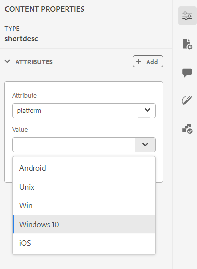{width="200" align="left"}
执行以下步骤以更改值：

1. 从中选择属性 **属性** 下拉菜单。
1. 选择 **编辑** .
1. 从中选择所需的值 **值** 下拉菜单。
1. 单击&#x200B;**更新**。


您还可以通过从下拉列表中选择多个值来应用属性的值。

**源视图**

您还可以从源视图中的属性下拉列表中更改值。 源视图还可以防止您添加任何不正确的值。

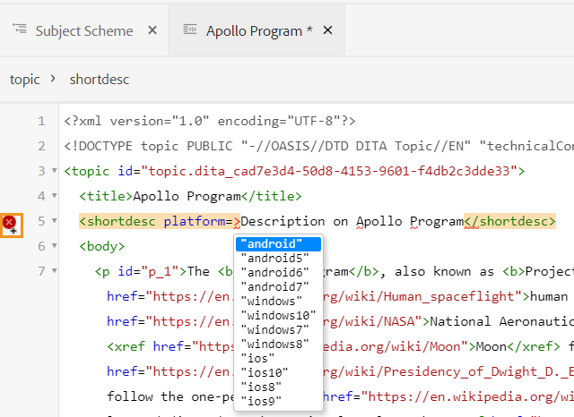{width="550" align="left"}

**从“条件”面板查看并应用主题方案**

您还可以从“条件”面板查看和应用主题方案。

要从“条件”面板查看主题方案，您的系统管理员必须选择选项 **在“条件”面板中显示“主题方案”** 在编辑器设置的条件选项卡下。 有关详细信息，请参阅， [“条件”选项卡](#id21BMNE0602V).

“条件”面板显示主题方案中的主题定义的扁平垂直结构。

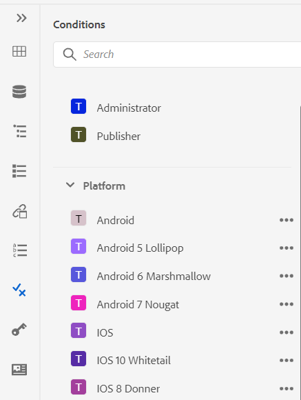{width="300" align="left"}

通过将所需条件拖放到内容中，可以向内容添加条件。 使用为条件定义的颜色突出显示条件内容。

**代码片段** -  

片段是小型内容片段，可在文档项目的各种主题中重复使用。 “代码片段”面板会显示您已创建的内容代码片段的集合。 要插入代码片段，请将面板中的代码片段拖放到主题中的所需位置。 “代码片段”面板允许您添加、编辑、删除、预览和插入代码片段。

>[!IMPORTANT]
>
> 以下屏幕截图显示具有管理权限的用户。 作为具有管理权限的用户，您可以添加、编辑和删除代码片段。 否则，作为普通作者，您将只获得预览和插入代码片段的选项。

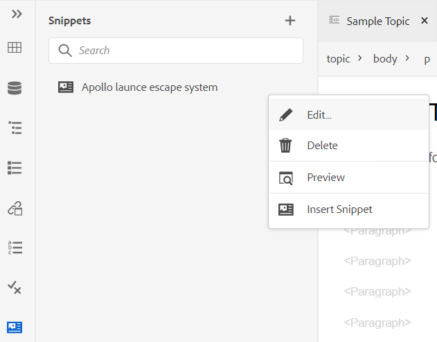{width="400" align="left"}

要添加代码片段，请使用以下任一方法：

- 单击代码片段旁边的+图标以打开新建代码片段对话框。

  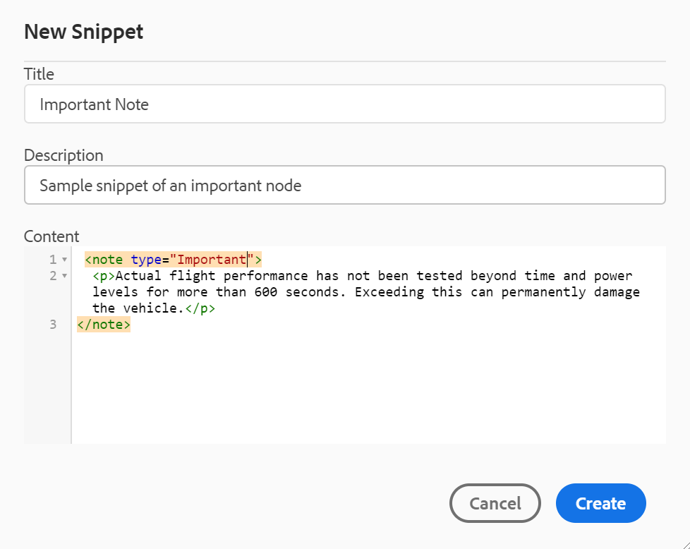{width="550" align="left"}

  在“新建代码片段”对话框中，提供显示在“代码片段”面板中的标题、描述以及要创建的代码片段内容的XML代码。 单击 **创建** 以保存并创建代码片段。

- 在内容编辑区域，右键单击要用作片段的元素痕迹导航，然后选择 **创建代码片段** 从上下文菜单中。 此时将显示“新建代码片段”对话框，所选元素的XML代码填充在 **内容** 字段。 输入 **标题** 和 **描述** 以获取相应代码片段，然后单击 **创建** 以保存代码片段。

- 在内容编辑区域中，右键单击要用作代码片段的内容上的任意位置，然后选择 **创建代码片段** 从上下文菜单中。 此时将显示“新建代码片段”对话框，所选元素的XML代码填充在 **内容** 字段。 输入 **标题** 和 **描述** 以获取相应代码片段，然后单击 **创建** 以保存代码片段。

  以下屏幕截图突出显示痕迹导航和内容区域，您可以从中调用上下文菜单。

  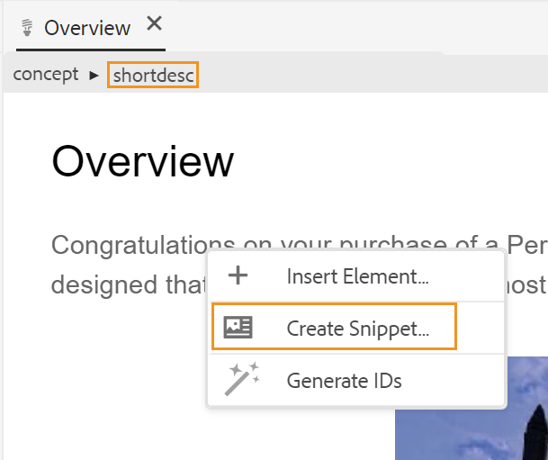{width="350" align="left"}


要插入代码片段，请使用以下任一方法：

- 从“代码片段”面板中选择一个代码片段，并将其拖放到主题中的所需位置。

- 将插入点放置在要插入代码片段的位置，从所需代码片段的“选项”菜单中选择“插入代码片段”。


>[!NOTE]
>
> 从代码片段条目的上下文菜单中，您还可以选择编辑、删除、获取预览或插入代码片段。

**模板** -  

“模板”面板仅对管理员可用。 使用此面板，管理员可以轻松地创建和管理随后可供作者使用的模板。 默认情况下，模板分类在 *地图* 和 *主题* 键入模板。

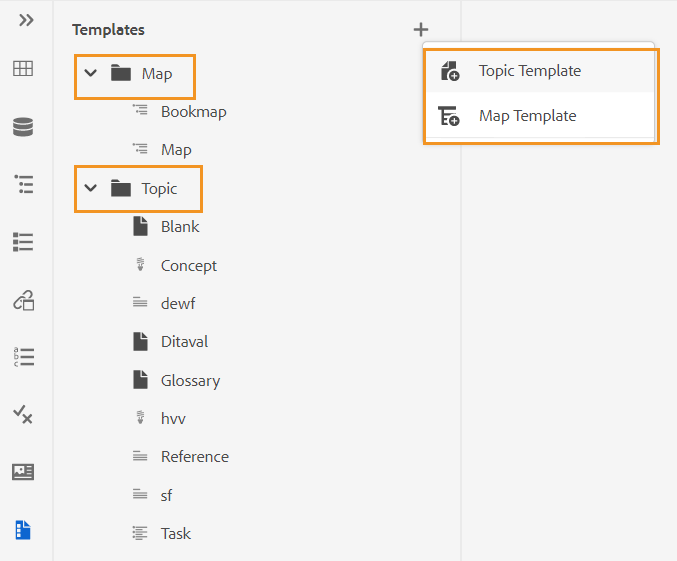{width="550" align="left"}

默认情况下，您可以按标题查看文件。 当您将鼠标悬停在模板上时，可以像工具提示一样查看文件标题和文件名。

>[!NOTE]
>
> 作为管理员，您还可以选择在Web编辑器中查看文件列表。 选择 **文件名** 的选项 **文件查看方式** 中的部分 **用户首选项** .

要创建模板，请单击模板旁边的+图标，然后选择要创建的模板。 如果您选择 **主题模板**，此时会显示创建新主题模板对话框：

{width="400" align="left"}

从中选择要创建的模板类型 **模板** 下拉列表。 提供 **标题**，它将显示在“模板”面板中。 此 **名称** 将根据标题自动建议模板的名称，但是，您可以提供其他文件名。

>[!NOTE]
>
> 如果管理员启用了基于UUID设置的自动文件名，则您将不会看到名称字段。

创建模板后，您需要将其添加到全局或文件夹级别的配置文件。 添加模板后，您的作者将在主题/地图创建过程中开始看到新模板。

通过使用现有模板上的“选项”菜单，您可以选择 **编辑** 或 **复制** 它。 如果出现重复，将保留模板的结构及类型\(document\)，您可以重复使用它以从中创建另一个模板。

**审核** -  

AEM Guides提供用于显示项目中所有审阅任务的功能。 您可以在审阅项目中查看您所属的所有审阅项目和活动审阅任务 **审核** 面板。  然后，可打开审阅任务以查看各种审阅人的注释。
审阅面板显示审阅任务。 默认情况下，您可以按标题查看文件。 当您将鼠标悬停在文件上时，您可以作为工具提示查看文件标题和文件路径。
>[!NOTE]
>
> 作为管理员，您还可以选择在Web编辑器中按文件名查看文件列表。 选择 **文件名** 的选项 **文件查看方式** 中的部分 **用户首选项** .

作为作者，您可以使用Web编辑器在主题中处理注释。


要在项目中存在的活动审阅任务中查看审阅注释，请执行以下步骤：

1. 选择审核    在左侧面板上。 此 **审核** 面板打开。  系统将显示您所属的审阅项目中的所有审阅项目和活动审阅任务。

   {width="300" align="left"}
1. 选择一个审阅项目，然后从列表中选择一个审阅任务以将其打开。
1. 您还可以按以下方式筛选项目：

   - 在项目标题中输入要查找的搜索词或文本。 然后按Enter键执行搜索。 例如，您可以搜索标题中包含“空间”一词的所有项目。

   - 选择   以打开 **筛选** 对话框。 您可以选择所有项目，也可以仅选择特定项目。 选定的项目将列在 **审核** 面板。
     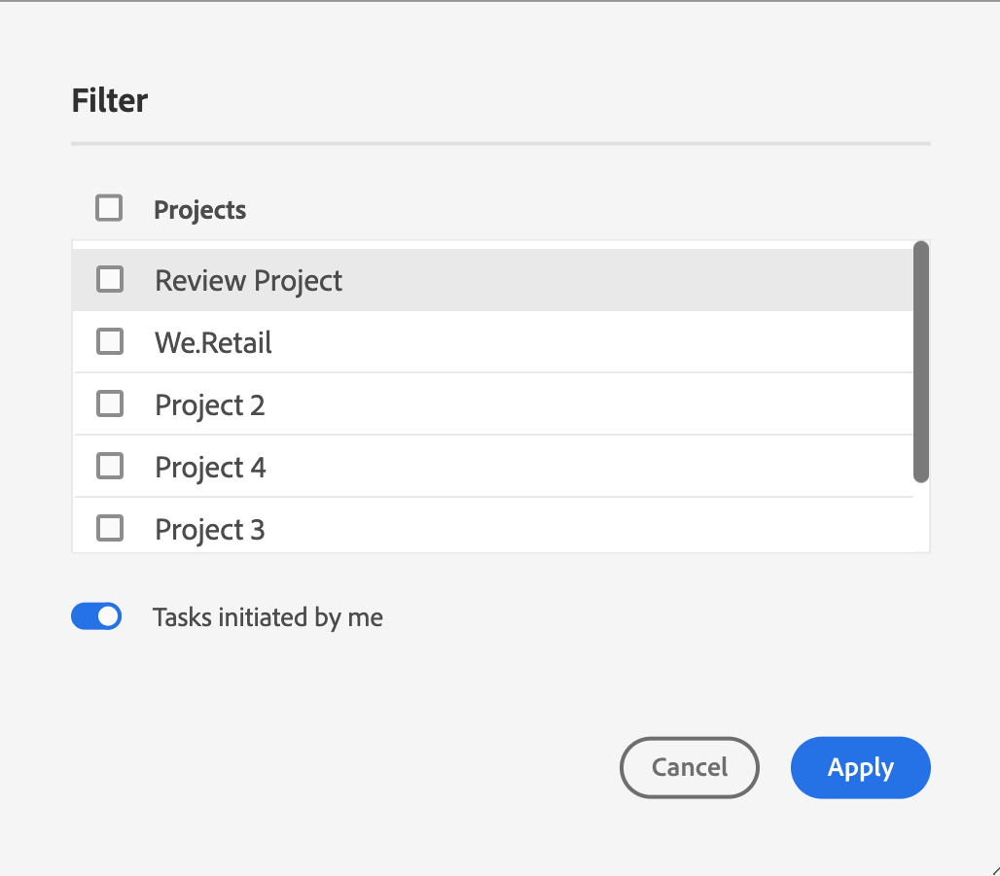{width="300" align="left"}

     此 **我发起的任务** 选项默认处于启用状态。 它仅允许您查看已启动的任务。

1. 默认情况下，在审阅项目中，您将查看包含与其关联的注释的主题平面列表。 应用左边栏中的必需过滤器，以根据主题中显示的审核注释过滤主题：

   - **查看所有主题**：列出项目中呈现的所有主题。
   - **查看包含评论的主题**：仅列出包含审阅评论的主题。
1. 您还可以输入要在主题标题或文件路径中查找的搜索词或文本。 标题或文件路径中包含术语的主题将列出。
1. 双击任何主题以在创作视图中将其打开。 您可在以下位置查看注释： **评论** 面板。
   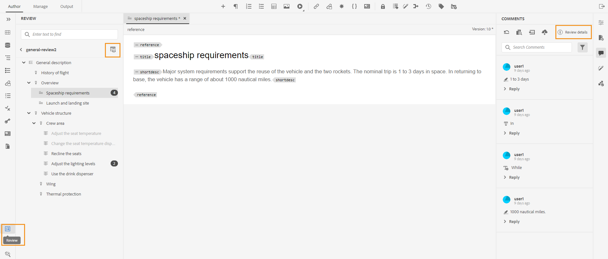{width="800" align="left"}


   >[!NOTE]
   > 
   > 此 **审核** 面板和 **评论** 面板始终保持同步。 在“注释”面板中，会根据“审阅”面板中加载的审阅任务来加载注释。
   > 有关如何处理注释的详细信息，请查看 [地址审核注释](review-address-review-comments.md#).

**查找和替换** -  

“查找并替换”图标位于左侧面板的底部。 通过“查找和替换”面板，您可以搜索并替换映射或存储库内文件夹中文件间的文本。 您可以查找和替换地图的所有主题以及地图内子地图中存在的主题。

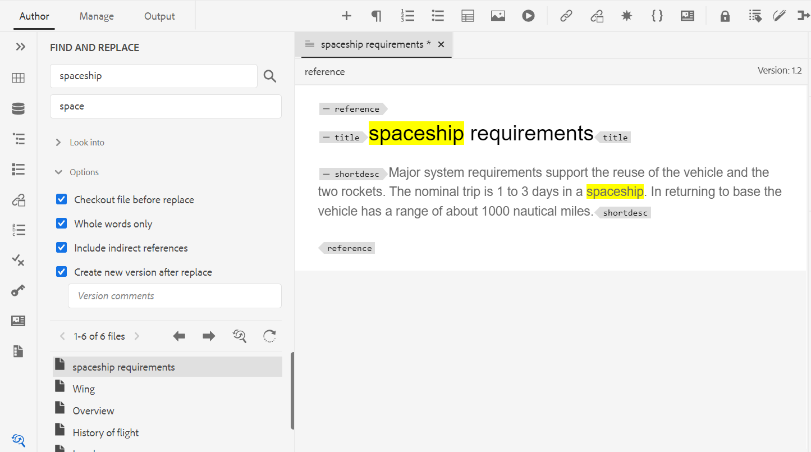{width="800" align="left"}

默认情况下，您可以按标题查看文件。 当您将鼠标悬停在文件上时，您可以作为工具提示查看文件标题和文件路径。
>[!NOTE]
>
> 作为管理员，您还可以选择在Web编辑器中查看文件名列表。 选择 **文件名** 的选项 **文件查看方式** 中的部分 **用户首选项** .

要执行全局搜索和替换，请执行以下步骤：

1. 打开全局 **查找和替换** 面板。
1. 单击 **查看** 下拉选择以下选项之一以执行搜索。
   - **当前映射**：在当前打开的映射中搜索

     >[!NOTE]
     >
     > 如果已打开映射进行编辑，则会显示此选项。

   - **路径**：在选定路径上进行搜索
   - **选择映射**：在选定映射中搜索

1. 您可以单击 **选项** 下拉菜单并从以下选项中进行选择：

   - **替换前签出文件**：如果您要在替换搜索词之前自动签出文件，请选择此选项。 如果您的管理员启用了配置以在编辑之前签出文件，则此设置更相关。 启用后端设置后，您应该选择此选项。 它将会阻止文件签出对话框在做出任何更改之前提示您签出每个文件。 如果不选择此选项，则在打开文件进行编辑之前将显示提示。
   - **仅全字**：如果要搜索整个搜索字符串，请选择此选项。 例如，如果在搜索字符串中输入over，则搜索结果将返回包含单词（如over和overview）的所有文件。 如果要限制搜索以返回输入的确切搜索词，请选择此选项。
   - **替换后创建新版本**：如果要创建主题的新版本，并且选择替换文本，请选择此选项。 您还可以提供版本注释，这些注释将随每个更新的文件一起添加。

     如果不选择此选项，则更改将保存在主题的当前版本中，并且不会创建新版本。

   - **包括间接引用**：如果要同时在DITA映射中搜索间接引用中的字符串，请选择此选项。 默认情况下，这是禁用的，因此仅对直接引用执行搜索。

1. 输入要查找的搜索词或文本。
1. 输入要替换搜索词的文本。
1. 按Enter键或选择 **Search** 图标\( \)执行搜索。
1. 从搜索结果列表中选择文件。 文件在内容编辑区域中打开，搜索词在内容中突出显示。
1. 打开全局 **查找和替换** 面板。
1. 单击 **查看** 下拉选择以下选项之一以执行搜索。

   - **当前映射**：在当前打开的映射中搜索

     >[!NOTE]
     >
     > 如果已打开映射进行编辑，则会显示此选项。

   - **路径**：在选定路径上进行搜索
   - **选择映射**：在选定映射中搜索

1. 您可以单击 **选项** 下拉菜单并从以下选项中进行选择：

   - **替换前签出文件**：如果您要在替换搜索词之前自动签出文件，请选择此选项。 如果您的管理员启用了配置以在编辑之前签出文件，则此设置更相关。 启用后端设置后，您应该选择此选项。 它将会阻止文件签出对话框在做出任何更改之前提示您签出每个文件。 如果不选择此选项，则在打开文件进行编辑之前将显示提示。

   - **仅全字**：如果要搜索整个搜索字符串，请选择此选项。 例如，如果在搜索字符串中输入over，则搜索结果将返回包含单词（如over和overview）的所有文件。 如果要限制搜索以返回输入的确切搜索词，请选择此选项。

   - **替换后创建新版本**：如果要创建主题的新版本，并且选择替换文本，请选择此选项。 您还可以提供版本注释，这些注释将随每个更新的文件一起添加。

     如果不选择此选项，则更改将保存在主题的当前版本中，并且不会创建新版本。

   - **包括间接引用**：如果要同时在DITA映射中搜索间接引用中的字符串，请选择此选项。 默认情况下，这是禁用的，因此仅对直接引用执行搜索。

1. 输入要查找的搜索词或文本。

1. 输入要替换搜索词的文本。

1. 按Enter键或选择 **Search** 图标\( \)执行搜索。
1. 从搜索结果列表中选择文件。 文件在内容编辑区域中打开，搜索词在内容中突出显示。

1. 单击 **替换单次发生次数** \( \)替换主题中当前突出显示的搜索词，或单击“下一个匹配”  或  “上一个匹配”移动到文本的下一个或上一个匹配项。

1. 单击 **全部替换文件** \( \)在单击时使用替换项替换单个文件中搜索项的所有匹配项。 替换选定文件中的所有匹配项后，您会看到通知。

   >[!NOTE]
   >
   > 将鼠标悬停在搜索结果列表中的文件上，可在文件右侧看到全部替换文件图标。 您还可以获得“忽略文件”图标以从搜索结果中删除文件。 您忽略的文件将从列表中删除，搜索词不会替换在其中。

1. 单击 **全部替换** \( \)在列表顶部的任意位置，通过一次单击即可使用替换项替换所有文件中搜索项的所有匹配项。

   >[!NOTE]
   >
   > 要启用 **全部替换** 图标，您的系统管理员必须选择选项 **启用全部替换** 在 **常规** tab in **编辑器设置**.


在整个系统中，一次只能执行一项“全部替换”操作，并且在执行操作之前，您会看到“全部替换”状态。 您还可以中止之间的替换所有操作或查看日志报告。 如果中止该操作，您将在收件箱中收到关于该操作的通知。 替换选定文件中的所有匹配项后，您将看到成功通知。

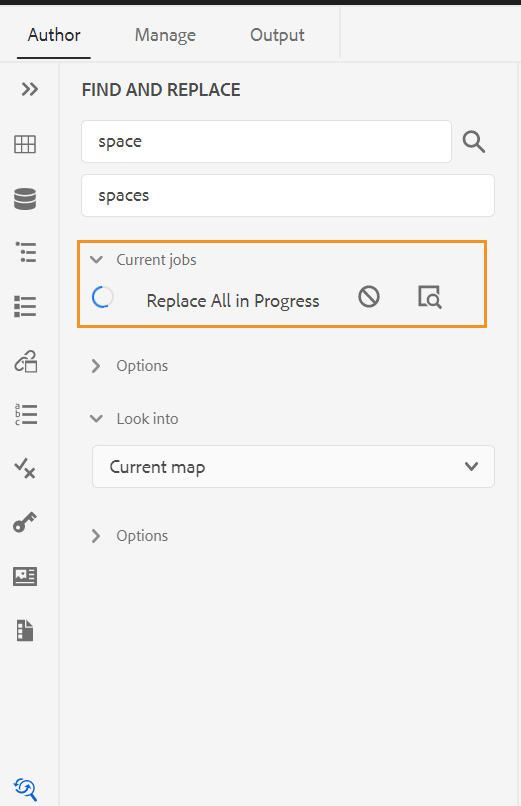{width="400" align="left"}

您也可以使用 **在地图中查找** 选项来自 **选项** 地图菜单，用于查找和替换地图中的文本。 对于在存储库面板或映射视图中打开的映射，将显示此选项。

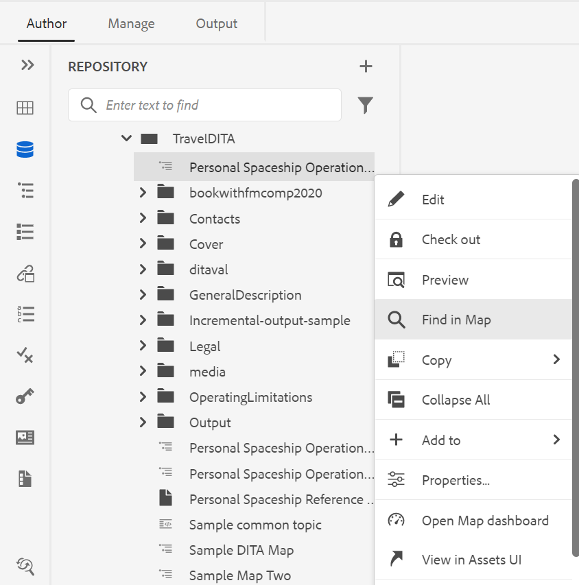{width="550" align="left"}

## 内容编辑区域 {#id2051EB000UI}

内容编辑区域是显示主题或地图内容的地方。 在此区域中进行所有内容编辑。 它提供您正在编辑的内容的“所见即所得”视图。 您可以同时打开多个主题，这些主题会显示在各自的选项卡中。

默认情况下，您可以在选项卡中查看文件标题。 当您将鼠标悬停在文件上时，您可以作为工具提示查看文件标题和文件路径。
>[!NOTE]
>
> 作为管理员，您还可以选择在选项卡中按文件名查看文件列表。 选择 **文件名** 的选项 **文件查看方式** 中的部分 **用户首选项** .

在文件的选项卡下方，您有在当前光标位置处的元素的痕迹导航。 在内容编辑区域的右上角，将显示当前主题的版本号。

{width="650" align="left"}

## 右侧面板 {#id2051EB003YK}

右侧面板是一个永久面板，其中包含有关当前选定文档的信息。

>[!NOTE]
>
> 右侧面板的大小可调。 要调整面板的大小，将光标置于面板边界上，光标将变为双向箭头，单击并拖动以调整面板宽度。

通过右侧面板，可访问以下功能：

**内容属性** -  

您可以通过单击右侧面板中的内容属性图标来访问内容属性功能。 “内容属性”面板包含有关文档中当前选定元素的类型及其属性的信息。
您可以轻松地添加、编辑或删除属性。

1. 单击 **+添加**.

   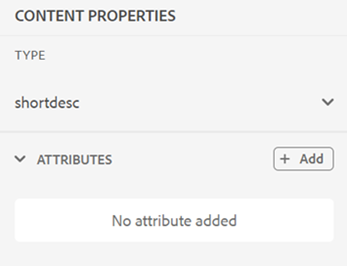{width="300" align="left"}

1. 在 **属性** 在下拉面板中，从下拉列表中选择属性并指定属性的值。  然后单击 **添加**.

   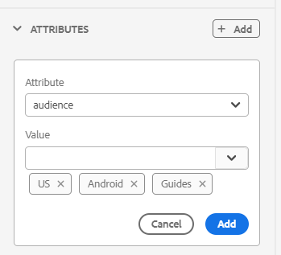{width="300" align="left"}

1. 要编辑属性，请将鼠标悬停在该属性上并选择 **编辑** .
   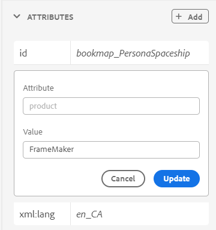{width="300" align="left"}

1. 要删除属性，请将鼠标悬停在该属性上并选择 **删除** .


>[!NOTE]
>
> 即使您的主题包含引用的内容，也可以使用属性面板在主题中添加属性。

如果管理员为属性创建了配置文件，则您将获得这些属性及其配置值。 使用“内容属性”面板，您可以选择这些属性，并将它们分配给主题中的相关内容。 这样您也可以创建条件内容，然后将其用于创建条件输出。 有关使用条件预设生成输出的更多信息，请参阅 [使用条件预设](generate-output-use-condition-presets.md#).


**文件属性** -  

通过单击文件属性查看所选文件的属性  图标。 “文件属性”功能在所有四种模式或视图中均可用：“布局”、“作者”、“源”和“预览”。

“文件属性”包含以下两个部分：

**常规**

通过“一般信息”部分可以访问以下功能：

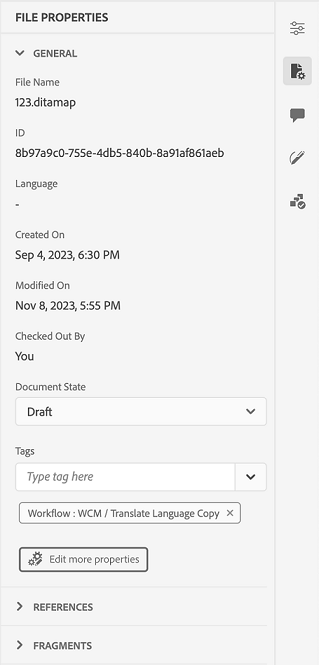{width="300" align="left"}

- **名称**：显示所选主题的文件名。 文件名超链接至选定文件的属性页。
- **ID**：显示所选主题的ID。
- **标记**：这些是主题的元数据标记。 它们是从属性页面中的标记字段设置的。 您可以键入或从下拉菜单中选择它们。  标记显示在下拉列表下方。 要删除标记，请选择标记旁边的交叉图标。
- **编辑更多属性**：您可以从文件属性页面编辑更多属性。
- **语言**：显示主题的语言。 在属性页面的语言字段中设置。
- **创建时间**：显示创建主题的日期和时间。
- **签出者**：显示签出主题的用户。
- **文档状态**：您可以选择并更新当前打开主题的文档状态。 有关更多详细信息，请参阅 [文档状态&#x200B;](web-editor-document-states.md#)*.*

**注意：** 您可以将“文件”属性中各个字段的属性值复制到剪贴板。

**引用**

利用“参照”部分，可访问以下功能：

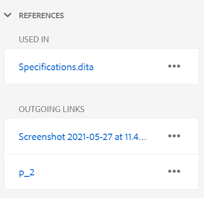{width="300" align="left"}

- **使用位置**：用于引用会列出引用或使用当前文件的文档。
- **传出链接：** “传出链接”列出当前文档中引用的文档。

默认情况下，您可以按标题查看文件。 当您将鼠标悬停在文件上时，您可以作为工具提示查看文件标题和文件路径。
>[!NOTE]
>
> 作为管理员，您还可以选择在Web编辑器中按文件名查看文件列表。 选择 **文件名** 的选项 **文件查看方式** 中的部分 **用户首选项** .

**注意：** 所有“用于”和“传出”引用均超链接到文档。 您可以轻松打开和编辑链接的文档。

除了打开文件之外，您还可以使用 **选项** 菜单。 您可以执行的某些操作包括“编辑”、“预览”、“复制UUID”、“复制路径”、“添加到收藏夹”、“属性”和“打开映射仪表板”。

**审核** -  

单击“审阅”图标将打开审阅面板，您可以在其中为当前打开的文档创建审阅任务。

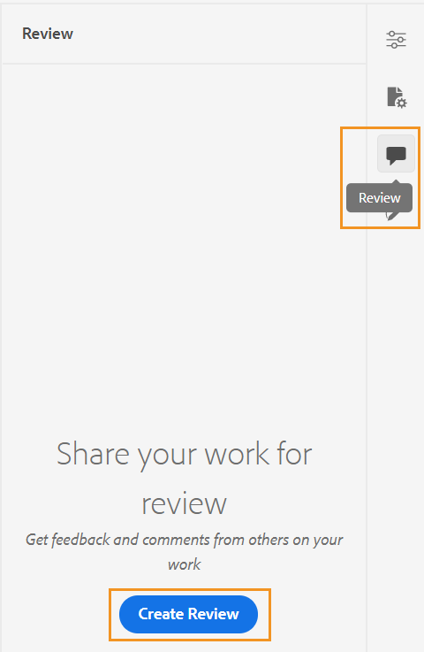{width="300" align="left"}

如果创建了多个“审阅”项目，则可以从下拉列表中选择一个项目并访问审阅注释。

使用“审阅”面板，您可以查看和发布对主题评论的回复。 您可以逐一接受或拒绝注释。

有关更多信息，请参阅 [地址审核注释](review-address-review-comments.md#).

**跟踪的更改** -  

使用右侧面板的“跟踪的更改”功能，可以查看文档中所做所有更新的信息。 您还可以搜索对文档所做的任何特定更新。

>[!NOTE]
>
> 跟踪的更改功能显示已使用主工具栏的启用/禁用跟踪更改功能跟踪的所有更新。 有关更多详细信息，请参阅 [启用/禁用跟踪更改](#id205DF0203Y4).

**父主题：**[&#x200B;使用Web编辑器](web-editor.md)
