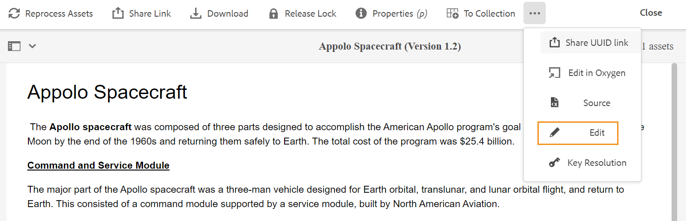
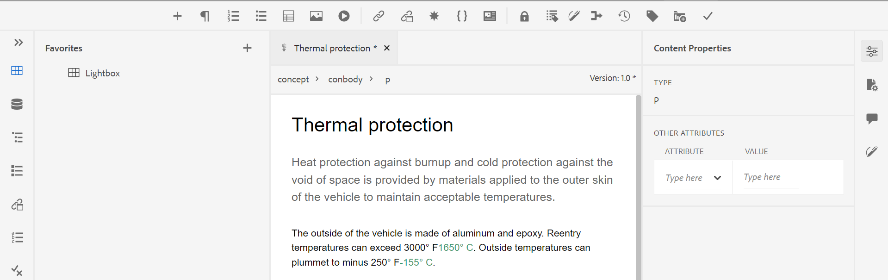

# 启动Web编辑器 {#id2056B0140HS}

您可以从以下位置启动Web编辑器：

- [AEM导航页面](#id2056BG00RZJ)
- [AEM ASSETS UI](#id2056BG0307U)
- [DITA映射控制台](#id2056BG090BF)

以下部分介绍了如何从不同位置访问和启动Web编辑器的详细信息。

## AEM导航页面 {#id2056BG00RZJ}

登录AEM时，您会看到“导航”页面：

{width="800" align="left"}

单击 **指南** 链接会将您直接转到Web编辑器。

{width="800" align="left"}

由于您启动了Web编辑器而未选择任何文件，因此将显示一个空白的Web编辑器屏幕。 您可以从AEM存储库或“收藏夹”收藏集中打开文件进行编辑。

- 单击 **指南** 图标( )，以返回到“AEM导航”页面。

- 此 **关闭** 按钮会根据您的设置引导您转到目标：

  

  
 Cloud Service 

  如果您使用的是Cloud Service，请单击 **关闭** 按钮以返回“AEM导航”页面。
  

  

  
 内部部署软件

  如果您使用的是AEM Guides On-premise Software（4.2.1及更高版本），请单击 **关闭** 按钮返回资产UI中的当前文件路径。

  

## AEM ASSETS UI {#id2056BG0307U}

可以从中启动Web编辑器的另一个位置来自AEM Assets UI。 您可以选择一个或多个主题并直接在Web编辑器中打开它们。 要在Web编辑器中打开主题，请执行以下步骤：

1. 在Assets UI中，导航到要编辑的主题。

   >[!NOTE]
   >
   > 您还可以看到主题的UUID。

   。

   {width="800" align="left"}

   >[!IMPORTANT]
   >
   > 确保您对包含要编辑的主题的文件夹具有读写权限。

1. 要获得对主题的独占锁定，请选择该主题并单击 **签出**.

   >[!IMPORTANT]
   >
   > 如果您的管理员已配置 **禁用“编辑而不签出”** 选项，则在编辑之前必须签出文件。 如果不签出文件，您将看不到编辑选项。

1. 关闭资源选择模式，然后单击要编辑的主题。

   此时将显示主题的预览。

   您可以从“列表”视图、“卡片”视图和“预览”模式中打开Web编辑器。

   >[!IMPORTANT]
   >
   > 如果要打开多个主题进行编辑，请从资产UI中选择所需的主题，然后单击编辑。 请确保您的浏览器未启用弹出窗口阻止程序，否则将仅打开选定列表中的第一个主题进行编辑。

   {width="800" align="left"}

   如果您不想预览某个主题并希望直接在Web编辑器中打开该主题，请从卡片视图单击快速操作菜单中的“编辑”图标：

   {width="800" align="left"}

1. 单击 **编辑** 以在Web编辑器中打开主题。

   {width="800" align="left"}

## DITA映射控制台 {#id2056BG090BF}

要从DITA映射控制台中打开Web编辑器，请执行以下步骤：

1. 在资产UI中，导航到包含要编辑的主题的DITA映射文件并单击该文件。

   将显示DITA映射控制台。

1. 单击 **主题**.

   将显示映射文件中的主题列表。 主题的UUID显示在主题标题的下方。

1. 选择要编辑的主题文件。

1. 单击 **编辑主题**.

   {width="800" align="left"}

1. 该主题将在Web编辑器中打开。

   >[!IMPORTANT]
   >
   > 如果您的管理员已配置 **禁用“编辑而不签出”** 选项，则在编辑之前必须签出文件。 如果未签出文件，则文档将在编辑器中以只读模式打开。

**父主题：**[&#x200B;使用Web编辑器](web-editor.md)
