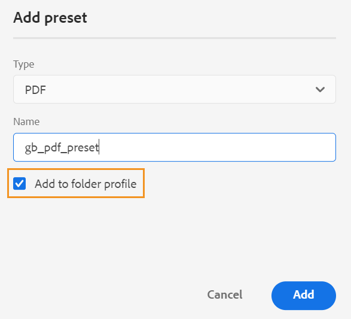

# 管理全局和文件夹配置文件输出预设 {#id22BLJ0D0V1U}

全局和文件夹配置文件预设仅适用于文件夹级别的管理用户。

作为管理员，AEM Guides允许您为全局和文件夹配置文件创建和管理输出预设。 然后，您可以轻松地使用这些输出预设为与该全局或文件夹配置文件相关的所有映射生成输出。

执行以下步骤，为全局配置文件和文件夹配置文件创建输出预设：

1. 选择要为其创建输出预设的DITA映射。
1. 选择 **编辑主题** 选项来自 **选项** 映射文件菜单。 将打开映射文件以便在Web编辑器中编辑。
1. 在 **输出** 选项卡，选择+图标以创建DITA映射的输出预设。

   {width="350" align="left"}

1. 在“ ”中输入以下详细信息 **添加预设** 对话框：
   - 类型
   - 名称
   - Target \（对于知识库预设\）
1. 选择 **添加到文件夹配置文件** 复选框，以便为相关文件夹配置文件创建输出预设，然后单击 **添加**. 随即会创建预设，该预设会显示在 **输出** 选项卡。 \( \)图标表示文件夹配置文件级别预设。
1. 输入配置详细信息。 有关输出预设的更多详细信息，请查看 [了解输出预设](./generate-output-understand-presets.md).

   >[!NOTE]
   >
   > 添加到文件夹配置文件的这些预设与映射无关，因此这些预设不存在映射特定的配置。

1. 您可以选择 **生成预设** 图标，以便为与创建的输出预设相关的映射生成输出。 您将看到输出生成过程的状态。 要查看输出，请将鼠标指针悬停在主题上，然后单击 **查看输出**.

>[!NOTE]
>
> AEM Guides还提供了现成的PDF输出预设，用于生成DITA映射的输出。

**“选项”菜单中的其他操作**

也可以从“选项”菜单对预设执行以下操作：

- 选择预设作为默认pdf预设。 PDF然后，所选预设将用作默认预设，以使用 **下载为PDF** 映射选项。
- **编辑**， **重命名**， **复制**，或 **删除** 来自的现有输出预设 **选项** 菜单。

>[!NOTE]
>
> 删除全局和文件夹配置文件中的输出预设时，它将反映在所有相关映射中，并且不会显示在 **输出** 选项卡。

**父主题：**[&#x200B;使用Web编辑器](web-editor.md)
