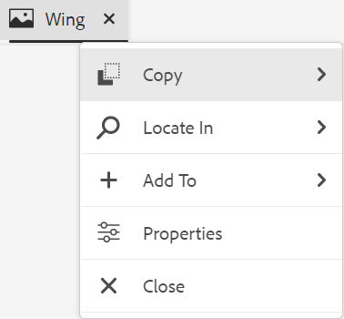
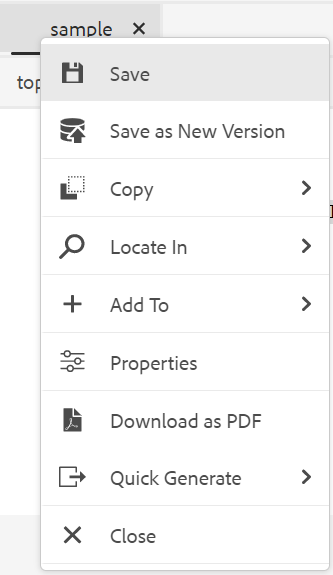
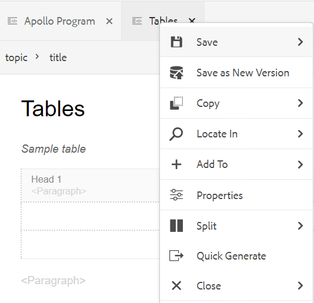
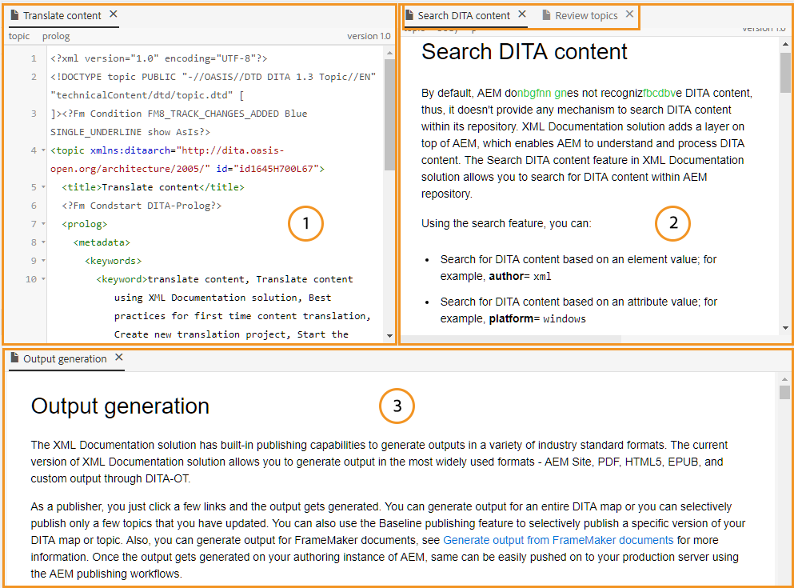
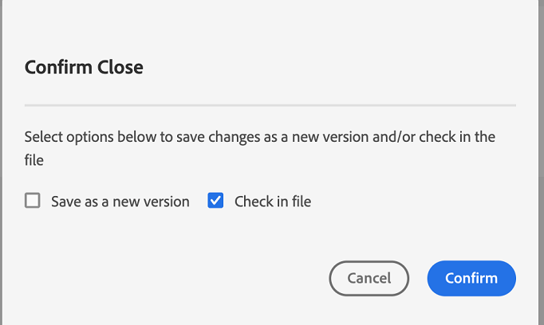
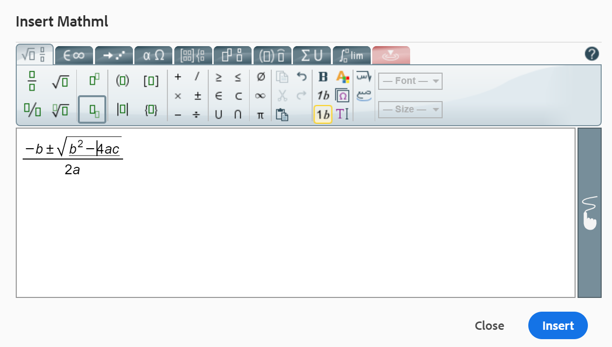
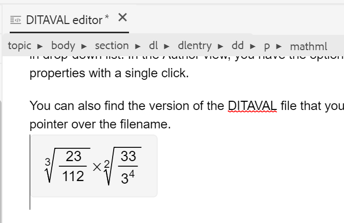
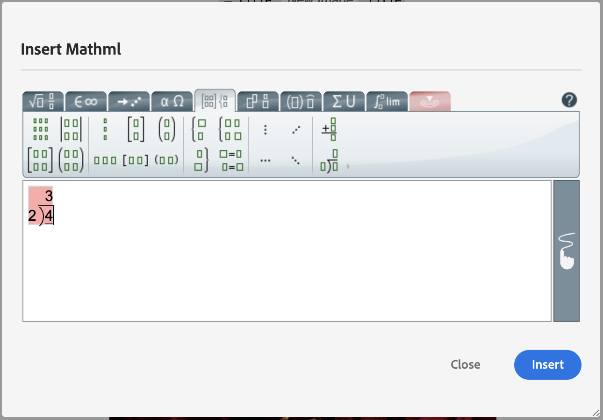
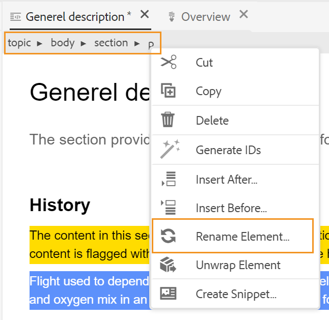
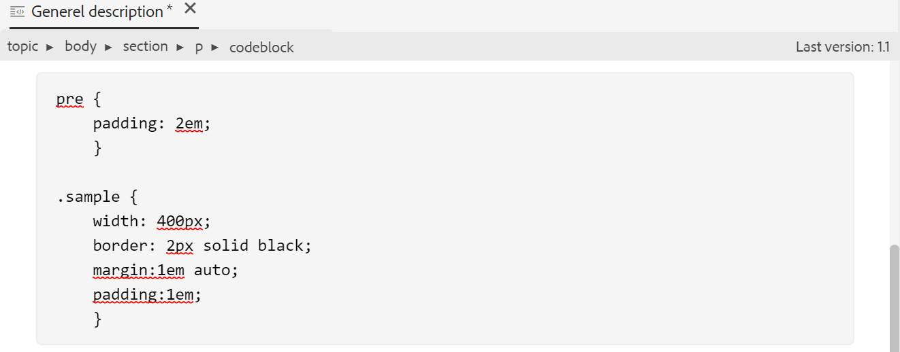

# Web编辑器中的其他功能 {#id2056B0B0YPF}

在Web编辑器中，还可以使用一些其他有用的功能：

**文件选项卡上的上下文菜单功能**

在Web编辑器中打开文件时，可以从上下文菜单执行各种操作。 根据您是打开介质文件、单个DITA文件还是多个文件，您可能会看到不同的选项。

**媒体文件**

在打开的媒体文件选项卡的上下文菜单中，可以获取以下功能：

{width="300" align="left"}

**单个DITA文件**

在打开的文件选项卡的上下文菜单中，可以获取以下函数：

：   {width="300" align="left"}

**多个文件**

打开多个文件时，上下文菜单中会提供更多选项：

{width="550" align="left"}

上下文菜单中的各种选项说明如下：

***保存***：您可以从以下选项中进行选择：

- **保存**：要保存文件而不创建新版本，请选择 **保存**. 无论何时创建新主题，都会在DAM中创建该主题的无版本工作副本。 保存文档将更新DAM中文档的工作副本。 在此版本上执行简单保存不会创建主题的新版本。 如果您的主题正在审阅，则保存主题不会向审阅人授予对已更改主题内容的访问权限。

- **全部保存**：如果在Web编辑器中打开了多个文档，则您还有一个选项，用于 **全部保存** 已打开的文档。

***另存为新版本***

要创建文件的新版本，请选择 **另存为新版本**. 有关更多详细信息 **保存** 和 **另存为新版本**，请参见 [了解Web编辑器功能](web-editor-features.md#).

***复制***：您可以从以下选项中进行选择：

- **复制UUID**：要将当前活动文件的UUID复制到剪贴板，请选择 **复制\>复制UUID**.
- **复制路径**：要将当前活动文件的完整路径复制到剪贴板，请选择 **复制\>复制路径**.

***查找位置***：您可以从以下选项中进行选择：

- **地图**：如果您已打开大型DITA映射，并且希望查找文件在映射中的确切位置，请选择 **在\>映射中找到**. 选择在映射中查找选项时，文件\（调用该选项的位置\）将位于映射层次结构中并突出显示。 要能够使用此功能，必须在Web编辑器中打开映射文件。 如果映射视图处于隐藏状态，则调用此功能将显示映射视图，并且该文件会在映射层次结构中突出显示。

- **存储库**：与“在地图中查找”类似， **在\>存储库中找到** 显示文件在存储库\（或DAM\）中的位置。 将打开“存储库视图”，所选文件在存储库中突出显示。 如果文件位于文件夹中，则该文件夹将展开以显示所选文件在存储库中的位置。

***添加至***：您可以从以下选项中进行选择：

- **收藏夹**：要将所选文件添加到收藏夹，请选择 **添加到\>收藏夹**. 欲知更多详情，请参见 **收藏夹** 中的功能描述 [左侧面板](web-editor-features.md#id2051EA0M0HS) 部分。

- **可重用内容**：要将所选文件复制到可重用内容列表，请选择 **添加到\>可重用内容**. 欲知更多详情，请参见 **可重用内容** 中的功能描述 [左侧面板](web-editor-features.md#id2051EA0M0HS) 部分。

***属性***

要查看所选文件的AEM属性页，请选择 **属性**.

***Split***：您可以从以下选项中进行选择：

**向上、向下、向左或向右**

默认情况下，Web编辑器允许您一次查看一个主题。 在某些情况下，您可能会希望同时查看两个或更多主题。 拆分编辑器的屏幕允许您同时查看多个主题。 例如，如果您在编辑器中打开了两个主题 — A和B。 右键单击主题B并选择 **拆分\>向上** 将编辑器窗口分为两部分。 主题B显示在上半部分，主题A显示在下半部分。 同样，您还可以通过选择水平拆分屏幕 **拆分\>左侧** 或 **拆分\>右侧**. 以下Web编辑器屏幕截图显示了水平和垂直拆分的主题。 在每个拆分中，您可以具有不同的视图。 例如，在下面的屏幕截图中，屏幕1处于源视图模式，屏幕2有两个文档在创作模式下打开，而屏幕3处于预览模式。 您可以通过将“文件”选项卡拖放到要放置文档的屏幕上，将文档从一个屏幕移动到另一个屏幕。 同样，您也可以根据自己的喜好通过拖动和移动文件选项卡来重新排序它们。

{width="800" align="left"}

***快速生成***

为所选文件生成输出。 只能为作为输出预设一部分的文件生成输出。 有关更多详细信息，请参阅 [从Web编辑器中基于文章的发布](web-editor-article-publishing.md#id218CK0U019I).

***关闭***：您可以从以下选项中进行选择：

**关闭**， **关闭其他**，或 **全部关闭**

如果要关闭从中调用上下文菜单的文件，请选择 **关闭\>关闭**. 使用 **关闭\>关闭其他** 关闭除当前活动文件之外的所有其他打开的文件。 要关闭所有打开的文件，请选择 **关闭\>全部关闭** 选项，或者也可以选择关闭Web编辑器。 如果会话中有任何未保存的文件，则会提示您保存这些文件。

**文件关闭并保存方案**

当您尝试使用关闭在Web编辑器中打开的文件时 **关闭** 文件选项卡上的按钮或 **关闭** 选项菜单中的选项，AEM Guides会提示您保存编辑内容并解锁锁定的文件。

提示基于管理员选择的以下配置：

- **关闭时要求签入：** 关闭编辑器时，您可以选择签入文件\（您已签出\）。
- **关闭时询问新版本**：关闭编辑器时，您可以选择将文件\（已编辑\）另存为新版本。

您的文件保存体验将取决于以下三种场景，其中您具有：

- 未对内容进行任何更改。
- 编辑了内容并保存了更改。
- 已编辑内容，但未保存更改。

根据文件处于锁定/解锁状态以及已保存或未保存更改，您可能会看到以下选项：

- **解锁并关闭**：释放对文件的锁定，并关闭文件。

  {width="400" align="left"}

- **另存为新版本**：这将保存您在内容中所做的更改，并创建文件的新版本。 您还可以为新保存的版本添加标签和注释。 有关保存新版本的更多信息，请参见 [另存为新版本](web-editor-features.md#save-as-new-version-id209ME400GXA).

- **解锁文件**：如果您选择解锁文件，它将解除对文件的锁定，并且更改会保存在文件的当前版本中。

  >[!NOTE]
  >
  > 如果取消选择用于解锁文件的选项，则还可以选择关闭文件而不保存更改的选项。

  例如，以下屏幕快照中显示了以下提示之一：

  {width="400" align="left"}

**已损坏引用的视觉提示**

- 如果主题包含损坏的交叉引用或内容引用，则它们将以红色文本显示。

**智能复制 — 粘贴**

- 您可以轻松地在主题内和主题间复制粘贴内容。 源元素结构将在目标处进行维护。 此外，如果复制的内容包含内容引用，那么即使这些引用也被复制。

**记住上次浏览的位置**

- Web编辑器提供了一个智能文件浏览对话框。 插入引用或内容时，编辑器会记住上次使用的位置。 第一次调用文件浏览对话框\（通过“插入引用”或“插入重用内容”\）时，将转到保存当前文档的位置。 在同一会话中，如果尝试插入另一个参照，则文件浏览对话框会自动导航到插入最后一个参照的位置。

>[!NOTE]
>
> 对于图像、音频或视频文件，文件浏览对话框默认为文件的位置，而不是上次使用的位置。

**支持基于文章的发布**

- 从Web编辑器中，可以为一个或多个主题或整个DITA映射生成输出。 您需要为DITA映射创建输出预设，然后可以轻松生成一个或多个主题的输出。 如果更新了映射中的几个主题，则也可以仅从Web编辑器生成这些主题的输出。 有关更多详细信息，请参阅 [从Web编辑器中基于文章的发布](web-editor-article-publishing.md#id218CK0U019I).

**支持Markdown文档**

- Web编辑器允许您将Markdown文档\(.md\)与DITA文档一起使用。 您可以轻松地在Web编辑器中创作和预览Markdown文档，还可以通过DITA映射编辑器将其添加到映射文件中。 有关更多详细信息，请参阅 [从Web编辑器创作Markdown文档](web-editor-markdown-topic.md#).

**支持DITA术语主题**

- Web编辑器支持DITA术语表，您可以通过添加 `term` 或 `abbreviated-form` 元素。

**插入MathML公式**

- Experience Manager指南为您提供开箱即用的支持，以便通过与集成来插入MathML公式 [MathType Web](https://docs.wiris.com/en/mathtype/mathtype_web/intro) 应用程序。 要插入MathML公式，请选择 **插入元素** 图标并键入mathml。 从列表中选择数学元素时， **插入MathML** 对话框随即显示：

{width="550" align="left"}

使用MathML方程式工具，创建方程式并单击 **插入** 以将其添加到您的文档。 该公式以浅灰色背景插入，如下所示：

{width="400" align="left"}

在任何时候，都可以通过右键单击现有公式并选择 **编辑MathML** 从上下文菜单中。

- **在MathML编辑器中验证公式**

  在保存包含MathML公式的主题时，“Experience Manager指南”会验证这些公式。
使用MathML编辑器插入公式时，如果存在任何语法问题，“Experience Manager指南”会以红色突出显示公式。 您可以在插入之前更正它。 如果您未进行任何更改，但选择 **插入**，它会显示警告。

  {width="400" align="left"}

  如果插入包含语法错误的MathML公式，则在尝试保存主题时会发生验证错误。

**插入脚注**

- 使用在内容中插入脚注 `fn` 元素。 在创作模式下，脚注值与内容内联显示。 但是，当您切换“预览”模式或发布文档时，脚注会出现在主题末尾。

**重命名或替换元素**

- Web编辑器在主题顶部显示元素的痕迹导航。 如果要使用其他元素交换或替换元素，则可以从痕迹导航的上下文菜单执行此操作。 例如，您可以交换 `p` 元素与 `note` 或上下文中的任何其他有效元素。

{width="400" align="left"}

在痕迹导航上，右键单击要替换的元素名称，然后从上下文菜单中选择重命名元素。 “重命名元素”对话框显示当前位置允许的所有有效元素。 在重命名元素对话框中，选择要使用的元素。 原始元素被替换为新元素。

除了痕迹导航的上下文菜单之外，还可以从其他位置访问“重命名元素”对话框：

- 单击痕迹导航上的元素名称以选择元素的内容，然后右键单击选定内容以调出上下文菜单。

- 启用“标记”视图，单击任何元素的开始标记，然后右键单击选定内容以调出上下文菜单。

- 可通过调用“轮廓”面板中元素的“选项”菜单来访问“重命名元素”对话框。

**将元素换行**

- 使用元素换行，可以向所选文本添加元素标记。 您可以按照DITA标准将文本换行到任何子元素。 例如，如果您在 `note` 元素，则可以将文本换行 `p` 元素。

  此 **将元素换行** 选项在主题痕迹导航的上下文菜单中可用。 要环绕元素，请右键单击该元素并打开上下文菜单。 从中选择元素 **将元素换行** 对话框。 该文本将显示在新元素中。

  您还可以选择文本或内容中的元素，然后选择 **将元素换行**  选项。

**取消包裹元素**

- 通过展开元素，可以从所选文本中删除元素标记并将其与其父元素合并。 例如，如果您拥有 `p` 中的元素 `note` 元素，您可以将 `p` 元素直接将文本合并到 `note` 元素。 此 **取消包住元素** 选项在主题痕迹导航的上下文菜单中可用。 要取消包裹某个元素，请右键单击该元素以打开上下文菜单，最后选择 **取消包住元素** 以移除该元素，并将该元素的文本与其父元素合并。

**DITA元素的空格处理**

- 在XML中，空格包括空格、制表符、回车符和空行。 “Experience Manager参考线”将多个后续空格转换为一个空格。 这有助于保留Web编辑器的WYSIWYG视图。

  >[!NOTE]
  >
  >在某些根据DITA规则需要保留空格的元素中，将保留多个后续空格。 例如， `<pre>` 和 `<codeblock>` 元素。

**保留换行符和缩进**

- 根据在“创作”、“源”或“预览”模式以及最终发布的输出中的定义，支持并呈现包含换行符和空格的DITA元素。 以下屏幕截图显示了 `msgblock` 其中保留换行符和空格\(indentation\)的元素：

{width="500" align="left"}

**在Web编辑器中处理不间断空格**

- 可以使用在文档中插入不间断空格 **插入特殊字符**   图标或 **Alt** + **空间** 快捷键。  在Web编辑器中编辑主题时，这些不间断的空格会显示为指示符。 您可以使用以下图标关闭不间断空格的显示 **在创作模式下显示不间断空间指示器** 选项来自 **外观** 选项卡 **用户首选项** ..

- 如果您将任何外部源中具有不间断空格的内容复制并粘贴到中 **作者** 视图，非中断空间将转换为空间。
但是，如果您复制并粘贴内容时其中带有不间断空格， **作者** 视图，它保存了。

**自动生成元素ID**

- 您可以为DITA主题中的元素自动生成ID。 这些ID在DITA主题中是唯一的。 例如，如果为段落元素生成ID，则ID将为p\_1、p2、p\_3等。 您可以选择多个元素，并为每个选定的元素生成ID。

执行以下操作可自动生成一个或多个元素的ID：

1. 在Web编辑器中打开主题。
1. 选择要为其分配ID的内容。
1. 右键单击并选择 **从上下文菜单生成ID。**

   或者，您可以在痕迹导航中右键单击并选择 **生成Id**.

**父主题：**[&#x200B;使用Web编辑器](web-editor.md)
