# 预览主题 {#id1696II000QR}

创建主题后，AEM Guides会生成该主题的预览。 “预览”模式提供了多种可用于处理文档的功能。

执行以下步骤以预览主题：

1. 在Assets UI中，导航到要查看的主题。
1. 单击要查看的主题。

   资产UI中将显示主题预览。

   >[!NOTE]
   >
   > 您可以在主题的文件选项卡的右上角看到活动主题或DITA映射的版本。

   >[!IMPORTANT]
   >
   > 根据您的AEM服务器的设置，以下功能在预览工具栏中的位置可能会有所不同。 某些功能可能位于主工具栏中，而其他功能可能位于“更多”菜单下。

## 预览模式下可用的功能

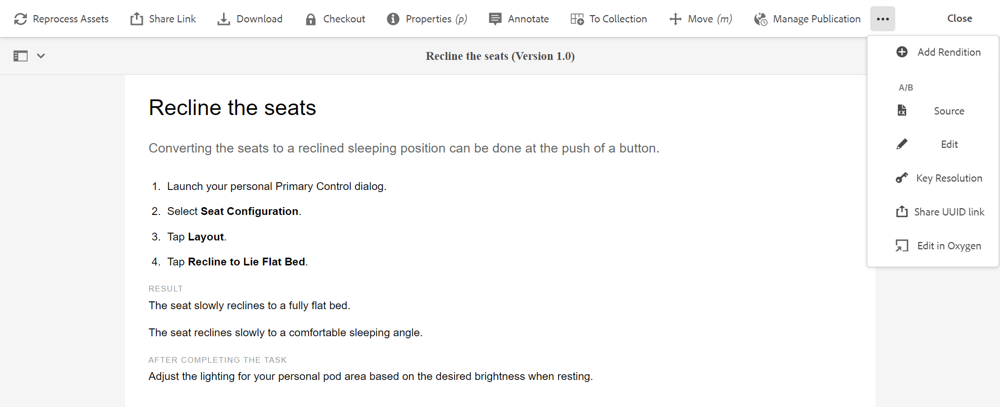{width="800" align="left"}

您可以在预览模式下从工具栏执行以下操作：

**属性**

查看所选主题的属性。 根据您的AEM版本，您可以看到元数据、计划\(de\)激活、引用、文档状态等属性。

>[!NOTE]
>
> 主题的标题属性自动填充自 `title` DITA主题或映射的标记。 如果您使用属性窗口对标题进行了任何更改，则更改将丢失。 如果要更新标题属性，应使用Web编辑器进行更新。

“属性”页面包含有关引用的有用信息，例如正在使用地图或主题的位置，或文档中包含哪些引用。 “属性”页面列出了文档的两种引用类型 —  **使用位置** 和 **传出引用**.

此 **使用位置** 引用列出引用或使用当前文件的文档。 此 **传出引用** 列出当前文档中引用的文档。

中的\(+\)图标 **使用位置** “引用”部分允许您进一步向上导航以查找正在使用或引用该主题的位置。

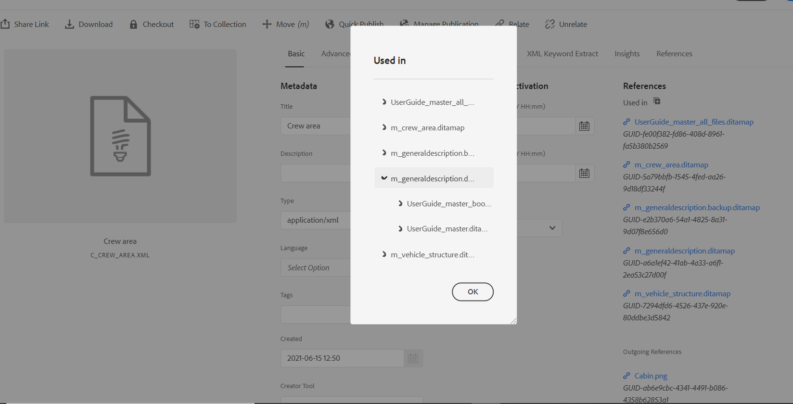{width="800" align="left"}

单击 文档旁边的图标显示映射或主题文件，其中文档被进一步引用。

**条件筛选\(A/B\)**

如果您的主题包含条件内容，那么您将在工具栏上看到A/B图标。 单击此图标将打开一个弹出窗口，允许您根据主题中的可用条件筛选内容。

>[!NOTE]
>
> 在Web编辑器中，使用浅色背景颜色突出显示条件内容。

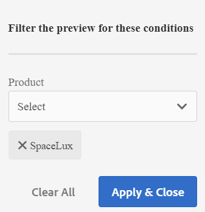{width="300" align="left"}

**编辑**

- 打开主题以在Web编辑器中编辑。 此 **编辑** 选项将不可用，如果管理员已启用 **禁用“编辑而不签出”** 选项。 启用该选项后，您将看到 **编辑** 选项。

**关键分辨率**

- 如果要将密钥空间文件用于主题，请单击“密钥分辨率”图标。 然后，您可以从“关键分辨率”弹出菜单中选择一个关键空间。

**来源**

- 打开文件的XML源代码。 通过在“预览”模式下打开映射、主题或DITAVAL文件并单击“源”图标，可以查看该文件的基础XML代码。 “XML源”弹出窗口显示XML源代码。 您可以从文件中选择特定代码或按 `Ctrl`+`a` 以选择整个内容。

  >[!NOTE]
  >
  > 要获取DITA映射文件的源代码视图，请在Assets UI中选择该文件，然后单击源。

  {width="800" align="left"}

**共享UUID链接**

- AEM Guides允许您从以下位置共享用于DITA映射、主题和图像文件的基于UUID的链接：

   - 资产UI
   - DITA映射的控制台
   - 主题或图像的预览

新选项 **共享UUID链接** 会显示在上述区域的工具栏中。 以下屏幕截图显示了 **共享UUID链接** 主题预览模式中的选项：

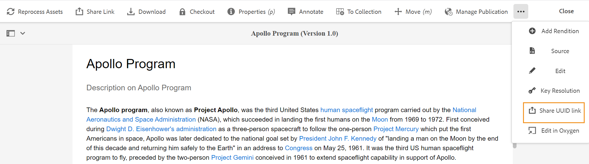{width="800" align="left"}

在资产UI中，当您选择文件时，此选项可见。 在“预览”模式下，此选项默认位于主工具栏中。 在DITA映射控制台中，此选项在输出预设部分中可见。

复制URL后，可以与其他用户共享该URL，以便他们直接访问文件。 即使将文件移动到存储库中的其他位置，此链接仍然有效。 仅当从存储库中删除文件时，链接才会失败。

如果从DITA映射控制台或文件的预览模式共享链接，则用户将进入文件的同一视图。 但是，当您从资产UI共享映射文件的链接时，用户将被带入映射的控制台。 同样，对于主题或图像文件，会显示文件的预览。

>[!IMPORTANT]
>
> 该链接不能用作其他主题中的引用链接，它仅提供对存储库中文件的直接访问。 此外，只要文件在存储库中可用，该链接仍然有效。 即使将文件移动到存储库中的其他位置，链接仍保持有效。 仅当从存储库中删除文件时，链接才会失败。

**签出/签入**

- 切换检出和检入功能。 签出文件时，当前用户将获得对该文件的独占写入权限。 可以在Web编辑器中打开签出的文件进行编辑。 进行所需的更改后，单击签入图标以将文件保存在DAM中。

检出主题时，文件的状态在卡片视图和列表视图中显示为“已检出”。

在卡片视图中签出的文件：

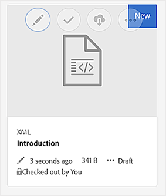{width="300" align="left"}

在列表视图中签出的文件：

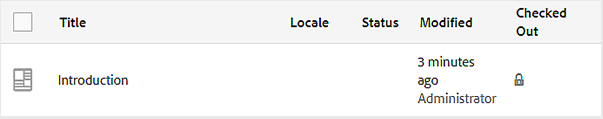{width="550" align="left"}

如果“已检出”列不可见，请选择 **查看设置** 下 **列表视图** 并选择 **已签出** 中的状态 **配置列** 对话框。

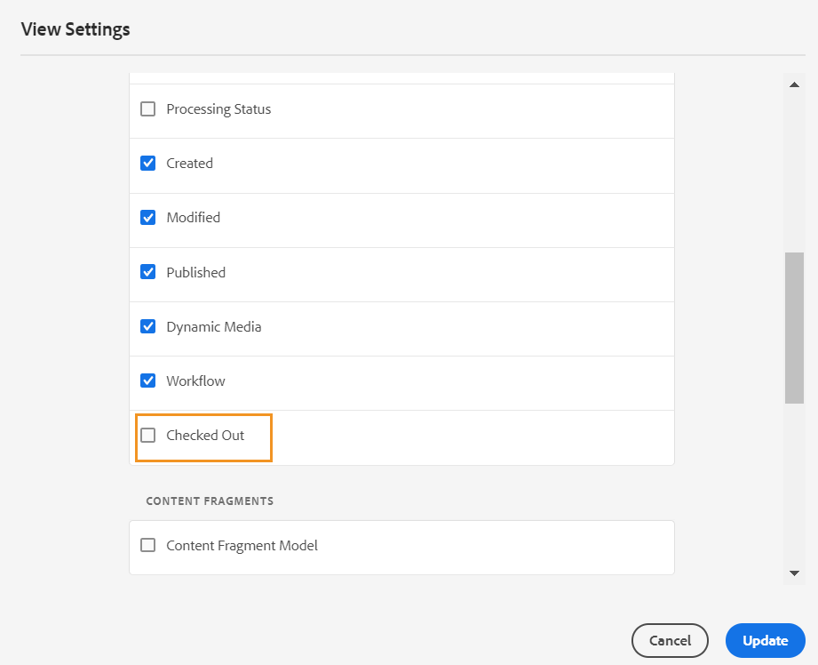{width="800" align="left"}

>[!TIP]
>
> 有关使用文件签出和签入的最佳实践，请参阅最佳实践指南中的内容版本控制部分。

**基于Web的版本差异**

- 如果您的主题发生了一些更改，您可以轻松地找到在该主题的不同版本中所做的更改。 要了解不同版本主题中的更改，请执行以下操作：

  >[!IMPORTANT]
  >
  > 以下过程中描述的方法仅适用于DITA文件。 对于非DITA文件，使用“时间轴”视图创建版本或恢复文件的现有版本。

   1. 在预览模式下打开主题。

   1. 在左边栏中，单击 **版本历史记录** 并选择版本。

      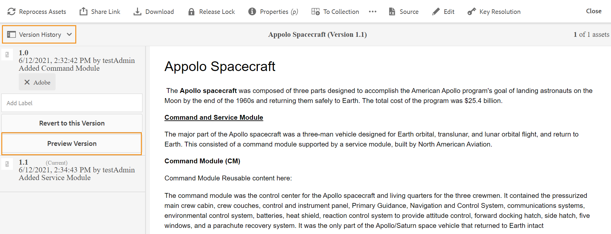{width="800" align="left"}

   1. 从列出的版本中，选择要用作基本版本的版本，然后单击 **预览版本**. 所选版本的预览将显示在“版本预览”窗口中。

   1. 从 **显示差异** 列表中，选择要与基本版本进行比较的版本。

      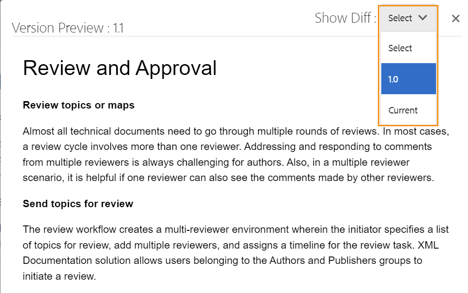{width="800" align="left"}

      更改的内容在主题预览中突出显示。 以绿色高亮显示的内容表示新添加的内容，而以红色显示的内容表示已删除的内容。

      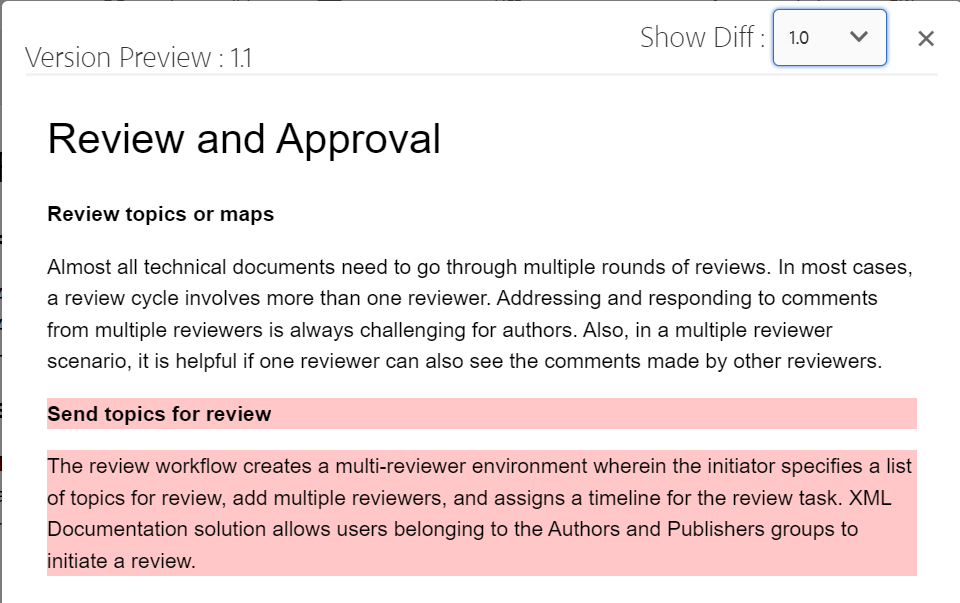{width="800" align="left"}

### 分支、还原和后续版本控制 {#id193PG0Y051X}

- 在典型的创作环境中，您需要创建一个主题的新分支来适应特定版本。 与任何其他版本管理系统一样，AEM Guides允许您从主题的现有版本创建分支，或还原到主题的旧版本。 使用AEM Guides提供的版本管理功能，您可以执行以下任务：

   - 从现有版本的主题创建分支
   - 在新分支中创建后续版本
   - 还原到主题的特定版本

  下图显示了典型的分支和后续版本化系统：

  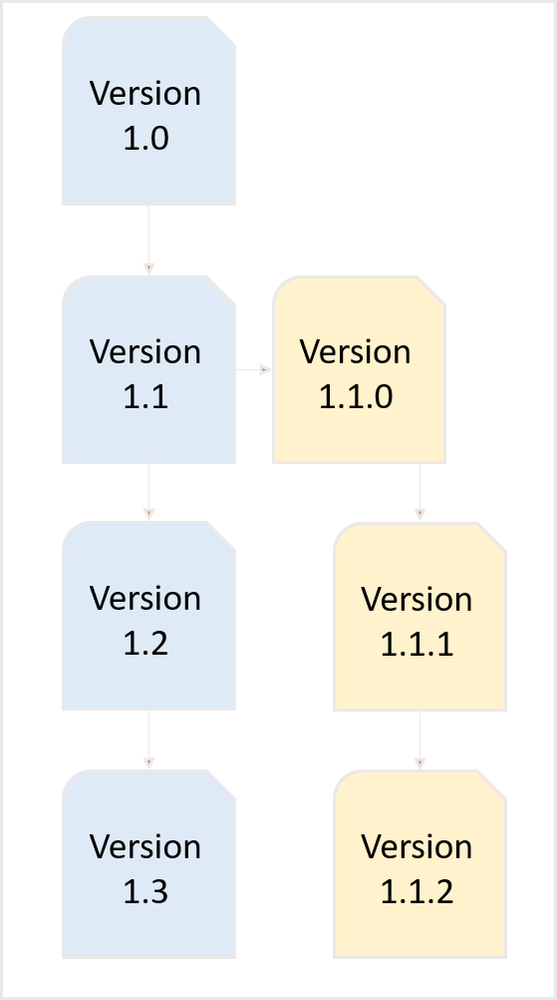{width="550" align="center"}

  对于任何新主题，第一个版本编号为1.0。此后，该主题的每个新版本都以增量数字（例如1.1、1.2等）保存。 创建主题的分支后，将创建一个新分支，该分支的版本号来自创建分支的位置，并在版本末尾添加。0。 如图所示，新分支是从主题的1.1版本创建的。 新分支的版本为1.1.0。此后，每次在此分支中保存该主题的新版本时，它都会获得一个增量版本号，例如1.1.1、1.1.2等。

  与分支类似，您还可以将工作版本或当前版本还原为存储库中存在的任何版本。 要还原到某个版本，只需选择所需的主题版本，然后单击 **还原到此版本** 在 **版本历史记录** 面板。

  执行以下步骤可创建分支、还原到版本并维护主题的后续版本：

  >[!IMPORTANT]
  >
  > 以下过程中描述的方法仅适用于DITA文件。 对于非DITA文件，使用“时间轴”视图创建版本或恢复文件的现有版本。

   1. 访问Assets UI中的主题。

      >[!NOTE]
      >
      > 您也可以在“预览”模式下打开主题，然后继续执行步骤3。

   1. 选择要为其创建分支的主题。

   1. 在左边栏中，单击 **版本历史记录**.

      >[!NOTE]
      >
      > 此时将显示所选主题可用的版本列表。 每个版本都包含时间戳、用户名、版本注释和 [标签](web-editor-use-label.md#) 信息。

   1. 选择要从中创建分支的版本。 在以下屏幕截图中，选择了版本1.2来创建分支。

      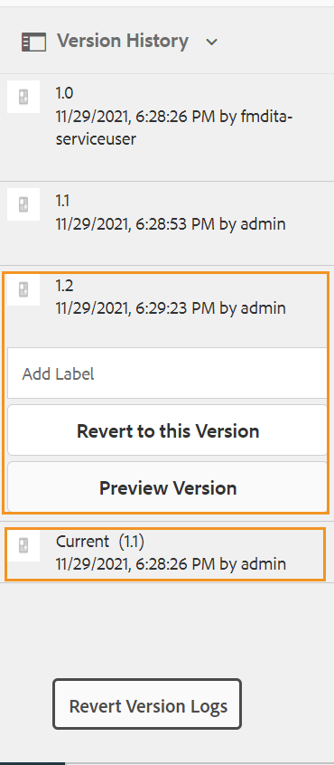{width="300" align="left"}

      >[!NOTE]
      >
      > 当前版本的主题包含 *\（当前\）* 在版本号旁边提及。

   1. 单击 **还原到此版本**.

      此时将显示一条消息，要求您确认创建新分支。

   1. *\（可选\）* 在消息提示中，您将获得一个选项来选择 **将当前工作副本另存为新版本**. 根据此选项的选择，可以执行以下两个操作：

      - 如果选择此选项，则从版本1.1创建分支。此外，还从主题的当前工作副本中创建新版本的主题，并将其另存为下一个版本 — 1.4。

        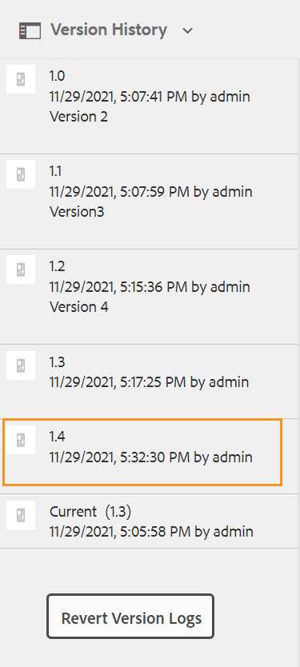{width="300" align="left"}

        版本1.2会成为您当前的主题工作副本。 在此之后保存的任何版本都在1.1的新分支下创建。例如，此分支中的新主题的后续版本将保存为1.2.0。

        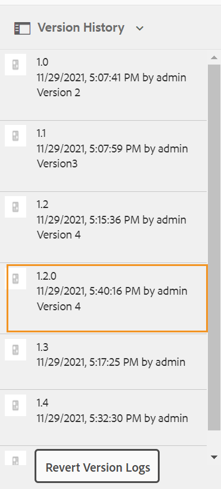{width="300" align="left"}

      - 如果不选择此选项，则不会创建主题当前工作副本中的新版本。 新分支是从主题的1.2版本创建的。 该主题的任何后续版本都会保存在1.2分支下，如1.2.0、1.2.1等。

        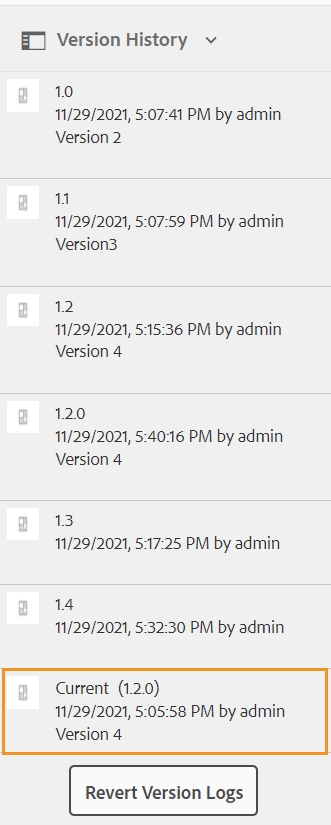{width="300" align="left"}

   1. 单击&#x200B;**确定**。

  将从主题的所选版本创建新分支。 上述过程也适用于恢复到主题的特定版本。 从技术上讲，恢复到特定版本意味着从选定版本创建新分支，并将该版本作为主题的当前工作副本。 您还可以在“版本还原历史记录”报告中查看已还原文件的历史记录。 有关此报告的更多详细信息，请参阅 [还原文件版本历史记录报告](reports-reverted-file-version-history.md#).

**父主题：**[&#x200B;创建和预览主题](create-preview-topics.md)
