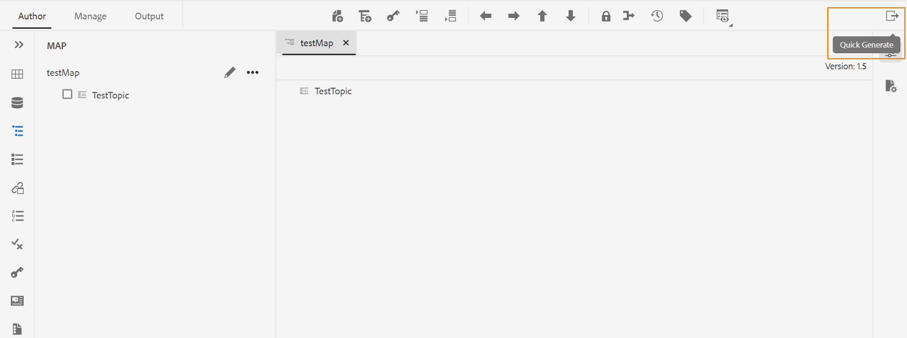

# 使用“快速生成”面板生成和查看输出 {#id22AKE050F5L}

AEM指南提供 **快速生成** 集成在Web编辑器中的面板。 此面板允许您同时为为DITA映射创建的输出预设生成输出。 可以为一个或多个预设或为DITA映射创建的所有预设生成输出。 您也可以使用 **快速生成** 面板以查看为预设生成的输出。

>[!NOTE]
>
> 此 **快速生成** 对于在“映射视图”面板中打开的DITA映射，将显示该面板。

{width="800" align="left"}

执行以下步骤以生成输出 **快速生成** 面板：

1. 在“映射视图”中打开DITA映射。 “快速生成”图标出现。 它出现在 **作者** 和 **管理** 选项卡。
1. 单击 **快速生成** 图标\( \)以打开 **快速生成** 面板。 在 **快速生成** 面板中，您可以看到为DITA映射创建的所有输出预设的列表。
1. 选择要为其生成输出的一个或多个预设。
1. 单击 **生成** 生成所选预设的输出。 成功消息显示在输出的生成中。 如果生成失败，将显示错误消息。 您还可以查看错误日志，以了解生成过程中所发生错误的详细信息。
1. 单击 **查看输出** \( \)图标以查看为预设生成的输出。

**父主题：**[&#x200B;使用Web编辑器](web-editor.md)
