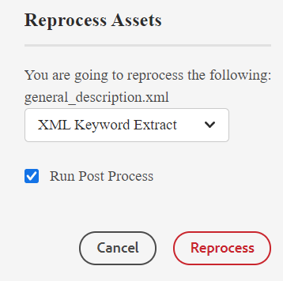
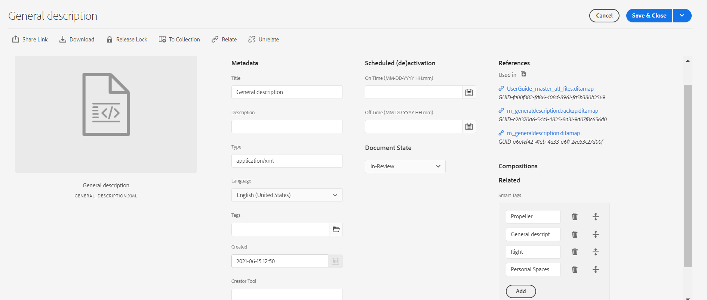

# 智能标记 {#id216KH0ID0Y8}

>[!IMPORTANT]
>
> 智能标记功能并非现成可用，它需要自定义实施，您需要就此咨询系统管理员。

AEM Guides附带了添加智能标记的功能。 您可以使用XML关键字提取工具来提取智能标记。 此工具使用人工智能来理解内容并提供相关关键词。 您可以使用智能标记来改进搜索引擎优化\(SEO\)，并帮助用户查找相关内容。

执行以下步骤可创建智能标记：

1. 在Assets UI中，导航到要创建智能标记的主题。
1. 在预览模式下打开主题，然后选择 **重新处理资产** 图标。
1. 选择“XML关键字提取”以提取相关关键字。

   {width="300" align="left"}

1. 选择“运行后处理”选项。 成功启动工具时将显示一条消息。
1. 标记将自动提取，并可在所选主题的“属性”页面上看到。

   {width="800" align="left"}

   >[!NOTE]
   >
   > 除了通过XML关键字提取工具提取关键字之外，您还可以添加、删除或自定义属性页面中的智能标记。

*请联系您的客户成功团队以在环境中启用此功能。 这并非开箱即用支持的一部分。*

**父主题：**[&#x200B;管理元数据](manage-metadata.md)
