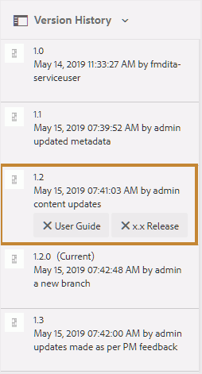
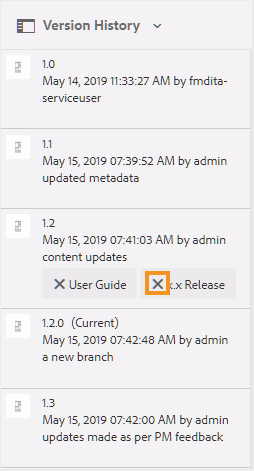

# 使用标签 {#id164JBG0M0T1}

AEM Guides允许您向文件的不同版本添加标签。 您可以使用这些标签指定要包含在要发布的基线中的版本。 有关使用标签创建基线的详细信息，请参见 [使用基线](generate-output-use-baseline-for-publishing.md#).

例如，如果要使用 *版本1.0* 中的主题 *版本1.0* 和 *版本1.1* 中的相同主题 *发行版本2.0*，您可以添加 *版本1.0* 标签在 *版本1.0* 和 *发行版本2.0* 标签在 *版本1.1*.

添加标签后，即可创建基线，并指定要使用该基线发布时包含的主题版本。 要查看基线中应包含或排除的版本，可以使用“版本历史记录”选项。

## 添加标签

执行以下步骤可向主题添加标签：

1. 在Assets UI中，选择一个主题
1. 单击左边栏选择器图标并选择 **版本历史记录**.
1. 在“版本历史记录”中，单击要添加标签的版本。

1. 输入所选版本的标签，然后按Enter键。 例如， *2.6版本*.

   >[!NOTE]
   >
   > 不能将同一标签添加到主题的不同版本。 但是，您可以向主题的同一版本添加多个标签。

   标签将显示在所选主题的“版本历史记录”中。 以下屏幕截图显示了标签 *x.x版本* 和 *用户指南* 已添加到主题的突出显示版本。

   {width="300" align="left"}

>[!NOTE]
>
> 使用基线，可以向多个主题添加标签。 有关使用基线添加标签的详细信息，请参见 [向基线添加标签](generate-output-use-baseline-for-publishing.md#id184KD0T305Z).

## 删除标签

执行以下步骤可删除标签：

1. 在Assets UI中，选择添加了标签的主题。
1. 单击左边栏选择器图标并选择 **版本历史记录**.

   在版本历史记录中，您将看到主题的所有版本以及附加到这些版本的标签。 下图显示了不同版本主题的一个示例，其中有一个版本添加了标签。

   {width="300" align="left"}

1. 单击删除按钮\(**X**\)以删除标签。

   {width="300" align="left"}

**父主题：**[&#x200B;使用Web编辑器](web-editor.md)
