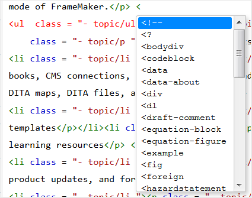
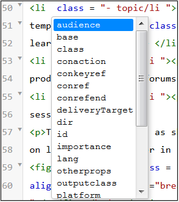
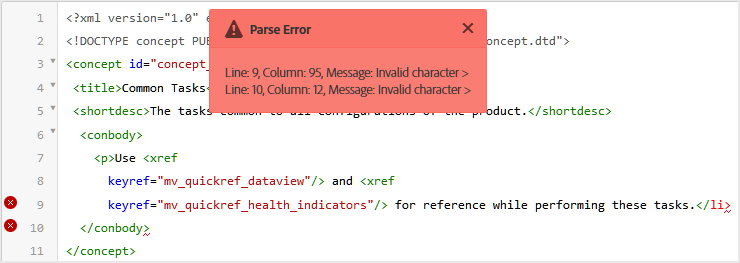
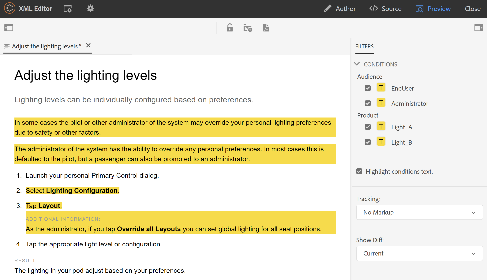
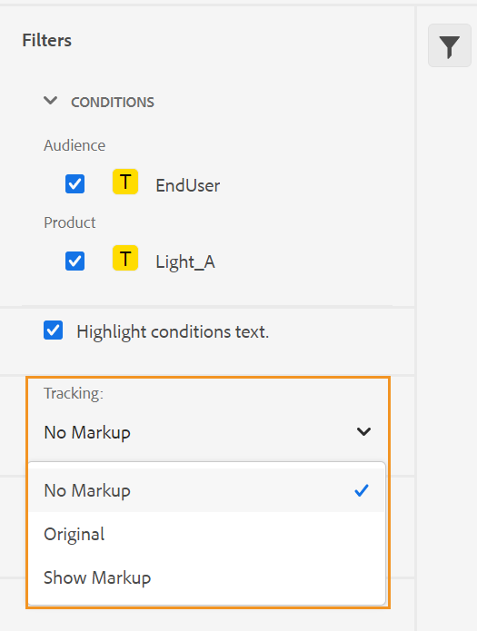
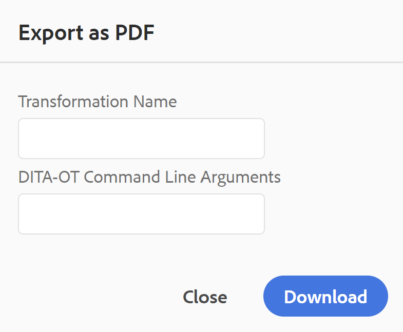

# Web编辑器视图 {#id204GK0D0V5Z}

AEM Guides的Web编辑器支持以三种不同的模式或视图查看文档：

## 创作

这是Web编辑器的典型视图，您看到的就是您获得的\(WYSISYG\)。 您可以像在任何常规富文本编辑器中一样编辑主题。 在“作者”视图中，您可以选择保存文档的修订版本、查找和替换内容、插入元素、插入超链接、插入内容引用等。

>[!NOTE]
>
> 使用内容引用时，引用的内容也会以蓝色显示在“创作”视图中。 引用的内容不可编辑。

## 源

“源”视图显示构成主题的基础XML。 如果您习惯直接使用XML，则应该使用“源”视图。 除了在此视图中编辑常规文本外，您还可以使用“智能目录”添加元素和属性，或者查找和替换文本、元素或属性。

- 要调用智能目录，请将光标放在要插入新元素的任何元素标记的末尾并输入“&lt;”。 该编辑器将显示可以在该位置插入的所有有效XML元素的列表。 使用箭头键选择要插入的元素，然后按Enter键。 在输入右括号“\>时，将自动添加元素的右标记。

  {width="400" align="left"}

- 您还可以从“源”视图中轻松更改元素。 例如，如果更改 `p` 元素至 `note`，然后是结尾 `p` 标记会自动更改为 `/note`. 如果用不正确的元素替换元素，则会立即显示验证错误。

- 如果要向元素添加属性，请将光标置于元素标记内并按空格键。 该元素的有效属性列表显示在智能目录中。 使用箭头键选择所需的元素，然后按Enter插入元素。 要为属性指定值，请输入等号\(=\)，编辑器将自动输入开头和结尾引号“”，您可以在其中指定属性值。

  {width="350" align="left"}

- 在“源”视图中，有一个“自动缩进”选项，该选项以可呈现且易于阅读的格式重新组织XML代码。 此外，如果您选择任何文本并从“创作”视图切换到“源”视图或从“源”视图切换到“创作”视图，则选定的文本也会在另一个视图中突出显示。
- “源”视图中的另一个强大功能是文档中的XML验证。 如果打开包含无效XML的文档，则会在“源”视图中打开该文档，其中包含有关无效XML的信息。 例如，在以下屏幕截图中，在“分析错误”弹出窗口中提供了有关错误XML的确切信息。

  {width="650" align="left"}

  在上面的屏幕快照中，交叉高亮用于指向包含错误XML的行。

- “查找和替换”功能允许您在“源视图”中搜索任何文本、元素或属性。
欲知更多详情，请参见 **查找和替换** 中的功能描述 [主工具栏](web-editor-features.md#id#id2051EA0G05Z) 部分。

- “源视图”提供了许多快捷方式，帮助您快速导航和处理文档。 下表列出了支持的操作及其快捷键：

  | 要执行此操作 | 使用此快捷方式 |
  |----------|-----------------|
  | 添加多个游标 | **Ctrl**+左键单击 |
  | 多个非连续文本选择 | **Ctrl**+左键单击以拖动并选择文本 |
  | 选择行间和行间的文本 | **Alt**+左键单击以拖动并选择文本 |
  | 撤消多项选择或退出全屏模式 | **Esc** |
  | 显示自动完成 | **Ctrl**+**空间** |
  | 转到当前标记的开头或结尾标记 | **Ctrl**+**J** |
  | 展开或折叠当前标记及其内容 | **Ctrl**+**Q** |
  | 选择当前元素及其内容 | **Ctrl**+**L** |
  | 减少当前元素的缩进 | **Shift**+**选项卡** |
  | 删除当前元素及其内容 | **Shift**+**Ctrl**+**K** |
  | 将光标左移一个单词 | **Alt**+**左箭头** |
  | 将光标向右移动一个单词 | **Alt**+**向右箭头** |
  | 向上滚动一行而不更改光标位置 | **Ctrl**+**向上箭头键** |
  | 向下滚动一行而不更改光标位置 | **Ctrl**+**向下箭头** |
  | 切换全屏 | **F11** |
  | 在当前元素之后插入新行 | **Ctrl**+**输入** |
  | 在当前元素之前插入新行 | **Shift**+**Ctrl**+**输入** |
  | 查找并选择当前单词的下一个匹配项 | **Ctrl**+**D** |
  | 将当前元素及其内容向上移动一个元素 | **Shift**+**Ctrl**+**向上箭头键** |
  | 将当前元素及其内容向下移动一个元素 | **Shift**+**Ctrl**+**向下箭头** |
  | 将当前元素包裹在注释标记中 | **Ctrl**+**/** |
  | 复制当前元素及其内容 | **Shift**+**Ctrl**+**D** |
  | 删除光标后面的文本。 如果光标在打开的元素之前，则删除整个元素。 | **Ctrl**+**K**+**K** |
  | 删除当前行中光标左侧的文本。 如果光标位于元素的结束标记之后，则会删除整个元素。 | **Ctrl**+**K**+**退格符** |
  | 将当前文本转换为大写 | **Ctrl**+**K**+**U** |
  | 将当前文本转换为小写 | **Ctrl**+**K**+**L** |
  | 将当前元素滚动到编辑器的中心 | **Ctrl**+**K**+**C** |
  | 在当前位置上方添加光标 | **Ctrl**+**Alt**+**向上箭头键** |
  | 在当前位置下添加光标 | **Ctrl**+**Alt**+**向下箭头** |
  | 递归查找当前单词\（向前\） | **Ctrl**+**F3** |
  | 递归查找当前单词\（向后查找\） | **Shift**+**Ctrl**+**F3** |

## 预览

在预览模式下打开主题会显示用户在浏览器中查看主题时主题的显示方式。 对于DITA映射，显示映射的预览，其中显示映射中所有主题的单个复合文档。

预览模式提供了以下功能：

- [查看基于条件筛选器的内容](#id2114BI00VXA)
- [查看跟踪更改标记](#id2114BJ00CE8)
- [将主题导出为PDF](#id2114BL00B5U)

### 查看基于条件筛选器的内容 {#id2114BI00VXA}

如果您在主题或地图中使用了条件，则这些条件会显示在“筛选器”面板中。 默认情况下，将选择所有条件并显示整个内容。 如果取消选择某个条件，则会从视图中删除具有该条件的内容。 您还可以选择高亮显示条件化内容。

下图显示了一个使用两个条件的主题 —  `Audience` 和 `Product`. 条件化内容以黄色背景突出显示。

{width="800" align="left"}

### 查看跟踪更改标记 {#id2114BJ00CE8}

如果文档包含跟踪更改标记\（或视觉提示\），则也可以预览包含或不包含这些标记的文档。 预览文档时，右侧面板包含筛选器和跟踪选项。

{width="400" align="left"}

有三个 **跟踪** 您可从以下选项中进行选择：

- **无标记**：在此视图中，接受所有插入和删除，并提供文档的简单视图。 在此视图中，您看不到任何跟踪更改标记。
- **原有**：在此视图中，所有插入都将被拒绝，所有删除都将被恢复，然后会显示预览。 简单地说，您可以在启用跟踪更改模式之前获得文档的原始表单。
- **显示标记**：在此视图中，您将获得插入和删除内容的所有标记。

  下图显示了带有标记的映射文件的预览：

  {width="800" align="left"}

### 将主题导出为PDF {#id2114BL00B5U}

PDF是在文档开发周期的每一个可能阶段使用的最常见输出格式之一。 AEM Guides使您能够灵活地生成单个主题或整个映射文件的PDF。 “导出为PDF”功能允许作者、发布者或管理员轻松生成单个主题的PDF输出。 它使用保存在文件夹级别配置文件中的DITA-OT配置来生成PDF。

此功能支持以下功能：

- 生成主题当前活动工作副本的PDF。
- 接受DITA-OT转换名称和命令行参数以生成PDF。
- 将生成的输出保存在本地系统上。
- 在生成输出之前，解析主题中使用的键和内容引用。

要将主题导出为PDF，请执行以下步骤：

1. 在预览模式下打开主题。

1. 单击 **导出为PDF** \(\)图标。

   此时将显示“导出为PDF”对话框。

   {width="350" align="left"}

1. *\（可选\）* 指定DITA-OT转换名称和要使用的任何命令行参数。

1. 单击&#x200B;**“下载”。**

   >[!NOTE]
   >
   > 请确保已在浏览器配置中启用了弹出窗口，否则将不会下载PDF。

   PDF会生成并在新选项卡中打开，或者您会看到一个对话框，用于在本地系统上保存PDF。

**父主题：**[&#x200B;使用Web编辑器](web-editor.md)
