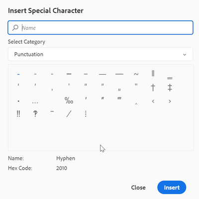
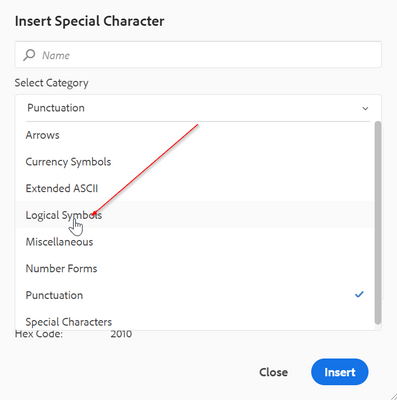
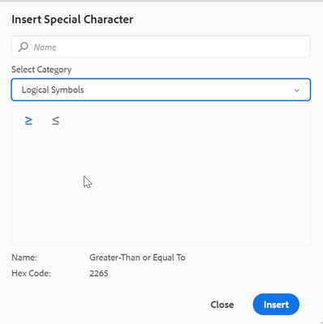

# 如何在Web编辑器工具栏中配置其他特殊字符

Web编辑器工具栏中有一个快捷方式选项，让作者可以插入特殊字符。
如下面的屏幕截图所示：




可在此处配置这些字符列表。 如果需要向其中添加更多字符，请执行以下步骤：

+ 登录AEM并打开CRXDE Lite模式。

+ 在以下位置创建symbols.json文件：“/apps/fmdita/xmleditor/”(您可以从 — “/libs/fmdita/clientlibs/clientlibs/xmleditor/symbols.json”位置复制默认值)

+ 在symbols.json文件中添加特殊字符定义，如下所示：

```
{
      "label": "Logical Symbols",
      "items": [
        {
          "name": "≥",
          "title": "Greater-Than or Equal To"
        },
        {
          "name": "≤",
          "title": "Smaller-Than or Equal To"
        }
      ]
}
```

symbols.json文件的结构说明如下：

+ &quot;label&quot;： &quot;Logical Symbols&quot;：它指定特殊字符的类别。 在该代码片段中，定义了名为“逻辑符号”的类别。

+ “项目”：这定义类别中特殊字符的集合。

+ &quot;name&quot;： &quot;≥&quot;， &quot;title&quot;： &quot;Greater-Than or Equal To&quot;：这是特殊字符的定义。 它以“name”标签开头，该标签不得更改。 名称后跟特殊字符。 “标题”是特殊字符的名称或标题，作为该特殊字符的工具提示显示。

您可以在一个类别中定义多个特殊字符定义。

这将在特殊字符对话框中添加另一个类别：





>[!MORELIKETHIS]
>
>+ [安装和配置指南](https://helpx.adobe.com/content/dam/help/en/xml-documentation-solution/3-6/XML-Documentation-for-Adobe-Experience-Manager_Installation-Configuration-Guide_EN.pdf)
