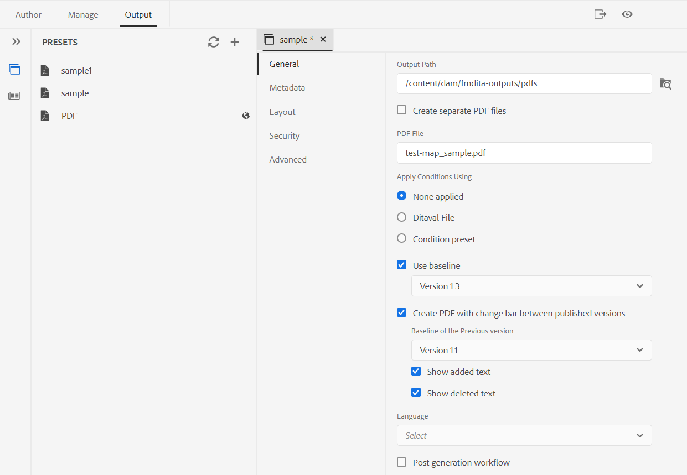
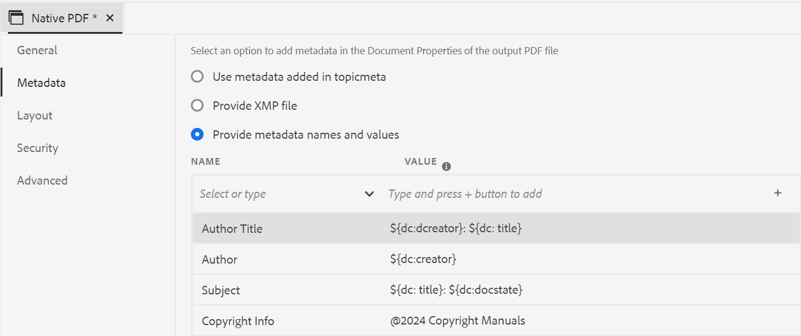
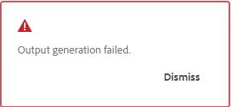

# 发布PDF输出

使用AEM Guides，您可以生成单个主题的PDF或整个映射文件。 您可以使用以下三种方法之一，以PDF格式发布内容：

* **DITA-OT**

使用此方法可从地图仪表板为地图生成PDF输出。 您可以通过在地图功能板中为打开的地图创建输出预设，在生成PDF之前设置发布属性。 要创建或编辑输出预设，请使用 *了解输出预设* 中的部分 [AEM Guidesas a Cloud Service用户指南](https://helpx.adobe.com/content/dam/help/en/xml-documentation-solution/cs-apr-22/XML-Documentation-for-Adobe-Experience-Manager_CS_User-Guide_EN.pdf).

有关使用DITA-OT方法生成PDF的更多信息，请参见 [使用DITA-OT生成PDF](https://help.adobe.com/en_US/xml-documentation-for-adobe-experience-manager/index.html#t=DXML-master-map%2Fgenerate-output-pdf.html).

* **FrameMaker Publishing Server(FMP)**

使用此方法可生成DITAPDF以及AEM存储库中可用的FrameMaker文档(.book和.fm)的文档输出。 PDF可通过配置输出预设创建，并使用FrameMaker Publishing Server(FMPS)发布。 您可以针对PDF和其他格式设计和配置输出的外观，并将其存储在设置文件(.sts)中。 然后，FMPS使用此设置文件来生成DITA映射或.book文件的输出。 要创建或编辑输出预设，请参阅  *了解输出预设* 中的部分 [AEM Guidesas a Cloud Service用户指南](https://helpx.adobe.com/content/dam/help/en/xml-documentation-solution/cs-apr-22/XML-Documentation-for-Adobe-Experience-Manager_CS_User-Guide_EN.pdf).

有关配置FMPS的更多信息，请参阅 [从FrameMaker单据生成输出](https://help.adobe.com/en_US/xml-documentation-for-adobe-experience-manager/index.html#t=DXML-master-map%2Ffm-output-generatation.html).

* **本机PDF发布**

使用此方法可基于W3C CSS3和CSS分页PDF标准生成功能丰富的媒体输出。 通过本机PDF发布，您可以使用模板来设置内容的布局和样式，并应用各种设置来微调PDF。 此外，您可以使用模板编辑器修改和创建自己的模板。

有关本机PDF发布的更多信息，请参阅 [使用本机PDF发布](#native-pdf-publishing).

## 使用本机PDF发布 {#native-pdf-publishing}

在创作内容时，必须确保内容针对查看、编辑和打印进行了优化。 通过使用诸如W3C CSS3之类的标准来设置内容样式，以及使用CSS分页媒体标准来设置页面定义属性（如大小、边距、方向、分页符、页眉、页脚和页码），您可以为PDF文档设置视图和布局，以确保一致性和可用性。 本机PDF发布功能使用这些标准来生成PDF。

在本机PDF发布中，您可以使用预定义的模板来确保内容布局和结构的一致性，应用样式表来更改输出的外观，优化PDF，设置打印机标记，允许屏幕阅读器支持，设置PDF一致性，嵌入字体等等。

使用本机PDF发布生成PDF有两个方面：

* 使用模板将样式应用于内容、设置页面布局和各种设置以微调PDF。 作者可以选择使用/修改提供的示例模板，也可以创建自定义模板并设置发布者和开发人员使用的高级配置选项。

* 创建或配置PDF输出预设以控制PDF设置。 创建PDF输出预设后，即可生成PDF。

有关更多信息，请参阅 [生成PDF输出](#generate-pdf-output).

## 创建PDF输出预设 {#create-output-preset}

生成PDF输出的第一步是创建PDF输出预设，该预设是分配给地图的发布属性的集合。 您可以为“映射视图”面板中打开的任何映射创建输出预设，也可以配置现有预设以快速生成同一映射的PDF。

从PDF输出预设中，您可以选择模板、应用条件、设置限制以控制用户与PDF的交互方式、配置高级设置（如压缩、合规性等）。

创建或配置PDF输出预设：

1. 在输出选项卡中，单击 **预设** 在左侧边栏中。
“预设”面板打开。  

1. 在输出中 **预设** 面板，执行以下操作之一：
   * 双击预定义的PDF输出预设以查看它。
   * 单击+图标以针对 **预设** 添加新的输出预设 **类型：PDF**

1. 要配置现有PDF预设的设置，请执行以下操作：
   * 单击  **选项**  图标，然后选择 **编辑**.
您可以在中使用以下设置 **常规**， **元数据**， **布局**， **安全性**、和 **高级** 用于配置PDF输出预设的选项卡：

**常规**

用于指定基本输出设置，如指定输出路径、PDF文件名等。

| 设置 | 描述 |
| --- | --- |
| **输出路径** | AEM存储库中存储PDF输出的路径。 确保输出路径不在项目文件夹内。 如果留空，将在默认DITA映射输出位置生成输出。 您还可以使用以下现成的变量来定义输出路径。 您可以使用单个变量或变量组合来定义此选项。   `${map_filename}`：使用DITA映射文件名称创建目标路径。   `${map_title}`：使用DITA映射标题创建目标路径。  `${preset_name}`：使用输出预设名称创建目标路径。   `${language_code}`：使用映射文件所在的语言代码创建目标路径。   `${map_parentpath}`：使用映射文件的完整路径创建目标路径。   `${path_after_langfolder}`：使用语言文件夹后的映射文件的路径创建目标路径。 |
| **PDF文件** | 指定文件名以保存PDF。 默认情况下，PDF文件名会添加DITA映射名称以及预设名称。 例如，ditamap是“TestMap”，预设的名称为“preset1”，则pdf的默认名称将为“TestMap_preset1.pdf”。  您还可以使用以下开箱即用的变量来定义PDF文件。 您可以使用单个变量或变量组合来定义此选项。  `${map_filename}` `${map_title}` `${preset_name}`   `${language_code}`。 |
| **使用以下方式应用条件** | 对于条件化内容，请从以下选项中进行选择，以根据这些条件生成PDF输出：  <ul> <li> **未应用** 如果不想对映射和源内容应用任何条件，请选择此选项。  <li> **Ditaval文件** 选择DITAVAL文件以生成条件化内容。 要进行选择，请单击“条件预设”并查找文件。   <li> **条件预设** 从下拉列表中选择条件预设，以在发布输出时应用条件。 如果为DITA映射文件添加了条件，则此选项可见。 条件设置在DITA映射控制台的条件预设选项卡中可用。 要了解有关条件预设的更多信息，请参阅 [使用条件预设](https://help.adobe.com/en_US/xml-documentation-for-adobe-experience-manager/index.html#t=DXML-master-map%2Fgenerate-output-use-condition-presets.html).   </ul> |
| **使用基线** | 如果已为所选DITA映射创建了基线，请选择此选项以指定要发布的版本。 请参阅 [使用基线](https://help.adobe.com/en_US/xml-documentation-for-adobe-experience-manager/index.html#t=DXML-master-map%2Fgenerate-output-use-baseline-for-publishing.html) 以了解更多详细信息。 |
| **在已发布的版本之间使用更改栏创建PDF** | 使用以下选项创建一个PDF，该内容使用更改栏显示两个版本之间的内容差异：    <ul><li> **以前版本的基线** 选择要与当前版本或其他基线进行比较的基线版本。 PDF中将显示一个更改栏，以指示修改的内容。 更改条是一条垂直线，用于直观地标识新内容或修订的内容。 更改栏显示在已插入、更改或删除的内容左侧。   **注意**：如果您选择 **使用基线** 并选择要发布的基线，将在两个选定的基线版本之间进行比较。 例如，如果您选择基线下的版本1.3 **使用基线**&#x200B;和版本1.1，位于 **以前版本的基线**，将在基线版本1.1与基线版本1.3之间进行比较。  <li> **显示添加的文本** 选择以绿色和带下划线的形式显示插入的文本。 默认情况下，该选项处于选中状态。   <li> **显示已删除的文本** 选择以红色显示删除的文本并标记删除线。 默认情况下，该选项处于选中状态。  **注意** 您还可以使用样式表自定义更改栏、插入的内容或删除内容的样式。 </ul> |
| **后期生成工作流** | 选择以显示一个下拉列表，其中包含在AEM中配置的所有工作流。 您可以选择在PDF生成工作流完成后要执行的工作流。 |

**元数据**

元数据是内容的描述或定义。 元数据有助于内容管理，也有助于在Internet上搜索文件。

使用“元数据”选项卡设置元数据字段，如作者姓名、文档标题、关键字、版权信息以及PDF输出的其他数据字段。 您还可以为PDF输出添加自定义元数据。

此元数据映射到输出PDF的“文档属性”中“描述”选项卡内的元数据。

**注意**：此元数据将覆盖在帐簿级别定义的元数据。

在输出预设中， **选择PDF** > **元数据** 添加和自定义元数据选项。
* **提供XMP文件**

  可以通过导入直接填充元数据字段 [XMP](https://www.adobe.com/products/xmp.html) （可扩展元数据平台）文件。 您可以从此处下载示例XMP文件。

[下载](assets/SampleXMP.xmp)

  或者，您可以使用Adobe Acrobat生成XMP文件。
   1. 单击 **文件** > **属性** 在Acrobat中。
   1. 下 **描述**，单击 **其他元数据**.
   1. 从左侧面板中，选择 **高级**.
   1. 单击 **保存**.

  XMP文件保存在设备上。

* **提供元数据名称和值**

   1. 从下拉列表中选择以添加名称，或直接在名称字段中键入以添加自定义元数据。
   1. 输入元数据的值，然后单击“+”图标。
元数据将添加到PDF的元数据列表中。

您还可以使用变量来定义元数据值。  可以将为DITA映射或书图文件定义的元数据用作变量。 元数据可在下找到 `/jcr:content/metadata` DITA映射或书图文件的节点。
使用变量时，将从元数据属性中选取变量的值。

要使用变量，您需要在以下位置定义它： `${<variable>}` 格式。

例如，在/中定义的其中一个元数据属性`jcr:content/metadata` 节点为
`dc:title`. 您可以指定 `${dc:title}`，并在最终输出中使用标题值。

您可以使用单个变量或变量组合来定义元数据。 例如，`${dc:title} ${dc:docstate}`。您还可以使用变量和字符串的组合。  例如：`View ${dc:title} in ${dc:language}`。

使用语言变量定义元数据属性的本地化值。 根据您选择的语言，将在PDF输出中自动选取本地化的值。 例如，您可以将“Author”作为元数据值打印在英语中，将“Autorin”作为元数据值打印在德语中。

格式： `${lng:<variable name>}`. 例如， `${lng:author-label}` 位置 `author-label` 是语言变量。

将鼠标悬停在  靠近该选项，以查看有关该报表的更多详细信息。

**布局**

用于设置页面布局，为PDF输出（如“页面显示”）指定页面查看选项，以及设置缩放级别。

| 设置 | 描述 |
| --- | --- |
| **PDF模板** | PDF模板提供了一个清晰的结构，可用于定义页面布局、内容样式和将各种设置应用于PDF输出。 从PDF模板下拉选项中进行选择，以选择您的首选模板。   您还可以选择 **浏览模板**   以选择模板。 在 **选择PDF模板** 对话框，您还可以预览缩略图并查看所选模板的标题和描述。 |
| **页面显示** | 使用页面显示的页面视图可显示打开PDF时的显示方式。 从“页面显示”下拉选项中进行选择，以选择首选视图。  <ul><li> **默认**  根据用户计算机上的PDF查看器的默认设置显示。    <li> **单页面查看** 一次显示一个页面。     <li> **单页滚动** 在连续的垂直列中显示单个页面。    <li> **两页视图** 一次并排显示两页跨页。.  <li> **两页滚动** 通过连续滚动并排显示两页跨页。 </ul> |
| **缩放** | 选择可调整页面视图的大小，以显示PDF在打开时的显示方式。   <ul><li> **默认** 根据用户计算机上的PDF查看器的默认设置显示      <li> **100%** 使页面以实际大小显示。       <li> **适应页面** 使页面宽度和高度适合文档窗格。.  <li> **适应页面宽度** 使页面宽度填满文档窗格的宽度。    <li> **适应页面高度** 使页面高度填充文档窗格的高度。 </ul> |

**安全性**

通过添加限制来Protect您的PDF，以打开和读取文件。 使用以下选项以避免未经授权的访问。

| 设置 | 描述 |
| --- | --- |
| **设置密码以打开文档** | 选择以添加安全密码来查看您的PDF文件。 在中指定密码 **用户密码** 字段。 用户只能通过输入此字段中提供的密码来打开PDF。 |
| **设置文档限制** | 选择以限制用户与您的PDF的交互方式。 在中指定密码 **所有者密码** 字段使以下限制设置生效。   <ul><li> **打印** 选择以允许用户打印PDF。   <li> **草稿质量打印** 选择可允许用户以较低分辨率打印PDF。    <li> **内容复制** 选择可允许用户从PDF复制内容。     <li> **注释** 选择以允许用户在PDF中添加注释或评论。    <li> **内容修改** 选择以允许用户更改PDF中的内容。    <li> **为辅助功能复制内容** 选择以允许屏幕阅读器阅读和导航PDF中的内容。     **文档程序集** 选择可允许用户在PDF中插入页面。    **注意**：用户需要输入所有者密码，以更改Adobe Acrobat中“文件”>“属性”的任何限制。 |

**高级**

使用以下选项指定高级设置以合并PDF、使用压缩、选择符合性标准等。

| 设置 | 描述 |
| --- | --- |
| **创建可访问（已标记）的PDF** | 选择此选项可生成带有标记的PDF。 标记的PDF使屏幕阅读器更轻松地阅读和导航内容、超链接、书签等。 例如，如果表被标记，屏幕阅读器将知道它正在读取表，而不仅仅是行和文本。 |
| **目录中包含的合并PDF** | 选择此选项可以将现有PDF作为资源文件添加到DITA映射中，从而将它们合并到输出中。 PDF将插入地图中显示的位置，页面将相应增加。 |
| **嵌入使用的字体** | 在使用可能未安装在最终用户计算机上的字体时，请选择此选项。 选择此选项后，使用的字体将嵌入到PDF中，从而确保用户能够按预期查看PDF，即使字体未安装在他们的计算机上也是如此。   **注意**：仅当字体供应商设置允许嵌入某个字体时，才能嵌入该字体。 在嵌入字体之前，请确保您具有所需的设置或许可证。 |
| **使用自动断字** | 启用自动连字符后，行末的词语会在文法正确的位置用连字符断开。 |
| **启用JavaScript** | 如果您希望使用某个JavaScript代码在生成PDF之前动态转换内容，请启用此选项。 |
| **嵌入多媒体文件** | 选择此选项可将任何音频、视频和交互式内容包含到PDF中。 |
| **使用全压缩优化PDF大小** | 如果要压缩/减小大型PDF的大小，请选择此选项。 请记住，压缩PDF可能会降低文件质量。 |
| **使用图像压缩优化PDF大小** | 如果要在PDF中压缩/减小使用的图像大小，请选择此选项。 请记住，压缩图像可能会降低图像质量。 |
| **使用自定义分辨率（每英寸像素）** | 它是以像素/英寸为单位的页面显示分辨率。 在选中此选项时显示的字段中输入首选值。 默认值为每英寸96像素。 设置较高的值以在一英寸内容纳更多内容，如果设置较低的值，则反之亦然。 |
| **显示水印** | 选择此选项可在输出中叠加水印。 您可以在文本框中输入新的文本字符串，其字符大小写符合您的要求。   使用静态文本或语言变量发布水印的本地化版本。  根据您选择的语言，将在PDF输出中自动选取本地化的值。 例如，您可以将“Publisher”作为水印以英语打印，将“Auteure”作为水印以法语打印。    格式： `${lng:<variable name>}`. 例如， `$ {lng:publisher-label}` 位置 `publisher-label` 是语言变量。   将鼠标悬停在  靠近该选项，以查看有关该报表的更多详细信息。 |
| **启用MathML公式** | 选择此选项以呈现内容中存在的MathML公式。 否则将默认忽略公式。 |
| **下载临时文件** | 如果要下载在生成本机HTML输出时创建的临时PDF文件，请选择此选项。 生成输出后，您可以稍后下载临时文件。 |
| **PDF符合性** | 这是您打算保存PDF以确保其合规性的标准。 从下拉列表中选择，以从可用PDF标准列表中进行选择。 有关支持的标准的更多详细信息，请参阅 [关于PDF标准](https://helpx.adobe.com/acrobat/using/pdf-conversion-settings.html#about_pdf_x_pdf_e_and_pdf_a_standards). |

## 生成PDF输出 {#generate-pdf-output}

配置输出预设后，可以使用 **生成预设** 功能。

1. 在 **作者** 选项卡，选择 **存储库** 视图。\
   这将打开“存储库”面板。

1. 在“存储库”面板中，打开DITA映射文件 **映射视图**.

1. 在 **输出** 选项卡，单击 **预设** 以查看“预设”面板。
要创建或配置输出预设，请参阅 [创建PDF输出预设](#create-output-preset).
1. 要保存您的设置，请单击 **全部保存**  图标（位于“输出”视图中的标准工具栏的左上角）。
1. 单击 **生成预设**  图标。
您可以在“输出预设”面板中查看选定输出预设旁边的进度条。
1. 输出生成完成后，单击  **查看输出**  图标以查看输出。\
   A **成功** 对话框在屏幕的右下角可见。
如果输出不成功，则会显示以下错误消息。

要查看错误日志，请单击 **取消**，将鼠标悬停在选定的预设选项卡上，然后单击  **选项** > **查看日志**.

### 生成本机PDF输出后下载临时文件

如果您选择 **下载临时文件** 选项中，您还可以下载在生成本机HTML输出时创建的临时PDF文件。 生成输出后，您可以使用 **下载临时文件** 图标。 此功能可帮助您查看临时HTML样式和布局，并帮助您根据自己的要求更正或更改CSS样式。

>[!NOTE]
>
> 此 **下载临时文件**   图标仅在您使用预设生成最后一个PDF输出时显示，您在该预设中选择了 **高级** 选项卡。

### 使用语言变量

AEM Guides还提供了对语言变量的支持。 选择 **语言变量**   在左侧面板中定义开箱即用标签的本地化版本，如PDF输出中的“注释”、“警告”和“警告”或静态文本。 有关更多详细信息，请参阅 [支持语言变量](../native-pdf/native-pdf-language-variables.md).

